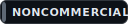
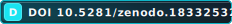
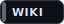
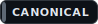

# VRAXION Golden Targets

[](https://github.com/VRAXION/VRAXION/wiki/Hypotheses) [](LICENSE) [](https://doi.org/10.5281/zenodo.18332532) [](https://github.com/VRAXION/VRAXION/wiki) [](https://github.com/VRAXION/VRAXION/wiki/Wiki-Policy---Wiki-Is-Canonical-(v1))

VRAXION is a research codebase centered on **repeatable internal mechanisms** (loops/recurrence) and **instrumented evaluation** (so performance claims come with artifacts, not vibes).

This repo root contains two curated targets:

- `Golden Code/`: end-user ("DVD") runtime library code only.
  - Primary package: `Golden Code/vraxion/`
- `Golden Draft/`: production-quality, non-DVD code (tools, tests, harness, contracts).

## Status

Research preview. Expect iteration and occasional breaking changes. Current status lives in the Roadmap and Releases.

## Where to look

- Pages (landing): https://vraxion.github.io/VRAXION/
- Wiki (deep dives): https://github.com/VRAXION/VRAXION/wiki
- Quickstart (local dev): `Golden Draft/docs/ops/quickstart_v1.md`
- Reproducibility checklist: `Golden Draft/docs/ops/reproducibility_v1.md`
- GPU objective/stability contract: `Golden Draft/docs/gpu/objective_contract_v1.md`
- Roadmap (public): https://github.com/orgs/VRAXION/projects/4
- Releases (public proof): https://github.com/VRAXION/VRAXION/releases

## Quickstart (safe commands)

CPU tests (recommended first command):

```powershell
python -m unittest discover -s "Golden Draft/tests" -v
```

Probe harness help (safe; does not run a benchmark):

```powershell
python "Golden Draft/tools/gpu_capacity_probe.py" --help
```

Sanity compile gate:

```powershell
python -m compileall "Golden Code" "Golden Draft"
```

## Versioning (MAJOR.MINOR.BUILD)

VRAXION uses a simple cadence tracker stored in `VERSION.json`:

- `BUILD` increments on every merged "ticket completion" PR (fast/beta cadence).
- `MINOR` increments only for curated public updates (BUILD unchanged).
- `MAJOR` increments only for lifetime milestones (MINOR resets to 0; BUILD unchanged).

This does not replace the historical release tag `v1.0.0`.

## Naming conventions

- Runtime env vars use the `VRX_` prefix.
- Legacy naming (`prime_c19`, `tournament_phase6`, `TP6_*`) is intentionally removed from the active code surface.
