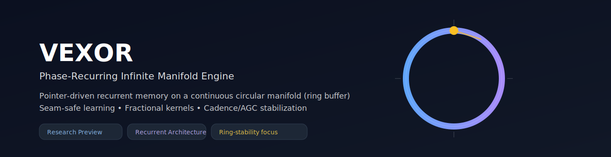
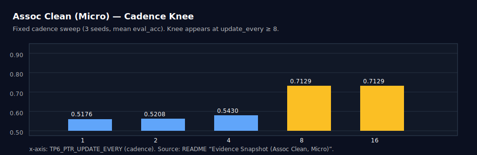

  

# VRAXION™
**Phase‑Recurring Infinite Manifold Engine**  
Pointer‑driven recurrent memory on a continuous circular manifold (ring buffer), focused on seam‑safe learning and stability on closed loops.

> **Research preview.** This project is a pre‑alpha prototype and prior‑art disclosure. It is not production‑ready.

---

## Founder note 👋
Hi — I’m **Daniel Kenessy**. I’m **31** and based in **Slovakia**. VRAXION™ is my working title for this line of research (mark filing intended; not yet registered).  
I build experimental systems at the edges: ideas that look strange on paper until you can run them, graph them, and break them.

I’ve always trusted two things: **intuition** and **mechanics**. VRAXION is me trying to turn that intuition into something you can inspect, reproduce, and improve — with the long‑term goal of making advanced AI **cheaper, more accessible, and more useful than “just a chatbot.”**

---

## What we’re trying to achieve 🎯
We want AI that runs as a **natural extension of the mind** — locally, privately, and efficiently — so it can:
- make **robots** more stable and adaptive,
- make **cars** safer and smarter,
- help **space probes** operate longer and farther,
- and reduce the cost of deploying intelligence on constrained devices.

---

## What VRAXION is (today) 🧠🧵
VRAXION is a recurrent neural memory architecture that navigates a continuous **1D circular manifold** (a ring buffer). It’s designed around a simple premise:

> If the model’s internal state can’t stay coherent while it moves across seams and loops, it can’t stay coherent while it thinks.

Core themes:
- **Seam‑safe pointer control** (wrap‑around without teleportation)
- **Fractional read/write kernels** (sub‑bin gradients)
- **Cadence‑aware updates** (stability on a looped substrate)
- **Governors** (dynamic scaling, cadence gating, safety rails)

---

<strong>Efficiency claim (careful wording) ⚠️</strong>

### Hypothesis (not yet proven)
We hypothesize that a *correctly scaled* seam‑safe manifold memory could support **much cheaper inference** than architectures that repeatedly touch large contexts — because the model can update and read a **local neighborhood** instead of scanning or attending to everything.

**Important:** this is a research hypothesis, not a promised benchmark. Training is currently compute‑heavy in this prototype, and we still need rigorous external reproduction and comparative baselines.

---

## Evidence (early snapshots) 📈

  

  

For the full technical README, commands, and ablations, see the GitHub repository.

---

## Looking for partners 🤝
If this direction resonates with you, I’d love to talk.

I’m **not** in a position to hire employees yet. What I’m looking for is **partnership** — working together to validate, harden, and ship the tech, then sharing upside fairly.

### The 2 critical roles I’m looking for
1) **ML / Systems engineer (Python + PyTorch)**  
   Someone who can turn a research prototype into a reliable training + inference pipeline, improve stability, and help design reproducible benchmarks.

2) **Legal / business partner**  
   Someone who can help structure licensing, collaboration agreements, and keep us safe while we scale adoption.

Optional (nice to have):
- A **research partner** to design evaluations / ablations and write the “paper‑grade” story.
- A **design/brand** helper to make the project presentable (docs, diagrams, communication).

### How to reach me
- **Email:** `kenessy.dani@gmail.com`
- Please include: your background, what you want to build, and what time commitment you can realistically offer.

> Note: Most project details are already public in the repo/Zenodo. If we discuss non‑public details in the future, we can use a mutual NDA — but NDAs generally do not cover information that’s already public or independently developed by the other party.

---

## License & commercial use 🧾
This public release is **PolyForm Noncommercial 1.0.0**.  
Commercial use requires a separate written license — see the repository’s `COMMERCIAL_LICENSE.md`.

---

## Cite this work 🔖
- Latest version DOI: https://doi.org/10.5281/zenodo.18332532  
- Concept DOI (always resolves to latest): https://doi.org/10.5281/zenodo.18289891

---

  <small>© Daniel Kenessy. Research preview — no warranty. Built with GitHub Pages.</small>

