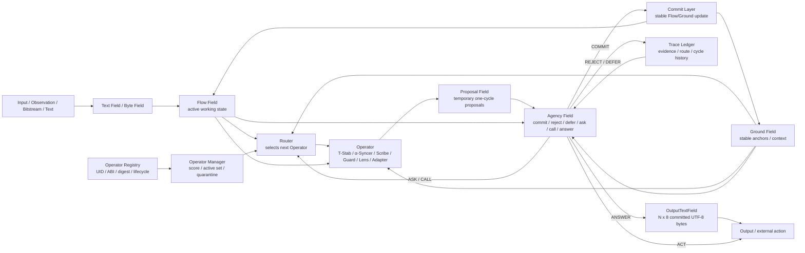

# Operator Naming And Library Schema Lock

Status:

```text
canonical = active
compatibility_alias = Pocket -> Operator
scope = naming, schema, library governance language
```

## Purpose

This document locks the current forward-facing vocabulary after E88.
Historical E-runs may keep the word `Pocket` because that was the term used in
those artifacts. New runtime/library work should use `Operator`.

## Canonical Terms

```text
Field
  A matrix/state surface.

Operator
  A runnable local transformation. This replaces the old generic term Pocket.

LogicAtom
  A small ALU-style rule, usually IF conditions THEN proposal.

Proposal
  A non-committed suggestion emitted by an Operator.

Proposal Field
  Temporary one-cycle thought/proposal surface.

OutputTextField
  Agency-committed output-side text matrix. Shape is N x 8 bit cells, where
  each row is one UTF-8 byte.

Agency Field
  Central commit/action decision layer.

Registry
  Operator UID -> artifact, ABI, digest, lifecycle, and load policy resolver.

Operator Manager
  Lifecycle, scoring, quarantine, promotion, and active-set governance.
```

Compatibility:

```text
Pocket = legacy alias for Operator
PocketToken = legacy alias for OperatorToken
Pocket Library = legacy alias for Operator Library
Pocket Manager = legacy alias for Operator Manager
```

Do not rename historical result files unless they are being superseded by a new
canonical document. Do not rewrite old evidence claims just to match the new
naming.

## Operator Families

```text
T-Stab
  Temporal/frame stabilizer Operator.
  Stabilizes bitstream, frame, cycle, drift, stale, or temporal evidence.

alpha_sync / alpha-Syncer / α-Syncer
  Symbol/codebook synchronization Operator.
  Maps external glyphs, bytes, words, or codeforms into internal canonical code.

Scribe
  Trace/parser/validator Operator.
  Reads visible structured traces and validates or translates them.

Guard
  Safety, scope, reject, or no-commit Operator.

Lens
  Observation or feature extraction Operator.

Adapter
  Edge ABI translator Operator.
  Converts source-node output into target-node input.
```

## Canonical Runtime Flow



Display names may use `α-Syncer`. Code, filenames, JSON keys, and artifact IDs
must use ASCII:

```text
alpha_sync
alpha_syncer
operator_token
operator_library
operator_manager
```

Avoid `aSync` and `A-Sync` in code because they are too easy to confuse with
programming `async`.

## Library Identity

Every governed Operator artifact should separate these layers:

```text
operator_uid
  Immutable machine identity.

content_digest
  Integrity hash for the frozen artifact.

human_alias
  Human-readable name. It may change without breaking load identity.

operator_token
  Behavioral/capability descriptor used by Router/Agency selection.

abi_version
  External call/read/write contract version.

lifecycle
  candidate / active / stable / LocalGolden / CoreCandidate / quarantine /
  deprecated / banned.

scope
  Explicit allowed-use boundary.

manager_policy
  Governance rules for load, active-set inclusion, mutation, quarantine, and
  promotion.
```

The model/selector may propose an Operator by token. The Registry and Operator
Manager remain the hard authority:

```text
OperatorToken suggests.
Registry resolves.
Operator Manager gates.
Agency commits or rejects.
```

No Operator may directly write stable Flow/Ground state or committed
OutputTextField state. Operators emit Proposals; Agency owns commit.

## Current Naming Map

```text
CALC-SCRIBE
  family = Scribe
  canonical role = visible calc-trace validator Operator

Native Trace Anchor
  family = Lens/Scribe support

Square Trace Lens
  family = Lens/Adapter

Arrow Trace Lens
  family = Lens/Adapter

Plain Equation Lens
  family = Lens/Adapter

Operator Glyph Grounder
  family = α-Syncer
  ascii_family = alpha_syncer

False Trace Rejector
  family = Guard

Long Text Scope Shield
  family = Guard
```

## Promotion Boundary

`LocalGolden` is not automatically Core or TrueGolden.

Machine-check phrase:

```text
LocalGolden is not automatically Core or TrueGolden
```

Promotion above scoped LocalGolden still requires:

```text
hard safety gate
vector score
challenger sweep
counterfactual uniqueness
reload + shadow import
scope-limited promotion
long-horizon no-harm evidence
```

## Decision

```text
decision = operator_naming_schema_lock_confirmed
```

Forward work should use Operator-first language. Legacy Pocket terminology is
kept only as an alias for compatibility and historical reproducibility.
