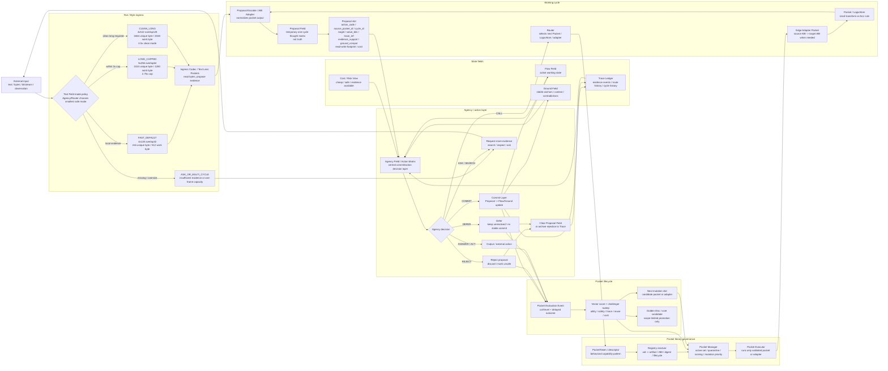

# VRAXION Current Architecture Flowchart

Status: current architecture sketch after E56C.

Boundary: this is an engineering flowchart for the controlled symbolic/numeric
VRAXION probe stack. It is not a claim about AGI, consciousness, raw language
reasoning, deployment quality, or model-scale behavior.

## Current Lock

```text
Input is not committed directly.
Pocket outputs are not committed directly.
Pocket outputs become temporary proposals.
Agency Field decides which proposals become state, action, ask/search, or call.
Text input uses mode selection, not one universal max Text Field.
Pocket loading uses token + registry + manager governance, not filenames.
Core promotion uses vector scoring + challenger sweep, not popularity.
```

## Flowchart



## Text Field Mode Lock From E56C

```text
Do not lock one universal Text Field max.
Lock three mechanically validated modes and require Agency/Router selection.
```

| mode | shape | unique coverage | work byte | role |
|---|---:|---:|---:|---|
| FAST_DEFAULT | 4x128 overlap32 | 416 | 512 | normal local evidence mode |
| LONG_CAPPED | 5x256 overlap64 | 1024 | 1280 | largest mode inside 3x budget |
| CLEAN_LONG | 4x512 overlap128 | 1664 | 2048 | special clean long-text mode |
| ASK_OR_MULTI_CYCLE | n/a | n/a | n/a | missing evidence or too large for one frame |

E56C adversarial result:

```text
three_mode_agency_router success = 1.000000
mode_accuracy = 1.000000
false_commit = 0.000000
overpay = 0.000000
```

## Current Architectural Rules

```text
Direct Flow write is disallowed.
Proposal Field is temporary and one-cycle scoped.
Agency commit boundary is mandatory.
Shared Proposal Field is allowed only with cycle/source/trace/ground/evidence compatibility.
Edge Adapter Pockets handle ABI mismatch between nodes.
Pocket Manager governs active set, lifecycle, quarantine, mutation priority, and promotion.
Text Field mode selection is evidence/coverage/integrity/cost based, not length-only.
```
