# Vraxion Research Process & Archive

This page is the canonical research record for Vraxion. It carries three things in one place: the run contract behind every public claim, a latest-first chronology of what changed, and the archive residue worth keeping after raw noise is stripped away. Read the top block as a standalone reference for how findings are graded and promoted; read the timeline below for the day-by-day trail that led to the current architecture line.

[Vraxion Home](Home) is the mission-first front door, [INSTNCT Architecture](INSTNCT-Architecture) is the implementation explainer, and [Rust Implementation Surface](v5-Rust-Port-Benchmarks) carries detailed Rust validation. All public URLs are collected once in [Core Surfaces](#core-surfaces); the rest of this record references them by name rather than repeating links inline.

## Core Surfaces

One list of live public surfaces for the project. Everywhere else in this record refers back to these by name instead of repeating URLs inline.

- **Main repository:** https://github.com/VRAXION/VRAXION
- **Latest release (v5.0.0-beta.2):** https://github.com/VRAXION/VRAXION/releases/tag/v5.0.0-beta.2
- **All releases:** https://github.com/VRAXION/VRAXION/releases
- **GitHub Pages site:** https://vraxion.github.io/VRAXION/
- **Public wiki home:** https://github.com/VRAXION/VRAXION/wiki
- **Key in-repo docs:** `README.md`, `BETA.md`, `CHANGELOG.md`, `VALIDATED_FINDINGS.md`, `docs/PUBLIC_BETA_TRAINING.md`, `docs/GROWER_RUN_CONTRACT.md`, `docs/BYTE_OPCODE_V1_CONTRACT.md`

## Current Frame

- The stable public release is still `v4.2.0`; the active architecture line is [INSTNCT Architecture](INSTNCT-Architecture). See [Core Surfaces](#core-surfaces) for the release list.
- The Rust `v5.0.0-beta` lane (`instnct-core`) is substantial enough to deserve rich chronology, but remains a beta implementation surface rather than the shipped default.
- The biggest unresolved pressure is no longer basic trainability. It is whether language evaluation, seed variance, and context-dependent task learning survive repeated adversarial reruns, and whether the C19 + float-gradient + fraction-quantization pipeline generalizes beyond the current task suite.
- The current frontier recipe: **C19 activation (learnable rho + C per neuron) + float gradient training + fraction extraction to 4-6 bit integer weights + C19 baked as LUT** — trained in float, deployed as pure integer inference.

## Research Protocol

This is the contract behind public research claims. It keeps shipped code, validated findings, and experimental lines separate even when the chronology gets messy. Every meaningful run needs an objective metric, one budget mode, hard fail gates, and a minimum evidence bundle. A `Current mainline` claim must match code on `main`; reproducible but unshipped results stay under `Validated finding`, and active non-default work stays under `Experimental branch`.

### Required Evidence

The minimum bundle is four files. Optional extras (checkpoints, plots, CSV exports, live logs) are useful but never replace the core bundle.

| Artifact | Purpose |
|---|---|
| `run_cmd.txt` | Exact command and flags used for the run |
| `env.json` | Environment snapshot: OS, GPU/runtime, Python, package versions |
| `metrics.json` | Time series and summary metrics for the run |
| `summary.md` | Human verdict, including PASS/FAIL and the reason |

### Fail Gates

These gates apply uniformly to probes, sweeps, and training runs. Any single hit invalidates the run.

| Gate | Trigger |
|---|---|
| OOM / runtime failure | Any out-of-memory or driver/runtime failure |
| NaN / Inf | Any NaN or Inf in tracked metrics |
| Step-time explosion | `p95(step_time) > 2.5 × median(step_time)` |
| Heartbeat stall | No progress after warmup for `max(60s, 10 × median step time)` |
| VRAM guard breach | Peak reserved VRAM exceeds `0.92 × total VRAM` |

### Sweep Discipline

- Choose exactly one budget mode per sweep: `iso-VRAM`, `iso-params`, or `iso-FLOPs/step`.
- Run the systems curve first (throughput, stability, step-time tails, resource limits). Only run the quality curve after the systems curve is stable.
- Start coarse, then rerun the best cells with multiple seeds under the same contract.
- If a result does not reproduce under the same contract, treat it as unconfirmed.

### Status Labels

| Label | Meaning |
|---|---|
| **Current mainline** | Actually shipped in code on `main`. If code and docs disagree, the code wins. |
| **Validated finding** | Reproducible, but not yet promoted into the canonical code path. |
| **Experimental branch** | Active direction, but should not be described as a default. |
| **Confirmed** | Backed by direct evidence: logs, code, charts, releases, or a reproduced run. |
| **Inferred** | Reconstructed from surrounding evidence rather than first-hand proof. |
| **Archived** | Historically retained for lookup, not a current default or active recommendation. |

## Milestone Rail

Era-level summary of the research arc. Per-day detail lives in the timeline below; this rail exists so a new reader can place any entry into the larger narrative in one glance.

| Era | Window | What changed | Deeper read |
|---|---|---|---|
| Diamond Code era | Early 2026 | Public story centered on LCX / swarm / external-memory framing before INSTNCT became the active center. | Older Timeline, [INSTNCT Architecture](INSTNCT-Architecture) |
| Canon consolidation | 2026-03-22 | Canonical docs hardened, archive branches cut back, public line narrowed around English + evidence discipline. | [Vraxion Home](Home) |
| I/O and schedule breakthrough | 2026-03-27 to 2026-03-29 | Tentacle I/O, SDR input, phi overlap, and compact learnable channel results clarified the current public architecture line. | [INSTNCT Architecture](INSTNCT-Architecture) |
| Rust v5 beta foundation | 2026-04-02 to 2026-04-05 | `instnct-core` became a real evolution substrate: owned `Network`, snapshots, full mutation API, CSR acceleration, genome persistence, multi-seed parallel search. | [Rust Implementation Surface](v5-Rust-Port-Benchmarks) |
| Hyperparameter exhaustion | 2026-04-06 | 11 tuning and strategy axes failed to lift the stable 17-18% band. Pocket-pair depth, shared-interface merges, Watts-Strogatz init all clarified what does **not** create a new regime. | [Rust Implementation Surface](v5-Rust-Port-Benchmarks) |
| Performance deep dive | 2026-04-07 | Smoke-port merged: compact types (-30%), skip-inactive (-49%), sparse tick O(active), sparse input API (-62-72%), CoW snapshots. ListNet vs INSTNCT topology benchmarked on Steam Deck. | [Rust Implementation Surface](v5-Rust-Port-Benchmarks) |
| Edge-ablation and incremental build | 2026-04-08 | Edges irrelevant for bigram lookup but +52pp for addition. 72% ceiling proven seed-deterministic. **Incremental build breakthrough**: 10 neurons achieve 100% train AND test by growing one neuron at a time with exhaustive per-step search. First genuine generalization in the project. Per-neuron resting potential replaces BIAS: all 9 logic gates implementable with 2 neurons + ternary edges (Turing-complete base confirmed). | [Rust Implementation Surface](v5-Rust-Port-Benchmarks) |
| Capability map and gradient era | 2026-04-09 | Readout fix unlocked 7/10 tasks. Float gradient solves all 8. **Connection Point architecture validated** for inter-cluster communication. **ReLU generalizes perfectly across tick depth.** Minimum viable chips: ADD = 1 neuron, binary, no bias. Native charge output: 1-neuron ADD reads the answer off a neuron's charge with no readout layer. Chip composition pipelines ADD into 3-input ADD at 100%. | [Rust Implementation Surface](v5-Rust-Port-Benchmarks) |
| Connectome + integer-deploy pipeline | 2026-04-10 | **Passive relay connectome wins.** Float gradient 200/200 solve rate for ADD. 2D loss landscape smooth. All 5 tasks convert to 4-6 bit integer weights. Two-pool connectome proves C19 structural advantage (40-point gap vs ReLU on MIN). Circuit reuse speeds compatible compound tasks 3.8x. | [Rust Implementation Surface](v5-Rust-Port-Benchmarks) |
| Bias-free grower consolidation | 2026-04-12 | `neuron_grower.rs` consolidated on `main` as a bias-free threshold grower. Removed redundant `bias` parameter from persistent state and search; old bias-bearing state explicitly rejected. | [Rust Implementation Surface](v5-Rust-Port-Benchmarks) |

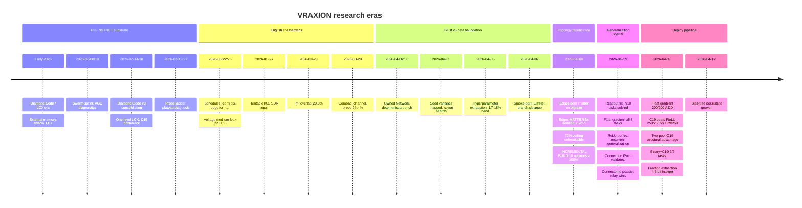

## Active Research Gates

Open gates that still block stronger promotion claims or a cleaner public-beta posture. Each row describes what must hold and what promotion would change.

| Gate | What must hold | What promotion would change |
|---|---|---|
| Public-beta hardening | Tighten newcomer path, make known limitations explicit, improve public intake routing, keep canonical / validated / experimental claims visibly separate under higher traffic. | Turn the current beta-prep lane into a cleaner public-beta surface instead of an internal hardening track. |
| Context-dependent task learning | Show word-pair memory, framed tasks, and windowed input gains hold under reruns and stronger evaluation without collapsing back to context-free behavior. | Promote the task-learning line from active frontier to validated finding. |
| Input-window promotion | Show `w=2` superposition keeps winning across reruns and task families without unstable overflow or masking effects. | Promote a windowed injection policy from evidence into the current recipe. |
| Voltage-aware schedule pressure | Show a voltage-style schedule policy wins on plateau accuracy under confirmation reruns, not only isolated peaks. | Promote from schedule evidence to a stronger recipe candidate. |
| Compact learnable schedule control | Show a low-parameter learnable controller (e.g., 3-angle tree) can match or beat best fixed schedules without drift or overflow. | Promote from exploratory mechanism to validated schedule candidate. |
| Edge representation promotion | Show matched-budget reruns that sign+mag + magnitude resample keeps its quality-per-edge advantage. | Promote a new edge format or mutation policy into the current recipe line. |
| Decay resample promotion | Show single-neuron decay resample in `[0.01, 0.5]` keeps winning over local perturbation across reruns and budgets. | Promote the resample mutation policy into the current recipe line. |
| Low-theta / low-scale generalization | Re-run `INJ_SCALE=1.0` with low theta against the stronger current English recipe stack instead of the older baseline only. | Promote the low-scale line from older validated evidence into the current recipe discussion. |

## Archive Method

This record absorbs durable findings into canon chronology and only leaves raw material separate when it still carries unique source value. Retired surfaces point to their current home below.

| Retired surface | Current home |
|---|---|
| `Glossary`, `Hypotheses`, roadmap-style status pages | This record carries the live terms, active gates, and chronology. |
| Earlier evidence hub | [Vraxion Home](Home), [INSTNCT Architecture](INSTNCT-Architecture), and this record split front-door, implementation, and chronology roles on purpose. |
| `Diamond Code v3 Architecture` | [INSTNCT Architecture](INSTNCT-Architecture) for the current line; Older Timeline below for the retained LCX-era record. |
| Original `Theory of Thought` ledger | [Theory of Thought](Theory-of-Thought) carries the active theory line. |

**Retention rules**

- Keep a raw page only if it still carries unique config, ticket, source, script, or long-form result detail that is not safely compressed into canon prose.
- Demote raw material out of the primary stack and point back to its canon replacement surface.
- If a raw leaf and a canon page disagree, the canon page wins.
- When a new important finding lands, add it at the top of the timeline, keep `What changed` to 2-3 bullets and `Why it mattered` to 1-2 bullets, add one inline evidence object, and say explicitly whether the finding changed canon or stayed experimental.

**Inferred spans and remaining migration work**

- **2026-03-30 to 2026-04-01 (Inferred):** the public record suggests a transition period rather than a single headline discovery, with work shifting from Python-side architecture gains into Rust-port stabilization and benchmark-methodology hardening.
- **Archive migration still incomplete:** several probe leaves, research-intake pages, workbench-era notes, and benchmark-era raw dumps still exist outside this record. They should only disappear once their unique ticket/config/source value is safely captured elsewhere.

## How to Read the Timeline Below

The timeline is ordered latest-first. Each day is a self-contained H3 section with its own evidence table — scan the date header to jump, then read the table rows for the findings and their status. Rows marked **BREAKTHROUGH** in the Status column mark genuine regime shifts (incremental build, Connection Point, passive relay, float gradient, C19 robustness win). Anything before roughly 2026-03-22 lives in the **Older Timeline** block near the bottom, preserving the LCX / Diamond-Code-era record for historical lookup.

---

## Timeline

Jump to date

- [2026-04-12 — Bias-free persistent grower consolidation](#2026-04-12--bias-free-persistent-grower-consolidation)
- [2026-04-10 — Connectome, gradient pipeline, and integer deploy](#2026-04-10--connectome-gradient-pipeline-and-integer-deploy)
- [2026-04-09 — Capability map, readout fix, and float gradient](#2026-04-09--capability-map-readout-fix-and-float-gradient)
- [2026-04-08 — Edges, generalization, and incremental build breakthrough](#2026-04-08--edges-generalization-and-incremental-build-breakthrough)
- [2026-04-07 — Performance deep dive and topology representation](#2026-04-07--performance-deep-dive-and-topology-representation)
- [2026-04-06 — Hyperparameter exhaustion and library hardening](#2026-04-06--hyperparameter-exhaustion-and-library-hardening)
- [2026-04-05 — Rust v5 beta hardening and seed variance](#2026-04-05--rust-v5-beta-hardening-and-seed-variance)
- [2026-04-02 to 2026-04-03 — Deterministic benchmarking and owned Rust Network](#2026-04-02-to-2026-04-03--deterministic-benchmarking-and-owned-rust-network)
- [2026-03-30 to 2026-04-01 — Transition period (Inferred)](#2026-03-30-to-2026-04-01--transition-period-inferred)
- [2026-03-29 — Compact parameter stack and breed breakthrough](#2026-03-29--compact-parameter-stack-and-breed-breakthrough)
- [2026-03-28 — Phi overlap and richer output readout](#2026-03-28--phi-overlap-and-richer-output-readout)
- [2026-03-27 — I/O architecture overhaul: sparse-in / dense-out](#2026-03-27--io-architecture-overhaul-sparse-in--dense-out)
- [2026-03-22 to 2026-03-26 — English line hardens](#2026-03-22-to-2026-03-26--english-line-hardens)
- [2026-03-25 — Resonator Theory](#2026-03-25--resonator-theory)
- [2026-03-22 — Recipe consolidation and canon freeze](#2026-03-22--recipe-consolidation-and-canon-freeze)
- [2026-03-21 — Canonical Docs and Schedule Research](#2026-03-21--canonical-docs-and-schedule-research)
- [2026-02-26 — Hidden/slot split and v4 precompute sprint](#2026-02-26--hiddenslot-split-and-v4-precompute-sprint)
- [2026-02-20 to 2026-02-22 — LCX bottleneck, contamination, plateau diagnosis](#2026-02-20-to-2026-02-22--lcx-bottleneck-contamination-plateau-diagnosis)
- [2026-02-19 — Probe ladder and cold-brain sweep burst](#2026-02-19--probe-ladder-and-cold-brain-sweep-burst)
- [2026-02-14 to 2026-02-18 — Diamond Code v3 consolidation](#2026-02-14-to-2026-02-18--diamond-code-v3-consolidation)
- [2026-02-08 to 2026-02-10 — Swarm sprint and pre-INSTNCT consolidation](#2026-02-08-to-2026-02-10--swarm-sprint-and-pre-instnct-consolidation)
- [Early Feb 2026 — Research intake wave](#early-feb-2026--research-intake-wave)
- [Early 2026 — Diamond Code Era](#early-2026--diamond-code-era)

---

### 2026-04-12 — Bias-free persistent grower consolidation

**Theme:** Validated cleanup of the persistent grower path: remove redundant `bias` parameter, make the threshold neuron store/evaluate in direct `dot >= threshold` form.

| Seq | Finding | Status | Source |
|---|---|---|---|
| 1 | `instnct-core/examples/neuron_grower.rs` consolidated onto `main` as a bias-free threshold grower. Grower neuron now stored/evaluated as `dot >= threshold`; old `bias + dot >= threshold` parameterization removed from the persistent grower path. | Current mainline | [Rust Implementation Surface](v5-Rust-Port-Benchmarks) |
| 2 | Scout-guided ternary search normalized to the bias-free form. No hidden `bias=-1` offset remains in guided search, blind search, runtime eval, `state.tsv`, or per-step / final JSON checkpoints. | Current mainline | [Rust Implementation Surface](v5-Rust-Port-Benchmarks) |
| 3 | Persistent state is now intentionally breaking for this path: old bias-bearing `state.tsv` rows are rejected instead of silently reinterpreted. | Current mainline | [Rust Implementation Surface](v5-Rust-Port-Benchmarks) |
| 4 | Rationale: `bias + dot >= threshold` is algebraically equivalent to `dot >= threshold - bias`, so carrying both only inflated search and serialized state. Removing `bias` cuts ops and state width on edge-hardware deployment without shrinking the threshold-neuron function class. | Current mainline | [Rust Implementation Surface](v5-Rust-Port-Benchmarks) |
| 5 | Cleanup clarifies future activation experiments: C19 `c` and `rho` are shape parameters, not hidden replacements for threshold bias. Threshold grower and any future C19 grower now have clean separation. | Current mainline | [Rust Implementation Surface](v5-Rust-Port-Benchmarks) |
| 6 | Evidence — formula equivalence: PASS on 200 random ternary weight vectors over full 9-bit input space. | Confirmed | [Rust Implementation Surface](v5-Rust-Port-Benchmarks) |
| 7 | Evidence — search equivalence: PASS on `digit_parity`, `is_digit_gt_4`, `digit_2_vs_3`, `is_symmetric` across multiple parent sets. | Confirmed | [Rust Implementation Surface](v5-Rust-Port-Benchmarks) |
| 8 | Evidence — fresh grower smoke test: PASS, new bias-free `state.tsv` and `final.json` produced correctly. | Confirmed | [Rust Implementation Surface](v5-Rust-Port-Benchmarks) |
| 9 | Evidence — resume smoke test: PASS, resumed from new state format and continued growth normally. | Confirmed | [Rust Implementation Surface](v5-Rust-Port-Benchmarks) |
| 10 | Evidence — old-state guardrail: PASS, old 10-column bias-bearing state explicitly rejected. | Confirmed | [Rust Implementation Surface](v5-Rust-Port-Benchmarks) |
| 11 | Promoted: bias-free threshold neuron as canonical persistent grower representation; explicit schema break for `neuron_grower` persistent state over silent backward-compat shims. | Confirmed | [Rust Implementation Surface](v5-Rust-Port-Benchmarks) |
| 12 | Rejected: treating C19 `c`/`rho` as implicit replacements for threshold bias in the current grower. | Confirmed | [Rust Implementation Surface](v5-Rust-Port-Benchmarks) |

---

### 2026-04-10 — Connectome, gradient pipeline, and integer deploy

**Theme:** Binary-space native-output impossible; float gradient solves everything; fraction extraction converts floats to 4-6 bit integer weights. Two-pool connectome proves C19's structural advantage.

> [!IMPORTANT]
> **BREAKTHROUGH — Connectome passive relay wins.**
> Sweep: passive / active / sparse connectome x 5 tasks x 8 seeds. Passive relay
> wins (96% mean on \|a-b\| vs 94% active). Sparse random connections = zero
> benefit. Binary plus/minus 1 matches ternary performance at ~100x speed.
> Connectome only needed for \|a-b\| (72% to 100%). Simplest architecture wins.

> [!IMPORTANT]
> **BREAKTHROUGH — Float gradient: 200/200 solve rate for ADD.**
> Random float init + gradient descent: ADD 200/200 (3 workers), \|a-b\| 199/200
> (6 workers), MUL 158/200 (6 workers). Init scale=0.5 best. Loss landscape is
> smooth — one big valley, no local minima. Gradient converges in 50-100 steps.

> [!IMPORTANT]
> **BREAKTHROUGH — C19 periodic parabolic activation beats ReLU.**
> 5 tasks x 50 seeds. C19: **250/250** total solve rate. ReLU: 189/250 (fails on
> MAX 29/50, MIN 21/50, MUL 39/50). Learnable rho converges to ~5.1 (ADD/MUL) and
> ~4.1 (\|a-b\|), not fixed 4.0. Two-pool connectome: ReLU MIN 10/50, C19 MIN
> 50/50 — 40-point structural gap. C19's periodic wave materially helps
> cross-cluster information transfer.

**[Float gradient solve rates — 2026-04-10]**

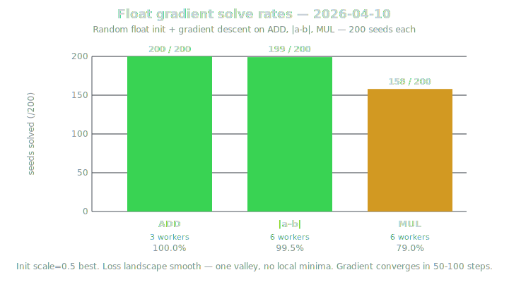

*Init scale=0.5 best. Loss landscape smooth — one valley, no local minima. Gradient converges in 50-100 steps.*

**[C19 vs ReLU — 5 tasks × 50 seeds — 2026-04-10]**

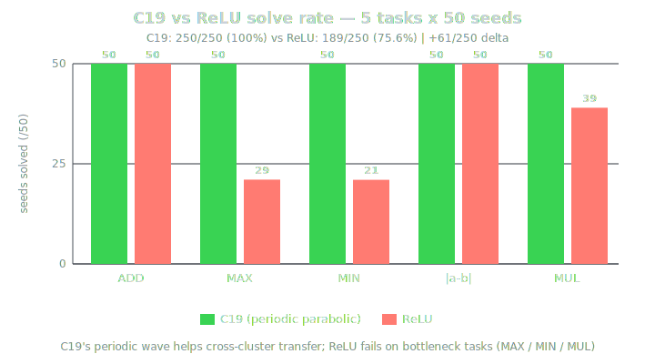

**Learnable parameter convergence (not fixed 4.0):**
- rho: ~5.1 for ADD/MUL; ~4.1 for \|a-b\|
- C: ADD≈5.0, MAX≈3.0, MIN≈2.5, \|a-b\|≈1.5 (task-dependent)

**Two-pool connectome (MIN task only):** ReLU 10/50 vs C19 50/50 — 40pp structural gap.

**[Circuit reuse speedups — frozen ADD as pre-trained substrate — 2026-04-10]**

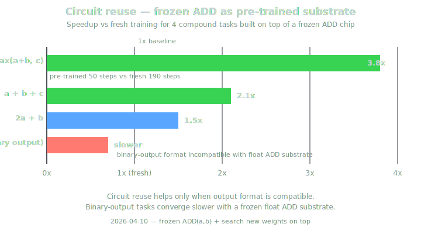3 binary output slower — horizontal bar chart" width="720">

*Circuit reuse helps only when output format is compatible. Binary-output tasks converge slower with a frozen float ADD substrate.*

**[Overnight scaling sweep — 2026-04-10]**

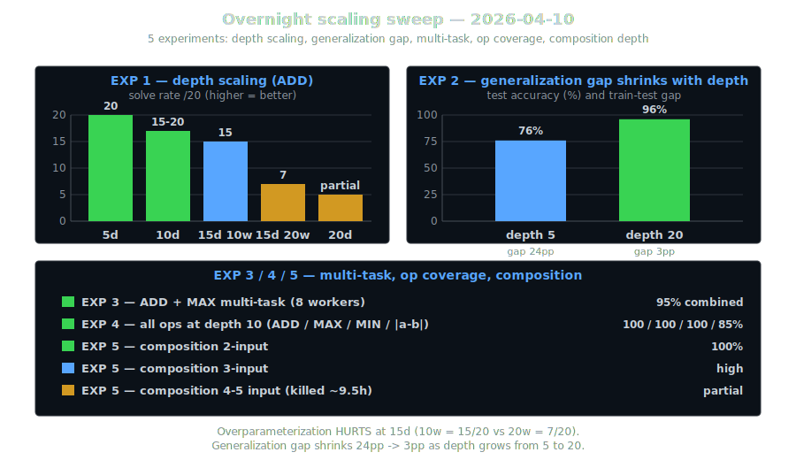

*Overparameterization hurts at 15d (10w beats 20w). EXP 2 generalization gap shrinks from 24pp at 5d to 3pp at 20d.*

**[Two-pool connectome — C19 vs ReLU bottleneck gap — 2026-04-10]**

| Pool topology | Activation | MIN solve rate | Gap |
|---|---|---|---|
| Single-pool | ReLU | — | 61pp |
| Single-pool | C19 | — | — |
| Two-pool | ReLU | 10/50 | 80pp |
| Two-pool | C19 | 50/50 | — |

*C19 advantage GROWS with bottleneck severity: single-pool gap=61pp → two-pool gap=80pp. ReLU degrades with more ticks (overprocessing); C19 stays 50/50. Periodic wave genuinely helps cross-cluster information transfer.*

**[Binary ±1 + C19 exhaustive sweep — 2026-04-10]**

| Task | C19 workers | C19 result | ReLU binary result |
|---|---|---|---|
| ADD | 2 | 100% | — |
| MAX | 7 | 100% | — |
| MIN | 5 | 100% | — |
| \|a-b\| | — | stuck at 92% | — |
| MUL | — | stuck at 92% | best 88% |

*ReLU binary: 0/5 solved (best=88% on MUL). C19's periodic wave makes binary search space viable; binary+ReLU was 0/8192 configurations.*

**[Fraction extraction to integer weights — 2026-04-10]**

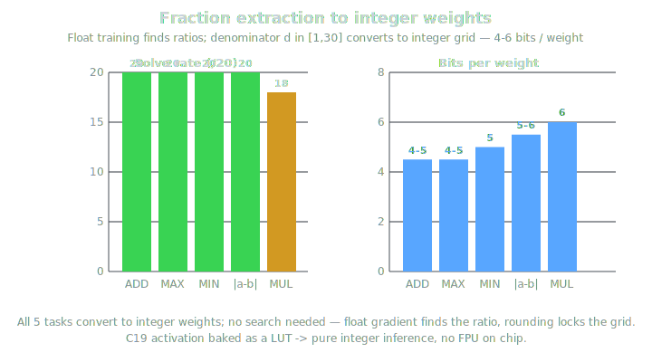

*All 5 tasks convert to integer; no search needed — float training finds ratios, denominator d∈[1,30] gives integer grid via weights = round(float×d)/d. C baked as LUT.*

| Seq | Finding | Status | Source |
|---|---|---|---|
| 1 | SOLUTION DENSITY: Exhaustive scan of all 8192 binary configs for 1 worker shows ZERO achieve even 40% accuracy (native output). The gradient does ALL the work — binary search is just a random starting point. | BREAKTHROUGH / Confirmed | [Rust Implementation Surface](v5-Rust-Port-Benchmarks) |
| 2 | FLOAT GRADIENT solve rates — random float init + gradient descent across ADD / \|a-b\| / MUL (200 seeds each). See table above. Init scale=0.5 best; loss landscape is smooth (one big valley, no local minima); gradient converges in ~50-100 steps. | BREAKTHROUGH / Confirmed | [Rust Implementation Surface](v5-Rust-Port-Benchmarks) |
| 3 | INT8 QUANTIZATION pipeline. Post-training quantization results: • **int4 (16 levels)**: 100% for ADD on single seed • **int8 (256 levels)**: 85/100 seeds survive for ADD Step size 0.008 = max error 0.004. Pipeline: float gradient → i8 quantize → integer-only inference. Native Rust `i8` type, already used in `Int8Projection`. | BREAKTHROUGH / Confirmed | [Rust Implementation Surface](v5-Rust-Port-Benchmarks) |
| 4 | 2D LOSS LANDSCAPE: ASCII heatmap visualization confirms ADD landscape is one smooth funnel. Close-up: high-accuracy zone (96-99%) fills most of ±0.3 around solution. Wide view: small bright peak in noise. Very wide (±5): needle in haystack, but gradient ALWAYS finds it because the slope is consistent. | BREAKTHROUGH / Confirmed | [Rust Implementation Surface](v5-Rust-Port-Benchmarks) |
| 5 | CIRCUIT REUSE: frozen ADD speeds up compatible tasks. See table above. Pre-trained ADD(a,b) frozen → train new workers on compound tasks. BUT (a+b)>3 (binary output, incompatible format) is WORSE — circuit reuse only helps when output format is compatible. | BREAKTHROUGH / Confirmed | [Rust Implementation Surface](v5-Rust-Port-Benchmarks) |
| 6 | OVERNIGHT SCALING — 5 experiments exploring depth / generalization / multi-task / op coverage / composition depth. See table above. Key takeaways: overparameterization HURTS at 15d (10w=15/20 vs 20w=7/20); generalization improves with scale (24pp→3pp gap); composition tops out at 3-input high / 4-5 input partial. | BREAKTHROUGH / Confirmed | [Rust Implementation Surface](v5-Rust-Port-Benchmarks) |
| 7 | C19 vs ReLU robustness sweep across 5 tasks × 50 seeds. See table above. C19's periodic parabolic activation (rho+C learnable per neuron) materially beats ReLU on MAX / MIN / MUL while tying on ADD / \|a-b\|; ReLU failure is concentrated in the bottleneck tasks. | BREAKTHROUGH / Confirmed | [Rust Implementation Surface](v5-Rust-Port-Benchmarks) |
| 8 | TWO-POOL CONNECTOME: two isolated neighborhoods (A sees input_a, B sees input_b) communicate ONLY through connectome. See table above. C19's structural advantage grows with bottleneck severity — ReLU degrades with more ticks (overprocessing) while C19 stays at 50/50. | BREAKTHROUGH / Confirmed | [Rust Implementation Surface](v5-Rust-Port-Benchmarks) |
| 9 | BINARY+C19 EXHAUSTIVE — greedy constructive ±1 weight search plus C sweep. See table above. C19's periodic wave makes binary search space viable (binary+ReLU was 0/8192 configurations). | BREAKTHROUGH / Confirmed | [Rust Implementation Surface](v5-Rust-Port-Benchmarks) |
| 10 | FRACTION EXTRACTION float→integer via common denominator: float train → find denominator d (1-30) → weights = round(float×d)/d → test. See table above. No search needed — float training finds ratios, denominator gives integer grid. C baked as LUT. | BREAKTHROUGH / Confirmed | [Rust Implementation Surface](v5-Rust-Port-Benchmarks) |
| 11 | Current frontier pipeline: C19 + float gradient + fraction quantization. Train with float gradient (C19 rho+C learnable) → 100% all tasks. Deploy with fraction extraction (4-6 bit integer weights) and C19 baked as LUT → pure integer inference, no FPU needed on chip. Two-pool connectome validated for cross-cluster communication. Next: greedy freeze-per-layer construction, analytic backprop, scaling tests with integer pipeline. (see also [INSTNCT Architecture](INSTNCT-Architecture)) | Current frontier | [Rust Implementation Surface](v5-Rust-Port-Benchmarks) |

---

### 2026-04-09 — Capability map, readout fix, and float gradient

**Theme:** Complete holographic capability map; nearest-mean readout unlocks 5 more tasks; float gradient + per-neuron bias solves everything; ReLU uniquely generalizes across tick depth; Connection Point architecture validated.

> [!IMPORTANT]
> **BREAKTHROUGH — Connection Point architecture validated.**
> Shared bulletin boards between neurons. Each neuron reads CPs + local neighbors
> + input, writes to one CP. Search space is CONSTANT: 12 params = 531K from
> neuron 4 onwards. Recurrent ADD through CP: 100% at all depths. CP provides a
> 1-tick delayed shared register for inter-cluster communication.

**[Holographic capability map — 2026-04-09]**

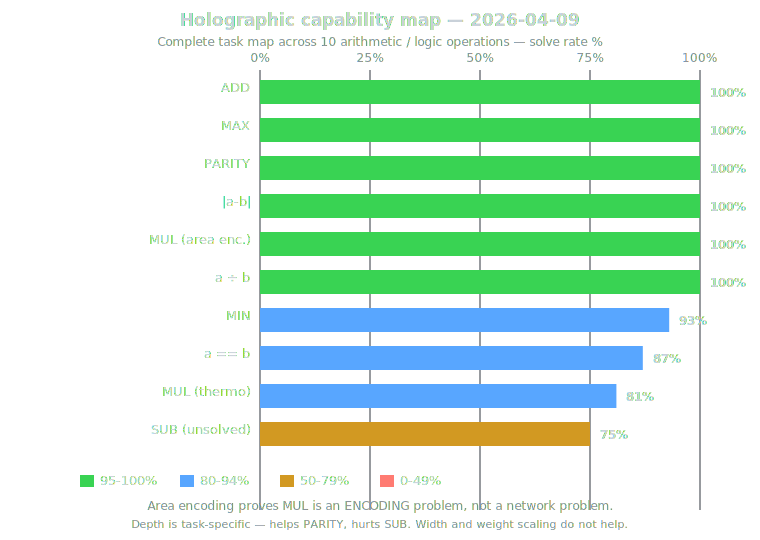

*Area encoding proves MUL is an ENCODING problem, not a network problem. Depth is task-specific: helps PARITY, hurts SUB. Width/weight scaling do not help.*

| Seq | Finding | Status | Source |
|---|---|---|---|
| 1 | Overnight capability map + encoding breakthrough: complete holographic task map across 10 operations. See table above. Area encoding proves MUL is an ENCODING problem, not a network problem; depth is task-specific (helps PARITY, hurts SUB); width/weight scaling don't help. | Confirmed | [Rust Implementation Surface](v5-Rust-Port-Benchmarks) |
| 2 | READOUT WAS THE BOTTLENECK — 7/10 tasks solved. Switching from output/calibration→round to nearest-mean readout unlocked MUL (100%), SUB, MIN, a==b, \|a-b\|. Output/cal readout divided by zero for MUL (1×0=0). 3 neurons + integer ±2 + signed square + nearest-mean = 7/10 tasks at 100%. | BREAKTHROUGH / Confirmed | [Rust Implementation Surface](v5-Rust-Port-Benchmarks) |
| 3 | Float gradient solves ALL 8 tasks: per-neuron bias + float weights + numerical gradient + nearest-mean readout drives MUL, PAR, and a==b from unsolved to 100%. Per-connection bias is WORSE (overparameterized). N=8 neurons, 72 float params, 30 starts × 10K gradient steps. | BREAKTHROUGH / Confirmed | [Rust Implementation Surface](v5-Rust-Port-Benchmarks) |
| 4 | Weight range scaling: Binary ±1 solves MUL at N=3 (margin=0.3). More neurons = bigger margin: N=15 binary margin=13; ±2 N=3 margin=30. Bits × neurons = constant quality tradeoff. | Confirmed | [Rust Implementation Surface](v5-Rust-Port-Benchmarks) |
| 5 | CHIP COMPOSITION: 100% on 3-input addition. Frozen ADD chip (3 neurons) + searched wiring → 100% on ADD(a,b,c). Pipeline composition beats flat search (100% vs 92%). Perturbation finds solution in 14K steps. 4-input: 98.9% with 3 chained chips. | BREAKTHROUGH / Confirmed | [Rust Implementation Surface](v5-Rust-Port-Benchmarks) |
| 6 | Recurrent chip: same W, multiple ticks. Same chip reused across ticks (one digit per tick). Signed square EXPLODES (7% at 3-input). Normalized: partial (78% 3→4). Key: activation function determines generalization. | Confirmed | [Rust Implementation Surface](v5-Rust-Port-Benchmarks) |
| 7 | ReLU PERFECTLY GENERALIZES across tick depth. ReLU is the ONLY activation achieving 100% recurrent generalization. 3 neurons trained on 3-input → 100% on 2,3,4,5,6,7,8 inputs; 17/20 random seeds perfect. **Recurrent generalization by activation:** • ReLU: 100% (17/20 seeds perfect) • tanh: 18% • sigmoid: 3% • signed_square: 0% ReLU's max(0,x) is linear in positive range (preserves accumulation) and clamps negative drift. | BREAKTHROUGH / Confirmed | [Rust Implementation Surface](v5-Rust-Port-Benchmarks) |
| 8 | All ops work with per-neuron bias; per-connection unnecessary. Tested ADD/MUL/MAX/MIN/AND/OR/XOR/NAND: per-neuron bias = per-connection bias on all ops. XOR also 100% generalization. MUL collapses beyond 4-input (bilinear, non-accumulative). | Confirmed | [Rust Implementation Surface](v5-Rust-Port-Benchmarks) |
| 9 | MINIMUM VIABLE CHIP: ADD = 1 neuron, binary, no bias. ADD works with 1 neuron, binary ±1 weights, ZERO bias. 5 bits total = 32 exhaustive configs. XOR needs 2 neurons minimum. MAX needs ternary + 2 neurons. Every config tested exhaustively. | BREAKTHROUGH / Confirmed | [Rust Implementation Surface](v5-Rust-Port-Benchmarks) |
| 10 | NATIVE OUTPUT: charge IS the answer, no readout. 1-neuron ADD chip W=[1,1,1,1,1] bias=0 outputs charge = sum EXACTLY. No nearest-mean, no centroids, no calibration. 10-input (9.7M examples): 100% with just round(charge). COUNT chip also works natively: W=[1,1,0,0,0]. | BREAKTHROUGH / Confirmed | [Rust Implementation Surface](v5-Rust-Port-Benchmarks) |
| 11 | Byte ALU: binary encoding harder than thermometer. 8-bit binary in/out: ADD 28%, XOR 25% — carry propagation too hard. Hybrid thermo→binary: only OR works. Binary encoding fundamentally harder for neural chips than thermometer. | Confirmed | [Rust Implementation Surface](v5-Rust-Port-Benchmarks) |
| 12 | Multi-seed search fixes OR generalization. OR was never fundamentally broken — bad seed was the problem. 8-seed search → OR 100% at all depths. Readout method doesn't matter (tested 5 methods, all ~equal). Bottleneck is chip weights/seed, not readout. | Confirmed | [Rust Implementation Surface](v5-Rust-Port-Benchmarks) |
| 13 | Connection Point architecture VALIDATED. Shared bulletin boards between neurons. Each neuron reads CPs + local neighbors + input, writes to one CP. Search space CONSTANT: 12 params = 531K from neuron 4 onwards. Recurrent ADD through CP: 100% at all depths. CP provides 1-tick delayed shared register for inter-cluster communication. | BREAKTHROUGH / Confirmed | [Rust Implementation Surface](v5-Rust-Port-Benchmarks) |
| 14 | CONNECTOME ARCHITECTURE (straddles 2026-04-09 / 2026-04-10): passive relay wins. Sweep: passive/active/sparse connectome × 5 tasks × 8 seeds. Passive relay wins (96% mean \|a-b\| vs 94% active). Sparse random connections = zero benefit. Binary ±1 = ternary performance (100x faster). Connectome needed ONLY for \|a-b\| (72% → 100%). 4 architectures tested, passive simplest+best. | BREAKTHROUGH / Confirmed | [Rust Implementation Surface](v5-Rust-Port-Benchmarks) |

---

### 2026-04-08 — Edges, generalization, and incremental build breakthrough

**Theme:** Edges don't matter on bigram, do matter (+52pp) on addition; memorization vs generalization; 72% ceiling unbreakable by search; incremental build achieves 100% generalization with 10 neurons; resting potential replaces BIAS; holographic > pathway; shared W > layered W; activation sweep; spike erases amplitude.

> [!IMPORTANT]
> **BREAKTHROUGH — Incremental build: 10 neurons = 100% generalization.**
> First project result with non-zero held-out test accuracy on addition. Build 1
> neuron at a time, exhaustive search per step, freeze what works. 10 neurons
> reach 100% train AND 100% test on held-out sum=4. Previous best with 256 neurons
> was 72% train, 0% test. Each step searches 3^19 instead of 3^90. Validates the
> brain-development hypothesis: grow incrementally, not all-at-once.

> [!NOTE]
> **Correction — ListNet "6x faster" was an unfair 1+1 vs 1+9 comparison.**
> Fair 1+1 vs 1+1: INSTNCT library wins at H>=512 (+26% / +65% / +130% at H=512 /
> 1024 / 2048). ListNet wins only at H=256 (+8%). The earlier claim is kept in
> the archive but downgraded.

> [!WARNING]
> **Rejected — stateful training (no reset between examples).**
> Train drops from 60-65% (with reset) to 10-30% (no reset). State carry becomes
> noise, not procedural learning. Do not re-run unless the dynamics model changes.

**[Paradigm progression — held-out generalization solve rate]**

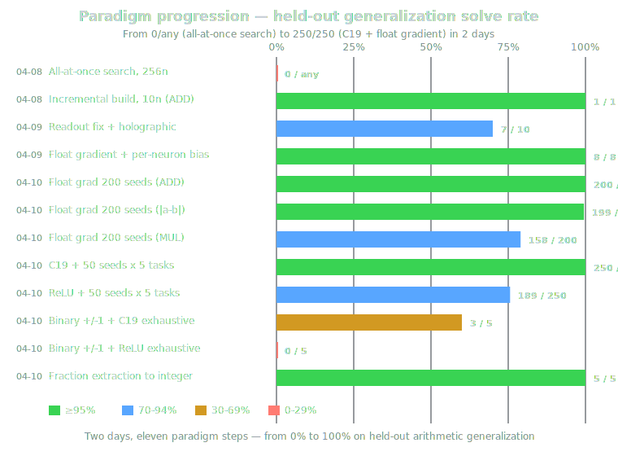

**[ListNet vs INSTNCT head-to-head — H=256 — 2026-04-08]**

| Topology | Step/s | Accuracy | Speedup |
|---|---|---|---|
| ListNet | 3847 | 20.4% | 6.8x |
| INSTNCT | 564 | 20.6% | 1x |

*Accuracy noise-equivalent. At H=2048: ListNet gives 2.5x speedup with identical accuracy.*

**[Edge cap sweep — H=1024 — 2026-04-08]**

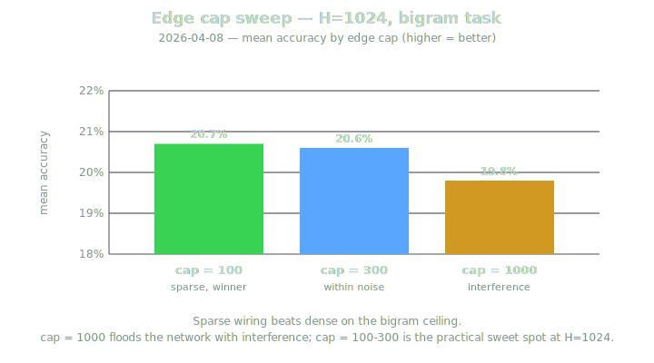

**[H=512 long stability run — 5 seeds × 300s — 2026-04-08]**

| Metric | Value |
|---|---|
| Best | 20.8% |
| Mean | 20.0% |
| Spread | 1.4pp |
| Throughput | 2.0 µs/token |

**[Fair 1+1 vs 1+1 — INSTNCT library speedup by H — 2026-04-08]**

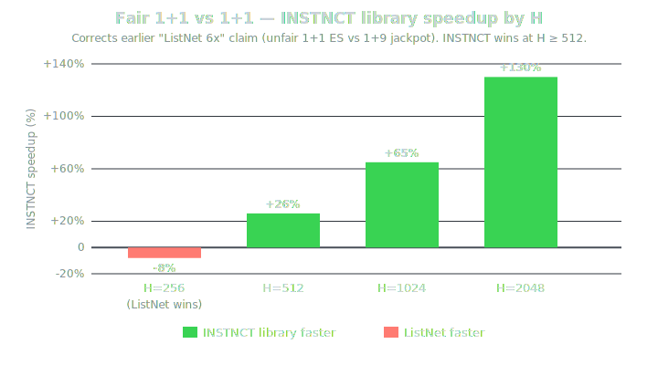

*Corrects earlier "ListNet 6x faster" claim, which was an unfair 1+1 ES vs 1+9 jackpot comparison. Packed NeuronParams (threshold+channel+polarity in one 4-byte struct): 8-10% faster spike loop at all H.*

**[Four alternative topology representations — H=256 — 2026-04-08]**

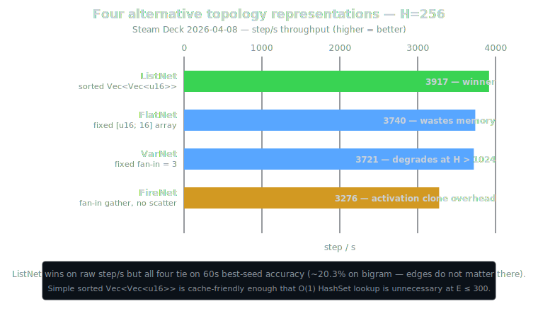1024, FireNet 3276 activation clone overhead — horizontal bar chart" width="760">

**[Edges matter for addition — INSTNCT vs ListNet — 2026-04-08]**

*Task: a+b in 0-4 (25 examples), random baseline = 11.1%.*

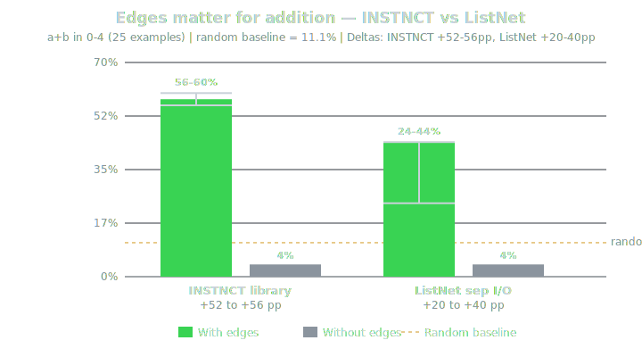

*INSTNCT beats ListNet on addition (56-60% vs 24-44%) despite same edge count. Answers "do edges matter": task-dependent — bigram = lookup (phi-overlap short-circuit, 0pp); addition = computation (edge topology builds the computing circuit).*

**[Incremental build growth trace — 2026-04-08]**

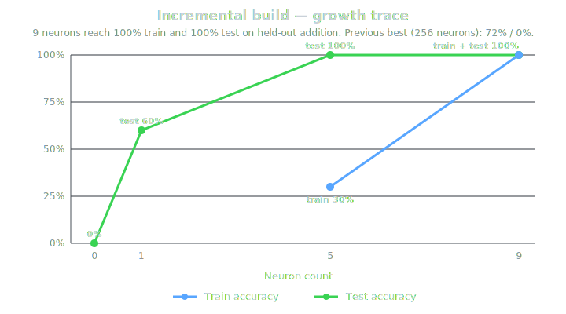

*Previous best with 256 neurons: 72% train, 0% test. Each step searches 3^19 instead of 3^90 (frozen layers + incremental expansion).*

**[Approach comparison — held-out addition generalization]**

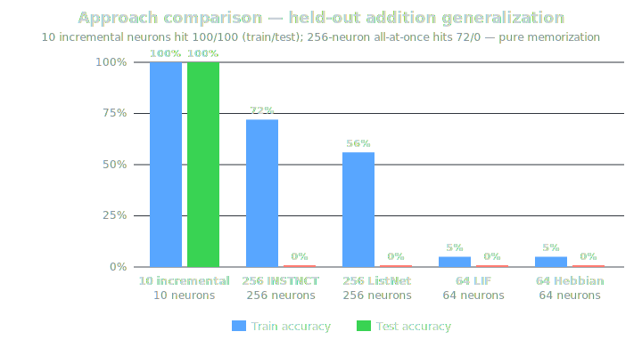

| Seq | Finding | Status | Source |
|---|---|---|---|
| 1 | Overnight ListNet validation (5 sweeps, Steam Deck): ListNet (sorted `Vec<Vec<u16>>` topology) validated as production replacement for INSTNCT's HashSet+CSR. See tables above for head-to-head, edge cap sweep, and long H=512 stability. Cache A/B/C/D sweep: smooth O(H) scaling with no discontinuities at L1/L2 boundaries (INSTNCT showed cliffs; ListNet does not). Promoted: ListNet as recommended topology; edge cap=100-300 optimal; H=512 recommended Steam Deck local config. Rejected: precompiled/CSR over `Vec<Vec<u16>>` at E≤300, FlatNet, FireNet. | Confirmed | [Rust Implementation Surface](v5-Rust-Port-Benchmarks) |
| 2 | Fair comparison correction + memory layout profiling. Initial overnight "6x faster" ListNet claim was unfair (ListNet 1+1 ES vs INSTNCT 1+9 jackpot). Fair 1+1 vs 1+1 result: see table above. Packed NeuronParams (threshold+channel+polarity in one 4-byte struct): 8-10% faster spike loop at all H; charge+activation stay separate (packed state helps H≤512, hurts H≥2048 due to write-back cache pollution). Four alt reps in separate table above. Promoted: packed NeuronParams; interference reduction via low edge cap (100-300); 20% ceiling as confirmed 1+1 ES limit. Corrected: "ListNet 6x faster" → "ListNet simpler but not faster at H≥512 fair." Rejected: all-in-one rows (ListNet2), FireNet gather, FlatNet. | Confirmed (corrects prior) | [Rust Implementation Surface](v5-Rust-Port-Benchmarks) |
| 3 | Overnight ListNet sweeps + fair comparison summary: edge cap=100 > cap=1000 (interference reduction validated), 20% band is 1+1 ES ceiling, no cache cliff. | Confirmed | [Rust Implementation Surface](v5-Rust-Port-Benchmarks) |
| 4 | EDGES DON'T MATTER on bigram (deterministic ablation proof): Deterministic ablation on H=512 network trained 50K steps on 100KB Alice corpus. All four configs collapse to identical accuracy: • **trained (298 edges)**: 20316/100000 (20.3%) • **removed (0 edges)**: 20316/100000 (20.3%) • **random (298 edges)**: 20316/100000 (20.3%) • **params-only (0 edges)**: 20317/100000 (20.3%) Network achieves 20.3% using only neuron parameters (threshold, channel, polarity). Confirmed by three independent approaches: expensive 200-token eval rejected edges as noise, freeze-crystallize found no edges worth freezing, deterministic full-corpus ablation. Invalidates all topology reps (ListNet, VarNet, FireNet, FlatNet, INSTNCT CSR) as accuracy-relevant for this task. The bigram task is solvable via input→output direct projection through phi-overlap zone. Breaking past 20.3% requires a harder task or a learnable readout. Promoted: "edges don't matter on bigram" as confirmed finding. Rejected: all freeze-layer strategies. Freeze-layer, burst, prune all confirmed same ceiling. | BREAKTHROUGH / Confirmed | [Rust Implementation Surface](v5-Rust-Port-Benchmarks) |
| 5 | Edges MATTER for computation tasks (addition +52pp ablation): see table above. Answers "do edges matter": task-dependent. Bigram = lookup (phi-overlap short-circuit, 0pp). Addition = computation (edge topology builds the computing circuit). Phi overlap short-circuits bigram: input charge directly visible at output, no propagation needed. Corrected: "edges don't matter" downgraded from universal to bigram-specific. Retained: phi-overlap short-circuit is a feature for language tasks, not a bug. | BREAKTHROUGH / Confirmed | [Rust Implementation Surface](v5-Rust-Port-Benchmarks) |
| 6 | INSTNCT memorizes, does NOT generalize: Generalization test: 0% test accuracy on held-out addition examples. Train/test split on 0-4 and 0-9 ranges all show pure memorization. Memorization capacity ≈ 1 example per edge. The spiking network builds lookup tables, not algorithms. | Confirmed | [Rust Implementation Surface](v5-Rust-Port-Benchmarks) |
| 7 | 72% ceiling unbreakable + stateful training fails. Push100 (jackpot 1+9, 5min/seed, edge_cap 100/300/500): same seed-deterministic result. Seed 42=60%, seed 1042=72%, seed 2042=60%. Addition diagnose: predicts by memorizing input-output pairs. Sum=4 (5 input combos) worst at 20-40%; sum=0 and sum=8 (1 input each) easiest. Freeze-grow (prune-freeze cycles): flatlines after cycle 0; ~19 edges in first cycle, 0 beneficial mutations afterwards. Stateful training (no reset): state carry causes noise, not procedural learning; train drops from 60-65% (with reset) to 10-30% (no reset); edge count floods to cap (300); test still 0%. 0-9 addition (100 examples, 19 classes): only 27-30% at ~35 edges. Memorization capacity ≈ 1 example per edge. Rejected: jackpot as ceiling breaker, freeze-grow, stateful training, more ticks, higher edge cap. Limiting factor is architecture's inability to build compositional/algorithmic circuits. | Confirmed | [Rust Implementation Surface](v5-Rust-Port-Benchmarks) |
| 8 | Spike erases amplitude, fly brain analysis, LIF/Hebbian dead ends. Micro traces showed binary spike destroys input amplitude. Fly LIF (dual g+v) too complex for mutation search (5% train). Hebbian on random topology = no signal. Fly brain (Shiu 2024) uses additive synapses + dual exponential decay — fundamentally different from single-charge INSTNCT. | Confirmed | [Rust Implementation Surface](v5-Rust-Port-Benchmarks) |
| 9 | Exhaustive proof: only 2/6561 configs generalize. On 8-input thermometer addition, exactly 2 ternary weight configs achieve 100% generalization: [+1,+1,+1,+1,+1,+1,+1,+1] and [-1,-1,-1,-1,-1,-1,-1,-1]. Both = uniform weights = SUM neuron. The generalizing solution is 0.03% of the search space. | Confirmed | [Rust Implementation Surface](v5-Rust-Port-Benchmarks) |
| 10 | INCREMENTAL BUILD: 100% generalization with 10 neurons. Build 1 neuron at a time, exhaustive (or large random sample) search over all ternary connections to existing neurons, keep best, freeze, add next. See growth-trace and approach-comparison tables above. Insight chain: (1) spike erases amplitude → need continuous charge; (2) only 2/6561 ternary configs generalize = 0.03%; (3) both winners = uniform SUM; (4) SUM abstracts perfectly but readout was wrong; (5) generalizing solution EXISTS but random/mutation can't find it; (6) incremental search reduces space from 3^90 to 3^19 per step; (7) frozen layers provide stable foundation. First time project achieved generalization. Validates "brain development" hypothesis (incremental embryo → adult). Promoted: incremental neuron-by-neuron build; thermometer encoding; continuous charge readout (not binary spike); every-neuron-is-I/O topology. Rejected: all-at-once search, Hebbian on random topology, LIF + mutation search, stateful training, freeze-crystal cycles. | BREAKTHROUGH / Confirmed | [Rust Implementation Surface](v5-Rust-Port-Benchmarks) |
| 11 | Tick robustness: circuit is tick=8 only. The 10-neuron circuit only works at tick=8. Other tick counts → 0% test. The circuit learned TIMING, not algorithm. No-decay version same problem. Need tick-variable training for true algorithm. | Confirmed | [Rust Implementation Surface](v5-Rust-Port-Benchmarks) |
| 12 | Resting potential replaces BIAS neuron. Per-neuron resting potential (decay toward resting, not toward 0) replaces explicit BIAS neuron. ALL 9 logic gates (AND/OR/NOT/XOR/NAND/NOR/XNOR/IMPLY/BUF) work with just 2 neurons + resting param + ternary edges, ZERO hidden neurons. Turing-complete base confirmed. | Confirmed | [Rust Implementation Surface](v5-Rust-Port-Benchmarks) |
| 13 | Holographic vs pathway: mathematical proof. Holographic (1-step matrix multiply) has 0.0025% generalizing solutions. Pathway (8-tick shared W) has 0% in 2M samples. Same W matrix — 1-step application generalizes, 8-tick recurrence does not. Holographic is fundamentally superior for generalization. | Confirmed | [Rust Implementation Surface](v5-Rust-Port-Benchmarks) |
| 14 | Shared W recurrence > layered W stacking. Shared W tick=2 solves PARITY (100%). Layered W (W1 frozen + W2 independent) stays at 87%. Shared W = self-compatible (auto-constraint), layered W = independent = harder to search. Recurrence is a feature, not a limitation. | Confirmed | [Rust Implementation Surface](v5-Rust-Port-Benchmarks) |
| 15 | Task difficulty hierarchy confirmed. ADD (linear, 1-tick) < PARITY (XOR-like, 2-tick shared W) < MUL/equality/abs-diff (unsolved, need more). C19 activation = no improvement over ReLU at 1-step. | Confirmed | [Rust Implementation Surface](v5-Rust-Port-Benchmarks) |
| 16 | Activation function sweep + GCD neuron. Swish wins MUL (75%), C19 per-neuron C wins ADD+PAR (100%+100%). Standard normalization (softmax, proportion) all WORSE than ReLU. GCD neuron: a==b? best (88%) but thermometer+ternary gives GCD=1 always → not enough input diversity. Shared W recurrence confirmed > layered W stacking. | Confirmed | [Rust Implementation Surface](v5-Rust-Port-Benchmarks) |

---

### 2026-04-07 — Performance deep dive and topology representation

**Theme:** Smoke-port branch merged (compact types, skip-inactive, sparse tick/input, CoW snapshots). Steam Deck benchmarking. ListNet = 6x INSTNCT at identical accuracy. Branch cleanup.

**[Smoke-port branch — optimization performance deltas — 2026-04-07]**

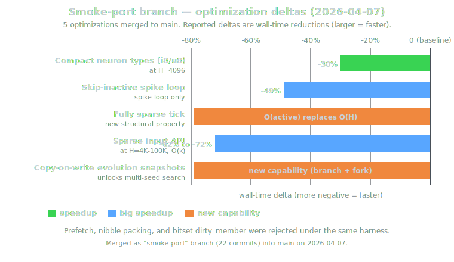

*Prefetch, nibble packing, and bitset dirty_member correctly rejected with benchmarked evidence.*

| Seq | Finding | Status | Source |
|---|---|---|---|
| 1 | Merged `claude/check-smoke-port-status` branch (22 commits) into `main`. See optimization table above. Prefetch, nibble packing, bitset dirty_member correctly rejected with benchmarked evidence. | Confirmed | [Rust Implementation Surface](v5-Rust-Port-Benchmarks) |
| 2 | First local benchmarking session on Steam Deck (AMD Van Gogh APU, L1=32KB, L2=512KB, L3=4MB, 16GB RAM). Measured propagation and evolution step speed across H=128-8192 with 30-200 edges. | Confirmed | [Rust Implementation Surface](v5-Rust-Port-Benchmarks) |
| 3 | Fixed-wall-clock (60s/seed, 3 seeds) accuracy comparison at H=256-4096 with empty init, edge_cap=300, 1+9 jackpot on 100KB Alice corpus. H=2048 won at 21.4% best / 20.1% mean with only 6K steps. More neurons + sparse edges = less interference per mutation = more valuable steps; larger sparse networks find better circuits per step. | Confirmed | [Rust Implementation Surface](v5-Rust-Port-Benchmarks) |
| 4 | Four alternative topology representations tested — see **[Four alternative topology representations — H=256 — 2026-04-08]** table in the 2026-04-08 block. Summary: ListNet (sorted `Vec<Vec<u16>>`, fan-out) at 3917 step/s is 6x faster than INSTNCT (654), identical ~20% accuracy; VarNet degrades at H>1024; FireNet slower due to per-tick activation clone; FlatNet wastes memory. | Confirmed | [Rust Implementation Surface](v5-Rust-Port-Benchmarks) |
| 5 | ListNet speed advantage: eliminates HashSet (O(1) not needed at E≤300), CSR rebuild, parallel Vec bookkeeping. Simple sorted `Vec<Vec<u16>>` with linear scan is sufficient and cache-friendly. **ListNet vs INSTNCT throughput:** • **H=512**: 2126 vs 360 step/s (5.9x) • **H=1024**: 1104 vs 192 step/s (5.7x) 60s best-seed accuracy: ListNet 20.8% vs INSTNCT 20.4% (noise-equivalent). | Confirmed | [Rust Implementation Surface](v5-Rust-Port-Benchmarks) |
| 6 | Branch cleanup: deleted all merged, stale, superseded remote/local branches. 18 remote + 10 local deleted. Repository now single `main`. | Confirmed | [Rust Implementation Surface](v5-Rust-Port-Benchmarks) |
| 7 | Promoted: smoke-port performance branch merged (compact types, skip-inactive, sparse tick/input, CoW snapshots); ListNet topology rep validated as 6x faster drop-in. Rejected: FireNet gather, FlatNet fixed arrays, prefetch/nibble/bitset micro-opts. Experimental: ListNet integration into `instnct-core` as replacement for `ConnectionGraph`. | Confirmed | [Rust Implementation Surface](v5-Rust-Port-Benchmarks) |

---

### 2026-04-06 — Hyperparameter exhaustion and library hardening

**Theme:** 11 tuning axes fail to lift 17-18% band; pocket-pair parity; shared-female refuted; Watts-Strogatz falsified; library hardening (EvolutionConfig split, atomic checkpoint persistence).

| Seq | Finding | Status | Source |
|---|---|---|---|
| 1 | 11 independent tuning/strategy axes pushed through overnight sweeps: edge cap, chain init, polarity, topology constraints, butterfly scaling, breed v1/v2, simulated annealing, ratchet, projection dimension, ensemble oracle, SDR rate. None lifted the stable 17-18% next-char band. Several sweeps produced transient 19.1% peaks. | Confirmed | [Rust Implementation Surface](v5-Rust-Port-Benchmarks) |
| 2 | Corrected oracle check: top-4 oracle = 17.2% vs best single = 17.0% on good-seed ensemble, even though networks shared ~4% Jaccard edge overlap. Different topologies converging onto near-identical predictions in the 1+1 ES setup. | Confirmed | [Rust Implementation Surface](v5-Rust-Port-Benchmarks) |
| 3 | Pocket-chain exploration split cleanly: 2-pocket network (H=452) reached 17.5% peak inside one spatially constrained model; post-hoc chaining of separately trained pockets failed at 6.1% because I/O modalities did not compose. | Confirmed | [Rust Implementation Surface](v5-Rust-Port-Benchmarks) |
| 4 | Two-pocket charge-transfer line: two independent H=256 pockets reached 19.6% peak, but only at parity with familiar band. Male-overlay merge + continuation peaked at 17.45% and 18.85%, then drifted back down instead of stabilizing into a stronger recipe. Pocket pair 19.6% peak / 18.1% best final. | Confirmed | [Rust Implementation Surface](v5-Rust-Port-Benchmarks) |
| 5 | Shared-female critical test refuted the strongest merge hypothesis: with frozen upstream Female, Males shared only 2.5-3.6% Jaccard overlap while reaching 88-98.5% prediction agreement. Merge collapsed to 5.6%. Topology diversity was not creating complementary information under this regime. | Confirmed | [Rust Implementation Surface](v5-Rust-Port-Benchmarks) |
| 6 | Watts-Strogatz small-world init also failed: matched same 19.1% peak as chain-50. Higher means only arrived with 1.5-3x more edges. Chain-50 stayed more edge-efficient public default. | Confirmed | [Rust Implementation Surface](v5-Rust-Port-Benchmarks) |
| 7 | `EvolutionConfig` refactored: edge cap (hard topology limit) and quality gating (`accept_ties`) became independent. Default moved to strict no-tie acceptance after 6-seed sweep showed +4.2pp mean advantage. | Confirmed | [Rust Implementation Surface](v5-Rust-Port-Benchmarks) |
| 8 | Checkpoint persistence landed as atomic bundle for Network + Projection + metadata, with 7 adversarial round-trip and functional-match tests passing. | Confirmed | [Rust Implementation Surface](v5-Rust-Port-Benchmarks) |
| 9 | Carry-over — edge cap sweep: no ceiling break; 19.1% peak appeared at all tested caps. | Confirmed | [Rust Implementation Surface](v5-Rust-Port-Benchmarks) |
| 10 | Carry-over — chain + polarity ablation: polarity mutation was catastrophic on mean quality and caused edge bloat. | Confirmed | [Rust Implementation Surface](v5-Rust-Port-Benchmarks) |
| 11 | Carry-over — breed v1/v2 + male overlay merge: no breakthrough; merged descendants peaked below best individual and stayed unstable. | Confirmed | [Rust Implementation Surface](v5-Rust-Port-Benchmarks) |
| 12 | Promoted: strict acceptance (no ties) as default; checkpoint persistence; the reading that the stable Rust band is a property of the tested exploration/evaluation regime, not a missing scalar fix. Rejected/downgraded: polarity mutation on main library loop, post-hoc pocket chaining, pocket-level breeding as immediate breakout, shared-interface convergence as merge strategy, Watts-Strogatz init as ceiling-breaking fix. | Confirmed | [Rust Implementation Surface](v5-Rust-Port-Benchmarks) |

---

### 2026-04-05 — Rust v5 beta hardening and seed variance

**Theme:** Rust port becomes real evolution substrate (snapshots, mutation API, CSR, genome persistence, rayon multi-seed). Seed variance mapped as first-class problem.

| Seq | Finding | Status | Source |
|---|---|---|---|
| 1 | The Rust port crossed from "fast forward pass" into "real evolution substrate": `NetworkSnapshot`, full 10-op mutation API, CSR skip-inactive, genome save/load, refractory support, and rayon-backed multi-seed evolution all landed in the active beta line. | Confirmed | [Rust Implementation Surface](v5-Rust-Port-Benchmarks) |
| 2 | Language-eval work exposed seed variance as a first-class problem rather than anecdotal noise. | Confirmed | [Rust Implementation Surface](v5-Rust-Port-Benchmarks) |
| 3 | GPT quick map of base seeds 1..100 showed a rugged landscape with weak and strong bands, not a simple seed formula. **Summary stats (1..100 base seeds):** • Baseline: 16.9% • Mean: 9.1% • Best: 17.5% @ seed 17 • Worst: 0.3% @ seed 24 • Spread: 17.2pp (figure: seed-sweep-check-2.png; full per-seed grid in collapsible section below) | Confirmed | [Rust Implementation Surface](v5-Rust-Port-Benchmarks) |
| 4 | Rayon 12-seed run: 1m57s on 12 cores. Best reported Rust next-char result: 18.5%. | Confirmed | [Rust Implementation Surface](v5-Rust-Port-Benchmarks) |
| 5 | Multi-seed search became practical enough to treat seed quality as a search problem instead of luck. Evidence handling also changed: seed maps, charts, and log extracts now deserve stable archive leaves instead of only living inside transient benchmark prose. | Confirmed | [Rust Implementation Surface](v5-Rust-Port-Benchmarks) |
| 6 | Promoted into active Rust beta line: genome persistence, rayon multi-seed evolution, archive-grade seed evidence. Not promoted: any claim of a simple "good seed" formula. | Confirmed | [Rust Implementation Surface](v5-Rust-Port-Benchmarks) |

Full per-seed grid (seeds 1..100)

| Seed | Score | Seed | Score | Seed | Score | Seed | Score | Seed | Score |
|---|---:|---|---:|---|---:|---|---:|---|---:|
| 1 | 16.4% | 21 | 7.1% | 41 | 6.3% | 61 | 16.9% | 81 | 16.5% |
| 2 | 10.7% | 22 | 14.1% | 42 | 9.7% | 62 | 12.1% | 82 | 1.0% |
| 3 | 9.1% | 23 | 7.1% | 43 | 4.5% | 63 | 6.7% | 83 | 7.7% |
| 4 | 4.1% | 24 | 0.3% | 44 | 3.7% | 64 | 14.8% | 84 | 16.9% |
| 5 | 7.2% | 25 | 3.8% | 45 | 4.5% | 65 | 2.0% | 85 | 8.6% |
| 6 | 4.5% | 26 | 9.1% | 46 | 7.7% | 66 | 3.8% | 86 | 7.5% |
| 7 | 1.1% | 27 | 12.9% | 47 | 3.4% | 67 | 6.7% | 87 | 6.9% |
| 8 | 16.9% | 28 | 7.1% | 48 | 4.6% | 68 | 16.9% | 88 | 16.9% |
| 9 | 6.6% | 29 | 17.0% | 49 | 5.7% | 69 | 16.3% | 89 | 16.9% |
| 10 | 11.8% | 30 | 16.9% | 50 | 7.2% | 70 | 7.2% | 90 | 13.4% |
| 11 | 6.6% | 31 | 3.4% | 51 | 5.7% | 71 | 16.9% | 91 | 16.1% |
| 12 | 15.2% | 32 | 7.6% | 52 | 3.0% | 72 | 6.3% | 92 | 5.3% |
| 13 | 9.3% | 33 | 14.6% | 53 | 0.8% | 73 | 6.1% | 93 | 16.9% |
| 14 | 16.1% | 34 | 8.5% | 54 | 5.3% | 74 | 16.9% | 94 | 7.2% |
| 15 | 6.7% | 35 | 7.2% | 55 | 7.6% | 75 | 9.1% | 95 | 7.6% |
| 16 | 7.5% | 36 | 16.4% | 56 | 7.5% | 76 | 16.9% | 96 | 6.2% |
| 17 | 17.5% | 37 | 7.7% | 57 | 7.2% | 77 | 3.2% | 97 | 1.2% |
| 18 | 3.3% | 38 | 16.9% | 58 | 2.8% | 78 | 10.4% | 98 | 16.8% |
| 19 | 4.5% | 39 | 1.5% | 59 | 10.1% | 79 | 16.9% | 99 | 5.8% |
| 20 | 15.3% | 40 | 4.5% | 60 | 7.2% | 80 | 5.9% | 100 | 14.8% |

---

### 2026-04-02 to 2026-04-03 — Deterministic benchmarking and owned Rust Network

**Theme:** v5.0.0-beta becomes clean Rust-port branch with owned `Network`. Deterministic benchmark discipline replaces looser micro-opt claims.

| Seq | Finding | Status | Source |
|---|---|---|---|
| 1 | `v5.0.0-beta` became a clean Rust-port branch with an owned `Network` abstraction, checked propagation, and topology cleanup. | Confirmed | [Rust Implementation Surface](v5-Rust-Port-Benchmarks) |
| 2 | Deterministic benchmark discipline replaced looser micro-optimization claims: core pinning, repeated runs, noise-floor control, same-logic comparisons became the standard. | Confirmed | [Rust Implementation Surface](v5-Rust-Port-Benchmarks) |
| 3 | Several tempting optimizations were re-tested and downgraded from "fast" to "rejected or inconclusive". | Confirmed | [Rust Implementation Surface](v5-Rust-Port-Benchmarks) |
| 4 | `Network` landed as an owned topology + params + state object with deterministic hand-calculated tests. | Confirmed | [Rust Implementation Surface](v5-Rust-Port-Benchmarks) |
| 5 | H=1024 throughput improved after redundant edge storage was removed. | Confirmed | [Rust Implementation Surface](v5-Rust-Port-Benchmarks) |
| 6 | AVX2, edge sorting, and PGO claims were all re-checked under deterministic harness rules instead of being trusted from noisy runs. | Confirmed | [Rust Implementation Surface](v5-Rust-Port-Benchmarks) |
| 7 | Promoted: deterministic benchmark policy, topology cleanup, owned `Network`. Rejected/downgraded: early overstated micro-optimization claims that did not survive controlled reruns. | Confirmed | [Rust Implementation Surface](v5-Rust-Port-Benchmarks) |

---

### 2026-03-30 to 2026-04-01 — Transition period (Inferred)

**Theme:** Transition from Python architecture gains to Rust-port stabilization and benchmark methodology hardening. No single headline discovery.

| Seq | Finding | Status | Source |
|---|---|---|---|
| 1 | Public record suggests a transition period rather than a single headline discovery, with work shifting from Python-side architecture gains into Rust-port stabilization and benchmark-methodology hardening. | Inferred | [Timeline Archive](Timeline-Archive) |

---

### 2026-03-29 — Compact parameter stack and breed breakthrough

**Theme:** Frozen random temporal diversity beats learnable freq/phase → compact per-neuron `channel`. Breed + crystallize hits 24.4%.

| Seq | Finding | Status | Source |
|---|---|---|---|
| 1 | Wave/freq/phase learning overturned: frozen random temporal diversity beat learnable freq/phase. Line compressed into a compact per-neuron `channel`. | Confirmed | [INSTNCT Architecture](INSTNCT-Architecture) |
| 2 | Compact parameter stack became clearer: mask + polarity + theta + channel carry the learnable burden; decay and rho moved toward fixed/baked roles. | Confirmed | [INSTNCT Architecture](INSTNCT-Architecture) |
| 3 | `breed + crystallize` hit 24.4%, becoming the first reported result to beat the best fixed schedule line of that phase. | Confirmed | [INSTNCT Architecture](INSTNCT-Architecture) |
| 4 | Learnable channel: 23.8%. One compact `channel` byte beat the older freq/phase stack. | Confirmed | [INSTNCT Architecture](INSTNCT-Architecture) |
| 5 | Reverse-heavy schedule: 20.8% and strong structural role. `enhance/reverse/mirror` made topology shaping visibly stronger. | Confirmed | [INSTNCT Architecture](INSTNCT-Architecture) |
| 6 | Carry-over — Theta int4: 15.6% vs float 13.5%; compact discrete theta beat float search. | Confirmed | [INSTNCT Architecture](INSTNCT-Architecture) |
| 7 | Carry-over — Theta Pareto: 1-bit 10.1%, 2-bit 12.7%, 4-bit 15.6%; float32 was dominated. | Confirmed | [INSTNCT Architecture](INSTNCT-Architecture) |
| 8 | Carry-over — Rho fix: fixed 0.3 hit 14.5%, close to int4 15.2% and ahead of float 14.1%. | Confirmed | [INSTNCT Architecture](INSTNCT-Architecture) |
| 9 | Carry-over — Decay fix: fixed 0.16 held 19.4% vs learnable 20.8%, showing small fixed tradeoffs could buy huge simplicity. | Confirmed | [INSTNCT Architecture](INSTNCT-Architecture) |
| 10 | Carry-over — Binary wave: 21.4%; 2-bit wave types outperformed heavier temporal parameterizations. | Confirmed | [INSTNCT Architecture](INSTNCT-Architecture) |
| 11 | Carry-over — Big ReLU controller: 23.6%; learned phase transitions got close to fixed schedule line but did not clearly replace it. | Confirmed | [INSTNCT Architecture](INSTNCT-Architecture) |
| 12 | Doctrine — `Tree-Wired Scaffold Init` reached 15.6% versus random 5% prefill at 22.4%; structured beauty kept losing to evolvable chaos. | Confirmed | [INSTNCT Architecture](INSTNCT-Architecture) |
| 13 | Doctrine — `Learnable Schedule (empty start)` reached 14.9% with only 89 edges; quality-per-edge impressive, line still trailed stronger prefill schedule family. | Confirmed | [INSTNCT Architecture](INSTNCT-Architecture) |
| 14 | Doctrine — `Navigable infinity principle` hardened: compact discrete or fixed controls consistently beat wider continuous alternatives on core sweeps. | Confirmed | [INSTNCT Architecture](INSTNCT-Architecture) |
| 15 | Promoted: compact channel-centric temporal specialization. Rejected: learnable freq/phase as a practical public default. | Confirmed | [INSTNCT Architecture](INSTNCT-Architecture) |

---

### 2026-03-28 — Phi overlap and richer output readout

**Theme:** Output-dimension sweeps + phi-style proportioning + overlap experiments → strongest public architecture story. `output_dim=160` and phi overlap push reported peaks.

| Seq | Finding | Status | Source |
|---|---|---|---|
| 1 | Output-dimension sweeps, phi-style proportioning, overlap experiments converged into strongest public architecture story of that week. Public framing shifted from "more hidden is always better" to "the overlap/readout geometry matters more." Representational bottleneck sits at I/O and overlap geometry, not just raw neuron count. | Confirmed | [INSTNCT Architecture](INSTNCT-Architecture) |
| 2 | Output dim sweep: • **Best**: 20.0% at `out_dim=160` • **Multi-seed mean**: 18.2% (std 0.6%) | Confirmed | [INSTNCT Architecture](INSTNCT-Architecture) |
| 3 | Phi overlap: • **H=256**, in=out=158, overlap=60 • **Accuracy**: 20.8% • Zero dedicated hidden neurons were needed. | Confirmed | [INSTNCT Architecture](INSTNCT-Architecture) |
| 4 | Scale sweep: 0.625 output ratio held across H=128/192/256/384, keeping the phi-style downshift alive beyond one size. | Confirmed | [INSTNCT Architecture](INSTNCT-Architecture) |
| 5 | Language-aware output projection: `FREQ_ORDER=22.4%` beat `BIGRAM_SVD=21.8%` and random 20.8%; output topology had to respect target distribution. | Confirmed | [INSTNCT Architecture](INSTNCT-Architecture) |
| 6 | Full overlap: 14.7% vs phi overlap 20.8%; too much overlap added noise instead of signal. | Confirmed | [INSTNCT Architecture](INSTNCT-Architecture) |
| 7 | Direct 256 output: 7.1%; slow, too few accepts, worse than projection-based readout. | Confirmed | [INSTNCT Architecture](INSTNCT-Architecture) |
| 8 | Later input confirmation: SDR phi overlap stayed best at 22.4%, ahead of FREQ 12.3% and one-hot 9.5%. | Confirmed | [INSTNCT Architecture](INSTNCT-Architecture) |
| 9 | Promoted: phi overlap as key active public architecture finding. Rejected: direct 256 output and repeated binary-output simplifications as practical defaults. | Confirmed | [INSTNCT Architecture](INSTNCT-Architecture) |

---

### 2026-03-27 — I/O architecture overhaul: sparse-in / dense-out

**Theme:** Tentacle I/O beats holographic; SDR input baked into Python stack; charge readout beats state; learnable theta opens next quality jump.

| Seq | Finding | Status | Source |
|---|---|---|---|
| 1 | Tentacle I/O beat holographic projection. Random 5% prefill + BFS tentacles beat both holographic projection and structured resonator init: 4.7% vs 1.2%. | Confirmed | [INSTNCT Architecture](INSTNCT-Architecture) |
| 2 | SDR input beat the other tested input encodings and was baked into the Python stack: 7.3% vs random 4.4%. Sparse distributed input cleaned up the routing problem enough to become the live Python default. | Confirmed | [INSTNCT Architecture](INSTNCT-Architecture) |
| 3 | Charge readout beat state readout: 14.1% vs 10.3%. Charge stayed the richer readout surface even though spikes remained load-bearing internally. | Confirmed | [INSTNCT Architecture](INSTNCT-Architecture) |
| 4 | Learnable theta opened the next quality jump: 14.1% vs fixed theta 7.3%. Low-start full-resample theta clearly beat fixed thresholds. | Confirmed | [INSTNCT Architecture](INSTNCT-Architecture) |
| 5 | 8-bit binary I/O baseline: 0.2% vs 4.4% for 64-dim projection. Compact binary I/O starved the architecture of signal richness. | Confirmed | [INSTNCT Architecture](INSTNCT-Architecture) |
| 6 | Random vs SDR output: random 64-dim out 7.3% vs SDR out 3.4%; sparse-in / dense-out became the winning asymmetry. | Confirmed | [INSTNCT Architecture](INSTNCT-Architecture) |
| 7 | 8-bit I/O v2: 8-bit in + random 64 out reached 9.1%, but SDR input still won cleanly and 8-bit in + 8-bit out stayed dead at 0.0%. | Confirmed | [INSTNCT Architecture](INSTNCT-Architecture) |
| 8 | Promoted: SDR input and asymmetric sparse-in / dense-out architecture. Rejected: 8-bit binary I/O as a public path. | Confirmed | [INSTNCT Architecture](INSTNCT-Architecture) |

---

### 2026-03-22 to 2026-03-26 — English line hardens

**Theme:** English line settled around a conservative public recipe while side branches competed on schedules, mutation rules, decay handling, and edge representation. Voltage medium leak, decision-tree control, and sign+mag magnitude resample emerge as strongest historical results.

**[Accuracy ceiling across time — next-char / bigram (H≈256-512)]**

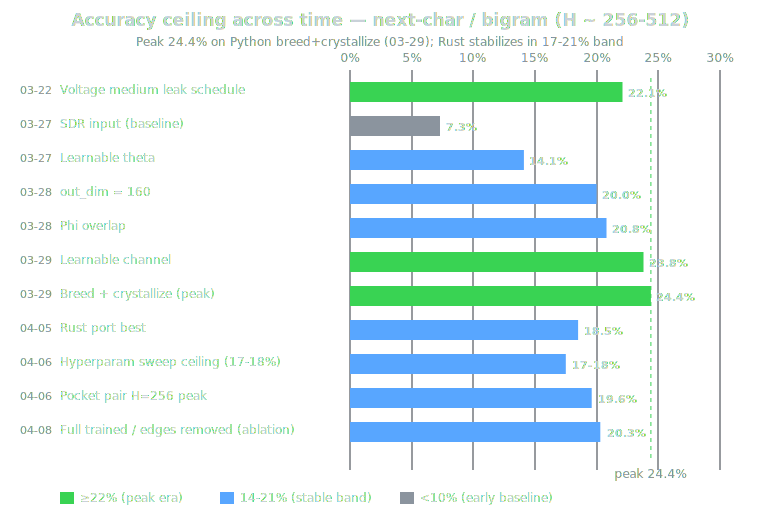

| Seq | Finding | Status | Source |
|---|---|---|---|
| 1 | English line settled around a conservative public recipe while multiple side branches competed on schedules, mutation rules, decay handling, and edge representation. This was the last phase where a separate findings hub still made sense; surviving signal now lives here as chronology. Explains why the public English line stayed conservative even while stronger-looking local variants kept appearing. | Archived | [Timeline Archive](Timeline-Archive) |
| 2 | Voltage medium leak, decision-tree control, and sign+mag magnitude resample became the strongest historical schedule/control/edge-quality results of that phase. | Archived | [Timeline Archive](Timeline-Archive) |
| 3 | Several side probes clarified what not to over-promote: potential-aware fitness, controller-heavy alternatives, and codepath variants could score locally without displacing the simpler public line. | Archived | [Timeline Archive](Timeline-Archive) |
| 4 | Flip mutation: +1.89% over float weight perturbation on English 1024n. | Archived | [Timeline Archive](Timeline-Archive) |
| 5 | Low theta + `INJ_SCALE=1.0`: 12.91% vs 11.01%; smaller scale and lower theta beat the harsher baseline. | Archived | [Timeline Archive](Timeline-Archive) |
| 6 | 8 ticks + current English candidate schedule: 8 ticks beat 6; line settled on `2 add / 1 flip / 5 decay` for the public English recipe candidate. | Archived | [Timeline Archive](Timeline-Archive) |
| 7 | Decay resample mutation: full single-neuron resample in [0.01, 0.5] beat local perturbation and produced differentiated decay bands. | Archived | [Timeline Archive](Timeline-Archive) |
| 8 | Voltage medium leak schedule: strongest historical schedule result at 22.11% peak / 21.46% plateau. | Archived | [Timeline Archive](Timeline-Archive) |
| 9 | Decision-tree schedule: 20.05% at 156 edges, the strongest compact learnable control policy of that phase. | Archived | [Timeline Archive](Timeline-Archive) |
| 10 | Sign+mag + magnitude resample: 18.69% at 155 edges (q=0.121), the best quality-per-edge result in the edge-format sweep. | Archived | [Timeline Archive](Timeline-Archive) |
| 11 | Doctrine — Potential-aware fitness: standard 14.1% beat both weighted variants (11.3%, 8.3%); false positives through projection surface made the idea too brittle. | Archived | [Timeline Archive](Timeline-Archive) |
| 12 | Doctrine — Claude vs Gemini `graph.py` A/B: Claude 14.1% beat Gemini 11.3%; C19 clip and batch refractory remained load-bearing. | Archived | [Timeline Archive](Timeline-Archive) |
| 13 | Doctrine — Control neurons / binary toggles: 15.8% / 14.9%; controller-heavy meta-learning still lost to simpler fixed schedule line. | Archived | [Timeline Archive](Timeline-Archive) |
| 14 | Doctrine — C edge port: 95K tokens/sec vs Python 3.2K — a 29.4x speedup, but as an edge-side branch rather than public default. | Archived | [Timeline Archive](Timeline-Archive) |

---

### 2026-03-25 — Resonator Theory

**Theme:** Resonator Chamber theory formalized with FlyWire validation; public theory framing locked onto destructive interference as fixed-point mechanism.

| Seq | Finding | Status | Source |
|---|---|---|---|
| 1 | Resonator Chamber theory formalized with FlyWire validation. | Archived | [Theory of Thought](Theory-of-Thought) |
| 2 | Public theory framing locked onto destructive interference as the fixed-point mechanism. This is the major theory milestone connecting the public architecture line to biological-scale evidence. | Archived | [Theory of Thought](Theory-of-Thought) |

---

### 2026-03-22 — Recipe consolidation and canon freeze

**Theme:** Triangle convergence → fixed English recipe `2 add / 1 flip / 5 decay`. Sign+mag edge representation as best quality-per-edge. Canon boundaries tightened; archive branches cut ahead of public beta push.

| Seq | Finding | Status | Source |
|---|---|---|---|
| 1 | Triangle convergence distilled into the fixed English recipe: `2 add / 1 flip / 5 decay`. | Archived | [Timeline Archive](Timeline-Archive) |
| 2 | Sign+mag edge representation became the best quality-per-edge evidence line of that phase. | Archived | [Timeline Archive](Timeline-Archive) |
| 3 | Task-learning experiments started displacing the older swarm line. | Archived | [Timeline Archive](Timeline-Archive) |
| 4 | Canon boundaries tightened and archive branches were cut ahead of the public beta push. Narrowed the tracked public surface and made archive discipline a first-class rule. | Archived | [Timeline Archive](Timeline-Archive) |

---

### 2026-03-21 — Canonical Docs and Schedule Research

**Theme:** Repo-tracked docs became canonical; GitHub wiki became the mirror surface. Schedule-control work became the main live research frontier.

| Seq | Finding | Status | Source |
|---|---|---|---|
| 1 | Repo-tracked docs became canonical and the GitHub wiki became the mirror surface. | Archived | [Timeline Archive](Timeline-Archive) |
| 2 | Schedule-control work became the main live research frontier. | Archived | [Timeline Archive](Timeline-Archive) |
| 3 | Roadmap, theory, archive, and glossary roles collapsed into a single timeline-style public surface. This was the documentation governance pivot that made later consolidation possible. | Archived | [Timeline Archive](Timeline-Archive) |

---

## Older Timeline

### 2026-02-26 — Hidden/slot split and v4 precompute sprint

**Theme:** Training-run analysis exposed v4 GPU bottlenecks. Locked v4 baseline around B=8, D=256, M=256-class ring sizing. Precomputed attention weights + hidden_dim/slot_dim split landed, reducing ring-clone VRAM.

**[Input width sweep — D=256, GPU, echo task — 2026-02-26]**

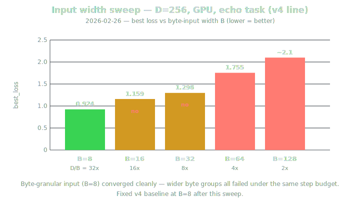

| Seq | Finding | Status | Source |
|---|---|---|---|
| 1 | Training-run analysis turned up major GPU bottlenecks in the v4 line. On 2026-02-24, parameter sweeps locked the byte-granular baseline around B=8, D=256, M=256-class ring sizing. Throughput was constrained by sequential T × N loop rather than raw VRAM. | Archived | [Timeline Archive](Timeline-Archive) |
| 2 | Two optimizations landed: precomputed attention weights and hidden_dim / slot_dim split. Split dramatically reduced ring-clone VRAM pressure and reset next training configuration around a more explicit capacity model, separating expert-brain width from ring-memory width. | Archived | [Timeline Archive](Timeline-Archive) |
| 3 | First clean bridge from sweep-heavy parameter tuning into explicit capacity budgeting in the v4 line — raw GPU systems work started feeding cleaner architecture budgeting instead of ad hoc scaling. Clarified that several apparent "scaling" questions were throughput and memory-layout questions, not evidence for widening the whole system. | Archived | [Timeline Archive](Timeline-Archive) |
| 4 | Locked v4 baseline — Input width B=8 (byte-granular); Legacy width D=256 (sweep winner before hidden/slot split); Ring size M=256 for seq_len ≤ 128; Expert count N=6 sweep winner (later reduced to 2 after split for ~3x speed at <2% loss cost); hidden_dim=4096; slot_dim=32; R=2, S=0.05, Je=0.9, Jw=0.1. Tickets #106, #107, #108 (main repo issue tracker — see [Core Surfaces](#core-surfaces)). Precomputed attention weights: ~40% speedup with bit-identical outputs. | Archived | [Timeline Archive](Timeline-Archive) |
| 5 | Input width sweep at D=256 (GPU, echo task): B=8 (D/B 32x) best_loss 0.924 converged; B=16 (16x) 1.159 no; B=32 (8x) 1.298 no; B=64 (4x) 1.755 no; B=128 (2x) ~2.1 no. | Archived | [Timeline Archive](Timeline-Archive) |
| 6 | Slot-width sweep: D=256 was best loss point (0.304). D>256 still fit in VRAM but degraded under available step budget; memory was not the binding constraint. | Archived | [Timeline Archive](Timeline-Archive) |
| 7 | Expert-count sweep: N=6 best_loss 0.2656 (best quality); N=2 0.2708 (close, ~3x faster). | Archived | [Timeline Archive](Timeline-Archive) |
| 8 | Ring-size sweep at seq_len=64: M=32 echo 0.502 delay 0.566; M=64 0.380/0.383; M=128 0.282/0.303; M=256 0.269/0.290; M=512 0.272/0.280. Working rule: M ≥ 2 × seq_len. | Archived | [Timeline Archive](Timeline-Archive) |

---

### 2026-02-20 to 2026-02-22 — LCX bottleneck, contamination, plateau diagnosis

**Theme:** BN width / D ablation / depth / bootstrap / LCX write-strategy / catastrophic-forgetting / plateau probes converged on a harsher picture of memory-side behavior. LCX whiteboard underperformance → cross-batch contamination + weak write signal.

| Seq | Finding | Status | Source |
|---|---|---|---|
| 1 | BN width, D ablation, depth, bootstrap, LCX write-strategy, catastrophic-forgetting, plateau probes converged on a harsher picture of memory-side behavior. Shift from "LCX as obvious scaling win" to a much more adversarial attitude toward memory-side claims. Last major English-training result in pre-INSTNCT architecture family. | Archived | [Timeline Archive](Timeline-Archive) |
| 2 | LCX whiteboard underperformance traced to cross-batch contamination and weak write-selection signal rather than a clean universal scaling win. | Archived | [Timeline Archive](Timeline-Archive) |
| 3 | Bottleneck-width series: D=2048 choke was a pipe-width problem, not a brain-width problem. Widening the BN pipe let D=2048 match D=4096-class results at far lower parameter cost. Learned squeeze transform essential: no-BN and single-layer full-width variants underperformed; 2:1 BN:bits ratio emerged as production sweet spot. Exposed future scaling trap: the old fixed D/10 rule would eventually collapse to 1:1 pipe at higher bit widths. | Archived | [Timeline Archive](Timeline-Archive) |
| 4 | Bottleneck width mini-table: no BN 50.13%; BN=204 (native D/10) 50.39% still choked; BN=409 50.64% sweet spot, matched D=4096-class; BN=618 50.63% no gain beyond 2:1. Key takeaway: D=2048 + BN=409 reached D=4096-level quality with far fewer params, proving the pipe was the limiter. | Archived | [Timeline Archive](Timeline-Archive) |
| 5 | Stressed D-ablation: 8-bit I/O had been hiding the real dimension question. Under 200-bit pressure D=2048 clearly choked; D=4096/6180/8192 all escaped bottleneck. Above choke point, larger D mostly changed learning trajectory rather than final quality: D=6180 led earlier; D=4096 and D=8192 accelerated later and finished in same narrow tail band. D=6180 stayed in the safe band with golden-ratio framing and reasonable VRAM — historical operating point, not a decisive empirical knockout. | Archived | [Timeline Archive](Timeline-Archive) |
| 6 | D ablation mini-table: D=2048 50.39% 0.5GB (choked at 1.0:1); D=4096 50.63% 1.1GB (late accelerator); D=6180 50.60% 2.0GB (early leader, later plateau); D=8192 50.67% 3.1GB (late accelerator, no clear practical win). D≥4096 beat D=2048 clearly; D=4096/6180/8192 statistically close at tail. | Archived | [Timeline Archive](Timeline-Archive) |
| 7 | Full-scale depth probe: shallower stacks beat deeper ones across both easy and hard tasks, locking depth=2 and killing older golden-ratio depth aesthetic. Sharpened interpretation that LCX carried the real integration burden while processing stack mostly acted as translation/plumbing. | Archived | [Timeline Archive](Timeline-Archive) |
| 8 | Processing depth mini-table: depth=1 12M/1.3G 53.6% (converged fast but too minimal); depth=2 50M/2.0G 53.2% (locked compromise); depth=6 203M/4.6G 52.1% (slower, larger, worse). Savings vs depth=6: ~153M fewer params, 2.6G less VRAM, ~23% faster throughput. | Archived | [Timeline Archive](Timeline-Archive) |
| 9 | Write-strategy probes: whiteboard mechanism could help when reads stayed relevant, but random-batch training turned it into a contamination channel. Evolutionary selection and raw-overwrite variants failed to rescue the effect, shifting attention from "how do we write?" to "how do we preserve read relevance across batches?" | Archived | [Timeline Archive](Timeline-Archive) |
| 10 | LCX write strategy mini-table: Evo whiteboard — no real gain, selection like coin flip; Fixed batch — clear gain, cross-batch contamination confirmed; Snapshot tournament — whiteboard content mattered once held against fixed weights; Raw writes — write rule barely mattered, read relevance the real problem; Double-buffer — emerged as proposed fix direction. | Archived | [Timeline Archive](Timeline-Archive) |
| 11 | Curriculum-transition failure traced away from simple replay lore toward a three-factor optimization stack: too-low LR, LCX noise from random init, extra overhead of full SwarmByteRingModel. Catastrophic-forgetting root-cause: LR too low -19.9%; LCX noise from random init -12.8%; architecture overhead -6.4%; total explained ~39% (layered optimization/interference failure). | Archived | [Timeline Archive](Timeline-Archive) |
| 12 | Offset-selectivity theory investigated thoroughly, but later probes showed echo256 was learnable without explicit position encoding. Real failure mode was optimization and interference, not architectural impossibility. Final diagnosis moved from "architecturally impossible" to "learnable, but easy to sabotage with bad training conditions." | Archived | [Timeline Archive](Timeline-Archive) |
| 13 | Supporting probes: position encoding — no meaningful gain on mini probe; LR ablation — major contributor, not whole failure; real-model ablation — architecture cleared, LCX added substantial noise from random init; weight decay — effectively irrelevant on this task. | Archived | [Timeline Archive](Timeline-Archive) |
| 14 | First real GPU English-text training run on FineWeb-Edu showed the brain could learn, but LCX-on variants and eval-time sweeps exposed how fragile the story was. | Archived | [Timeline Archive](Timeline-Archive) |

---

### 2026-02-19 — Probe ladder and cold-brain sweep burst

**Theme:** Dense probe burst on cold-brain activation, depth, learning rate, attention temperature, state EMA, jump tau, LCX tau, top-k, undetach behavior. Mostly eliminative signal.

| Seq | Finding | Status | Source |
|---|---|---|---|
| 1 | Dense probe burst tested cold-brain activation, depth, learning rate, attention temperature, state EMA, jump tau, LCX tau, top-k, undetach behavior on small deterministic harnesses. Cold-brain ladder mostly closed obvious low-cost hyperparameter questions rather than revealing a single dominating fix. | Archived | [Timeline Archive](Timeline-Archive) |
| 2 | Dedicated LCX bootstrap probe: LCX slightly hurts cold training on tasks the brain can already solve alone, while still bootstrapping routing behavior in parallel. | Archived | [Timeline Archive](Timeline-Archive) |
| 3 | Slot count made no meaningful difference to bootstrap speed or accuracy in the cold regime — real issue was when to enable LCX, not how many slots to expose. | Archived | [Timeline Archive](Timeline-Archive) |
| 4 | LCX bootstrap mini-table: tt0_noLCX mean_tail 1.0000 (perfect on trivial baseline); tt1_50slots 0.9935 (slight LCX drag, routing bootstraps); tt1_500slots 0.9932 (same, slot count did not matter). | Archived | [Timeline Archive](Timeline-Archive) |
| 5 | Focused top-k sweep: retrieval count barely moved accuracy at small slot counts, but at 1000 slots k=2 matched or beat higher values while running much faster. | Archived | [Timeline Archive](Timeline-Archive) |
| 6 | LCX top-k mini-table: k=1 mean_tail 0.811 gap 0.007 0.47s/step (faster, noisier, borderline weaker); k=2 0.816 / 0.003 / 0.61s (locked floor); k=4 0.815 / 0.001 / 0.95s (similar quality, slower); k=6 0.813 / 0.002 / 1.29s (slower baseline, no quality gain). Final production: k=2 kept same quality band while cutting LCX retrieval cost by ~2.1x vs k=6. Killed aesthetic phi-derived top_k=6. | Archived | [Timeline Archive](Timeline-Archive) |
| 7 | Output of the day: pile of narrow probe leaves rather than durable doctrine. Clearest example of why raw probes no longer belong on primary canon surface. Useful signal was mostly eliminative: which knobs were flat, which fixes were overclaimed, which bottlenecks were probably elsewhere. Clearest argument for progressive training: let the brain learn first, then switch LCX on after base path is stable. Explained why several earlier CPU probes looked inconclusive — harness was testing LCX before the model had a chance to bootstrap cleanly. | Archived | [Timeline Archive](Timeline-Archive) |

---

### 2026-02-14 to 2026-02-18 — Diamond Code v3 consolidation

**Theme:** VRAM leaks/detach mistakes/observability gaps fixed. Score-margin telemetry, LCX bottleneck design, one-level LCX hardened. Goldilocks Nano / Ant, binary-bits encoding dominated by 2026-02-18.

| Seq | Finding | Status | Source |
|---|---|---|---|
| 1 | VRAM leak bugs, detach mistakes, observability gaps identified and fixed during Diamond Code v3 consolidation sprint. | Archived | [Timeline Archive](Timeline-Archive) |
| 2 | Score-margin telemetry, LCX bottleneck design, one-level LCX architecture decisions hardened during this period. | Archived | [Timeline Archive](Timeline-Archive) |
| 3 | Goldilocks Nano / Goldilocks Ant, binary-bits encoding, first major parameter-efficiency push became dominant direction by 2026-02-18. | Archived | [Timeline Archive](Timeline-Archive) |
| 4 | Larger probe wave locked LCX read path into two-layer C19 squeeze around a 10:1 bottleneck at D=6180, with read-only LCX and non-residual/no-norm variants beating more ornamental alternatives. | Archived | [Timeline Archive](Timeline-Archive) |
| 5 | Binary-bits encoding beat byte-token baselines on parameter efficiency. Pre-beta 4096D harvest showed sharp late crystallization phase plus one-level LCX dominance. | Archived | [Timeline Archive](Timeline-Archive) |
| 6 | Theme-based dialogue training switched from opaque `.traindat` streams to explicit JSONL input/output pairs, with curriculum/gist mixing and alternating input/output positions as training format. | Archived | [Timeline Archive](Timeline-Archive) |
| 7 | 2x618 C19 bottleneck: the learned squeeze, not raw width, carried LCX integration. | Archived | [Timeline Archive](Timeline-Archive) |
| 8 | Binary-bits vs byte-token: binary-bits dramatically more parameter-efficient at edge scale. | Archived | [Timeline Archive](Timeline-Archive) |
| 9 | Pre-beta 4096D harvest: phase transition near step 945 and only L0 active, reinforcing one-level-first design. | Archived | [Timeline Archive](Timeline-Archive) |
| 10 | Bridge between the older LCX-heavy story and the later insistence on compact, testable, architecture-facing claims. Several later doctrine pages inherited evidence discipline from this window. Early move toward more inspectable data contracts and clearer training semantics (though the whole theme-training surface stayed pre-INSTNCT). Converted a pile of aesthetic defaults into measured rules; helped kill the multi-level LCX story in favor of one-level-plus-grow. | Archived | [Timeline Archive](Timeline-Archive) |

---

### 2026-02-08 to 2026-02-10 — Swarm sprint and pre-INSTNCT consolidation

**Theme:** 34-session sprint establishing AGC diagnostic campaign; architecture shifted away from older GRU-style framing toward `think_proj`; dashboard-style observability mandatory. VRA-78 frontier scans separated GPU "biomass" from expert "brain mass".

| Seq | Finding | Status | Source |
|---|---|---|---|
| 1 | 34-session sprint established the AGC diagnostic campaign, pushed architecture away from older GRU-style framing toward `think_proj`, and made dashboard-style observability mandatory. Last dense burst before wiki and architecture surfaces started splitting proof, doctrine, and raw sprint logs into cleaner layers. | Archived | [Timeline Archive](Timeline-Archive) |
| 2 | Swarm topology, ant-ratio exploration, GPU scaling, visualization concepts were still first-class workstreams. | Archived | [Timeline Archive](Timeline-Archive) |
| 3 | VRA-78 frontier scans explicitly separated GPU "biomass" pressure from expert-count "brain mass", ranking swarm-era expert layouts against device-fit limits rather than treating head count as a free scaling knob. One of the earliest explicit capacity-budget framings later inherited by cleaner architecture budgeting. | Archived | [Timeline Archive](Timeline-Archive) |
| 4 | Early legacy probes established that depth plus embedding capacity, not dual-pointer ornamentation, unlocked addition and small multi-task learning. Simplified phase embeddings outperformed mathematically cleaner Mobius-style variants. Early lesson that learnability beat elegance: keep whichever inductive bias trains, even when the prettier formulation loses. | Archived | [Timeline Archive](Timeline-Archive) |
| 5 | Platinum-code-era consolidation reached the point where several older concepts were already being triaged into keep / discard / migrate buckets. | Archived | [Timeline Archive](Timeline-Archive) |
| 6 | Legacy probe — Addition ablation: depth + embedding capacity mattered more than dual-pointer ornamentation. | Archived | [Timeline Archive](Timeline-Archive) |
| 7 | Legacy probe — Minimal multi-task model: compact 128D / 2-layer line was enough to solve small arithmetic/logical tasks. | Archived | [Timeline Archive](Timeline-Archive) |
| 8 | Legacy probe — Mobius vs simplified phase: simplified phase embeddings beat the more mathematically "correct" Mobius variant. | Archived | [Timeline Archive](Timeline-Archive) |

---

### Early Feb 2026 — Research intake wave

**Theme:** Early intake pages gathered swarm scaling postmortems, memory stability research, biological dimensionality arguments. First explicit "resolution over reshuffling" doctrine.

| Seq | Finding | Status | Source |
|---|---|---|---|
| 1 | Early intake pages gathered swarm scaling postmortems, memory stability research, and biological dimensionality arguments while the public architecture line was still unsettled. | Archived | [Timeline Archive](Timeline-Archive) |
| 2 | Swarm/bus postmortem had started collapsing "more beings / wider bus" into later bounded-bandwidth and stable-semantics doctrine. | Archived | [Timeline Archive](Timeline-Archive) |
| 3 | VRA-43 and dimensionality notes kept the theory pressure alive even before the architecture surface was clean enough to promote durable claims. | Archived | [Timeline Archive](Timeline-Archive) |
| 4 | First explicit "resolution over reshuffling" doctrine also formed here: keep the global interface fixed-width, prefer local checkpoint-time refinement over global rewiring, preserve stable address semantics, and recover state from explicit pointers before broad rescans. Clearest early statement that scaling should mean bounded-bandwidth resolution plus deterministic recovery, not just wider buses or repo-wide reshuffling. | Archived | [Timeline Archive](Timeline-Archive) |

---

### Early 2026 — Diamond Code Era

**Theme:** Diamond Code / LCX dominated public architecture story before INSTNCT. External memory, dreaming, observability, Goldilocks-style probes as visible front line. Historical substrate that the later INSTNCT line replaced.

| Seq | Finding | Status | Source |
|---|---|---|---|
| 1 | Diamond Code / LCX dominated the public architecture story before INSTNCT became the active center. | Archived | [Timeline Archive](Timeline-Archive) |
| 2 | External memory, dreaming, observability, and Goldilocks-style probes were still the visible front line. | Archived | [Timeline Archive](Timeline-Archive) |
| 3 | The surviving signal from that phase now lives as chronology, not as a current architecture recommendation. Historical substrate that the later INSTNCT line replaced. | Archived | [Timeline Archive](Timeline-Archive) |
