# Vraxion Research Process & Archive

This page is the canonical research record for Vraxion. It carries three things in one place: the run contract behind every public claim, a latest-first chronology of what changed, and the archive residue worth keeping after raw noise is stripped away. Read the top block as a standalone reference for how findings are graded and promoted; read the timeline below for the day-by-day trail that led to the current architecture line.

[Vraxion Home](Home) is the mission-first front door, [INSTNCT Architecture](INSTNCT-Architecture) is the implementation explainer, and [Rust Implementation Surface](v5-Rust-Port-Benchmarks) carries detailed Rust validation. All public URLs are collected once in [Core Surfaces](#core-surfaces); the rest of this record references them by name rather than repeating links inline.

## Core Surfaces

One list of live public surfaces for the project. Everywhere else in this record refers back to these by name instead of repeating URLs inline.

- **Main repository:** https://github.com/VRAXION/VRAXION
- **Latest release (v5.0.0-beta.2):** https://github.com/VRAXION/VRAXION/releases/tag/v5.0.0-beta.2
- **All releases:** https://github.com/VRAXION/VRAXION/releases
- **GitHub Pages site:** https://vraxion.github.io/VRAXION/
- **Public wiki home:** https://github.com/VRAXION/VRAXION/wiki
- **Key in-repo docs:** `README.md`, `BETA.md`, `CHANGELOG.md`, `VALIDATED_FINDINGS.md`, `docs/PUBLIC_BETA_TRAINING.md`, `docs/GROWER_RUN_CONTRACT.md`, `docs/BYTE_OPCODE_V1_CONTRACT.md`

## Current Frame

- The stable public release is still `v4.2.0`; the active architecture line is [INSTNCT Architecture](INSTNCT-Architecture). See [Core Surfaces](#core-surfaces) for the release list.
- The Rust `v5.0.0-beta` lane (`instnct-core`) is substantial enough to deserve rich chronology, but remains a beta implementation surface rather than the shipped default.
- The biggest unresolved pressure is no longer basic trainability. It is whether language evaluation, seed variance, and context-dependent task learning survive repeated adversarial reruns, and whether the byte-level L0+L1 pipeline generalizes beyond the current task suite.
- **Active pipeline (byte-level, as of 2026-04-18):** L0 Byte Unit LOCKED (C19 8→24→16 int4, 256-entry LUT, `tools/byte_embedder_lut.h`) + L1 Byte-Pair Merger CHAMPION (single-W mirror 3.36 KB Huffman-packed, `output/merger_single_w_huffman_pack/packed_model.bin`). Brain/higher layers are the active research frontier on top of frozen L0+L1 features.
- **Earlier track (archived 2026-04-18):** The character-level abstract-core pipeline (L0 16-dim char LUT + L1 Beukers Conv, 83.6% masked char prediction) is a validated finding preserved in the timeline (2026-04-15/16 section). It is not the current pipeline; track transition recorded in the Milestone Rail below.

## Research Protocol

This is the contract behind public research claims. It keeps shipped code, validated findings, and experimental lines separate even when the chronology gets messy. Every meaningful run needs an objective metric, one budget mode, hard fail gates, and a minimum evidence bundle. A `Current mainline` claim must match code on `main`; reproducible but unshipped results stay under `Validated finding`, and active non-default work stays under `Experimental branch`.

### Required Evidence

The minimum bundle is four files. Optional extras (checkpoints, plots, CSV exports, live logs) are useful but never replace the core bundle.

| Artifact | Purpose |
|---|---|
| `run_cmd.txt` | Exact command and flags used for the run |
| `env.json` | Environment snapshot: OS, GPU/runtime, Python, package versions |
| `metrics.json` | Time series and summary metrics for the run |
| `summary.md` | Human verdict, including PASS/FAIL and the reason |

### Fail Gates

These gates apply uniformly to probes, sweeps, and training runs. Any single hit invalidates the run.

| Gate | Trigger |
|---|---|
| OOM / runtime failure | Any out-of-memory or driver/runtime failure |
| NaN / Inf | Any NaN or Inf in tracked metrics |
| Step-time explosion | `p95(step_time) > 2.5 × median(step_time)` |
| Heartbeat stall | No progress after warmup for `max(60s, 10 × median step time)` |
| VRAM guard breach | Peak reserved VRAM exceeds `0.92 × total VRAM` |

### Sweep Discipline

- Choose exactly one budget mode per sweep: `iso-VRAM`, `iso-params`, or `iso-FLOPs/step`.
- Run the systems curve first (throughput, stability, step-time tails, resource limits). Only run the quality curve after the systems curve is stable.
- Start coarse, then rerun the best cells with multiple seeds under the same contract.
- If a result does not reproduce under the same contract, treat it as unconfirmed.

### Status Labels

| Label | Meaning |
|---|---|
| **Current mainline** | Actually shipped in code on `main`. If code and docs disagree, the code wins. |
| **Validated finding** | Reproducible, but not yet promoted into the canonical code path. |
| **Experimental branch** | Active direction, but should not be described as a default. |
| **Confirmed** | Backed by direct evidence: logs, code, charts, releases, or a reproduced run. |
| **Inferred** | Reconstructed from surrounding evidence rather than first-hand proof. |
| **Archived** | Historically retained for lookup, not a current default or active recommendation. |

## Milestone Rail

Era-level summary of the research arc. Per-day detail lives in the timeline below; this rail exists so a new reader can place any entry into the larger narrative in one glance.

| Era | Window | What changed | Deeper read |
|---|---|---|---|
| Diamond Code era | Early 2026 | Public story centered on LCX / swarm / external-memory framing before INSTNCT became the active center. | Older Timeline, [INSTNCT Architecture](INSTNCT-Architecture) |
| Canon consolidation | 2026-03-22 | Canonical docs hardened, archive branches cut back, public line narrowed around English + evidence discipline. | [Vraxion Home](Home) |
| I/O and schedule breakthrough | 2026-03-27 to 2026-03-29 | Tentacle I/O, SDR input, phi overlap, and compact learnable channel results clarified the current public architecture line. | [INSTNCT Architecture](INSTNCT-Architecture) |
| Rust v5 beta foundation | 2026-04-02 to 2026-04-05 | `instnct-core` became a real evolution substrate: owned `Network`, snapshots, full mutation API, CSR acceleration, genome persistence, multi-seed parallel search. | [Rust Implementation Surface](v5-Rust-Port-Benchmarks) |
| Hyperparameter exhaustion | 2026-04-06 | 11 tuning and strategy axes failed to lift the stable 17-18% band. Pocket-pair depth, shared-interface merges, Watts-Strogatz init all clarified what does **not** create a new regime. | [Rust Implementation Surface](v5-Rust-Port-Benchmarks) |
| Performance deep dive | 2026-04-07 | Smoke-port merged: compact types (-30%), skip-inactive (-49%), sparse tick O(active), sparse input API (-62-72%), CoW snapshots. ListNet vs INSTNCT topology benchmarked on Steam Deck. | [Rust Implementation Surface](v5-Rust-Port-Benchmarks) |
| Edge-ablation and incremental build | 2026-04-08 | Edges irrelevant for bigram lookup but +52pp for addition. 72% ceiling proven seed-deterministic. **Incremental build breakthrough**: 10 neurons achieve 100% train AND test by growing one neuron at a time with exhaustive per-step search. First genuine generalization in the project. Per-neuron resting potential replaces BIAS: all 9 logic gates implementable with 2 neurons + ternary edges (Turing-complete base confirmed). | [Rust Implementation Surface](v5-Rust-Port-Benchmarks) |
| Capability map and gradient era | 2026-04-09 | Readout fix unlocked 7/10 tasks. Float gradient solves all 8. **Connection Point architecture validated** for inter-cluster communication. **ReLU generalizes perfectly across tick depth.** Minimum viable chips: ADD = 1 neuron, binary, no bias. Native charge output: 1-neuron ADD reads the answer off a neuron's charge with no readout layer. Chip composition pipelines ADD into 3-input ADD at 100%. | [Rust Implementation Surface](v5-Rust-Port-Benchmarks) |
| Connectome + integer-deploy pipeline | 2026-04-10 | **Passive relay connectome wins.** Float gradient 200/200 solve rate for ADD. 2D loss landscape smooth. All 5 tasks convert to 4-6 bit integer weights. Two-pool connectome proves C19 structural advantage (40-point gap vs ReLU on MIN). Circuit reuse speeds compatible compound tasks 3.8x. | [Rust Implementation Surface](v5-Rust-Port-Benchmarks) |
| Bias-free grower consolidation | 2026-04-12 | `neuron_grower.rs` consolidated on `main` as a bias-free threshold grower. Removed redundant `bias` parameter from persistent state and search; old bias-bearing state explicitly rejected. | [Rust Implementation Surface](v5-Rust-Port-Benchmarks) |
| Abstract-core preprocessor validated | 2026-04-13 | All-binary {-1,+1} exhaustive grower with C19 achieves 100% lossless byte round-trip in 77 bits. Language model float baseline 34.5% (vs INSTNCT 24.6%). Int8 quantization lossless; naive binary quantization collapses. | [Timeline Archive](Timeline-Archive) |
| Named-layer pipeline: L0-L2 built, overfitting discovered | 2026-04-14 | L0 Byte Interpreter: ternary 3 neurons = 100%. L1 Input Merger: linear 112->96, exact 100% (no sigmoid). L2 Feature Extractor: Conv1D(k=3,f=64)+MLP, 96.6% train but overfits (test 48.5%). Conv beats one-hot (+33pp train). Binary weights: perfect for encoding, FAIL for prediction. ReLU beats C19 in deep networks. Fair A/B: MLP backprop ~18x more parameter-efficient than evolution. | [Timeline Archive](Timeline-Archive) |
| L0 CANONICAL: binary byte encoder frozen | 2026-04-14 | Exhaustive bitwidth sweep winner: 1-bit binary {-1,+1}, 4 neurons, 36 bits, pure POPCOUNT. Beats ternary (3n/43b) and 2-bit (2n/42b). Backprop STE validated (0.7s vs 194s exhaustive for 2-bit). Topology > weight precision for encoding. INSTNCT sparse edge-list unifies with binary deployment. | [Timeline Archive](Timeline-Archive) |
| Pure binary pipeline LOCKED | 2026-04-15 | L0 deployment pipeline finalized: no C19, no float, no multiply. POPCOUNT -> int32 sum -> int8 output. Multi-layer encoder WORSE than flat (bottleneck effect). Backprop STE validated but unnecessary at this scale. Architecture locked: L0 FROZEN, L1 next. Emergent INSTNCT topology baseline confirms designed encoder vastly outperforms random wiring. | [Timeline Archive](Timeline-Archive) |
| Beukers gate + brain-on-top validation **(EARLIER TRACK — char-level abstract-core)** | 2026-04-15/16 | Overnight session: 10+ commits, 30+ configs, 21 activation functions swept. Character-level pipeline peak: L0 Embedding (16-dim char lookup, LOCKED), L1 Conv (Beukers gate xy/(1+|xy|), k=7, novel discovery from zeta/number theory), Brain (+1.4% over end-to-end). Record progression: 77.4% → 80.1% → 82.1% → 83.6% (Beukers). Validated finding; superseded by byte-level track transition 2026-04-18. | [Timeline Archive](Timeline-Archive) |
| **Track transition: character-level → byte-level pipeline** | 2026-04-18 | The character-level abstract-core track (Beukers Conv, 83.6%) is archived as a validated prior exploration. The byte-level pipeline (L0 Byte Unit + L1 Byte-Pair Merger) becomes the active project line. L0 already locked; L1 championship in progress. | [Timeline Archive](Timeline-Archive) |
| Single-W mirror fp16 champion **(byte-level L1, current track)** | 2026-04-19 | Cluster 10's "73% ceiling" disproved: single-W mirror-tied architecture (one matrix, 2592 cells) reaches 100.0000% lossless via 5-seed restarts + LBFGS + exhaustive 1-cell rescue. Float champion (11.20 KB) compressed to **pure fp16 with a single 1-ulp grid search** — zero retraining required. Deploy champion: **5.60 KB, −22% vs Cluster 11, −50% vs fp32**. | [Timeline Archive](Timeline-Archive) |
| Huffman-packed champion **(byte-level L1, current track)** | 2026-04-19 eve | Generator-based encoding (K=16/4 K-means atoms per component) + canonical Huffman on coef and gen-index streams separately. Beats fixed-width by ~14%. Standard compressors all WORSE at this data size. **New champion: 3440 B (3.36 KB), 100% lossless, 65536/65536 pairs.** Shannon floor: 2422 B (~42% gap remains). | [Timeline Archive](Timeline-Archive) |

```mermaid
timeline
    title VRAXION research eras
    section Pre-INSTNCT substrate
        Early 2026       : Diamond Code / LCX era
                         : External memory, swarm, LCX
        2026-02-08/10    : Swarm sprint, AGC diagnostics
        2026-02-14/18    : Diamond Code v3 consolidation
                         : One-level LCX, C19 bottleneck
        2026-02-19/22    : Probe ladder, plateau diagnosis
    section English line hardens
        2026-03-22/26    : Schedules, controls, edge format
                         : Voltage medium leak 22.11%
        2026-03-27       : Tentacle I/O, SDR input
        2026-03-28       : Phi overlap 20.8%
        2026-03-29       : Compact channel, breed 24.4%
    section Rust v5 beta foundation
        2026-04-02/03    : Owned Network, deterministic bench
        2026-04-05       : Seed variance mapped, rayon search
        2026-04-06       : Hyperparameter exhaustion, 17-18% band
        2026-04-07       : Smoke-port, ListNet, branch cleanup
    section Topology falsification
        2026-04-08       : Edges dont matter on bigram
                         : Edges MATTER for addition +52pp
                         : 72% ceiling unbreakable
                         : INCREMENTAL BUILD 10 neurons = 100%
    section Generalization regime
        2026-04-09       : Readout fix 7/10 tasks solved
                         : Float gradient all 8 tasks
                         : ReLU perfect recurrent generalization
                         : Connection Point validated
                         : Connectome passive relay wins
    section Deploy pipeline
        2026-04-10       : Float gradient 200/200 ADD
                         : C19 beats ReLU 250/250 vs 189/250
                         : Two-pool C19 structural advantage
                         : Binary+C19 3/5 tasks
                         : Fraction extraction 4-6 bit integer
        2026-04-12       : Bias-free persistent grower
    section Abstract-core pipeline
        2026-04-13       : All-binary preprocessor 77 bits
                         : Language model 34.5% float baseline
        2026-04-14       : Ternary byte encoder 3 neurons = 100%
                         : Linear merger 100% at 86% compression
                         : Conv pattern finder 96.6% train
                         : Overfitting discovered train 97% vs test 49%
                         : Named layer architecture L0-L3
                         : L0 CANONICAL binary 4n 36b POPCOUNT
                         : Bitwidth sweep 1b/ternary/2b
                         : Backprop STE validates gradient path
        2026-04-15       : Pure binary pipeline LOCKED
                         : No C19 no float no multiply
                         : POPCOUNT to int8 end-to-end
                         : Multi-layer WORSE than flat
                         : L0 FROZEN L1 next
    section Beukers gate + brain validation (char-level track, archived 2026-04-18)
        2026-04-15/16    : L0 Embedding 16-dim LOCKED
                         : Beukers gate xy/(1+|xy|) novel discovery
                         : k=7 optimal kernel 83.6% record
                         : Single layer beats deep
                         : Brain on frozen features +1.4%
                         : 21 activation functions tested
                         : Record 77.4 to 80.1 to 82.1 to 83.6
        2026-04-18       : Track transition char-level to byte-level
    section L1 merger compression championship (byte-level current track)
        2026-04-17/18    : Quantization championship QAT int8 86.40%
                         : Cluster 10 73% ceiling disproved (seed artifact)
                         : Cluster 11 3-tier hybrid 7.14 KB 100% lossless
        2026-04-19       : Single-W mirror 100% lossless 2592 cells
                         : Float champion H=81 exhaustive seed+LBFGS rescue
                         : 7 compression routes tested K64/int8/escape/SVD/GCD
                         : fp16 only 2 bad pairs fp16 1-ulp grid closes both
                         : Cluster 12 CHAMPION 5.60 KB pure fp16 zero retraining
                         : Generator K-means + staged gen-all 4.11 KB
                         : hybrid-K per-component K=16/4 prune unused 3.91 KB
                         : Canonical Huffman coef+idx streams Cluster 13
                         : Standard compressors LOSE vs custom encoding
                         : Shannon floor 2422 B current 3440 B 42% above
                         : NEW CHAMPION 3440 B 3.36 KB 100% lossless
```

## Active Research Gates

Open gates that still block stronger promotion claims or a cleaner public-beta posture. Each row describes what must hold and what promotion would change.

| Gate | What must hold | What promotion would change |
|---|---|---|
| Public-beta hardening | Tighten newcomer path, make known limitations explicit, improve public intake routing, keep canonical / validated / experimental claims visibly separate under higher traffic. | Turn the current beta-prep lane into a cleaner public-beta surface instead of an internal hardening track. |
| Context-dependent task learning | Show word-pair memory, framed tasks, and windowed input gains hold under reruns and stronger evaluation without collapsing back to context-free behavior. | Promote the task-learning line from active frontier to validated finding. |
| Input-window promotion | Show `w=2` superposition keeps winning across reruns and task families without unstable overflow or masking effects. | Promote a windowed injection policy from evidence into the current recipe. |
| Voltage-aware schedule pressure | Show a voltage-style schedule policy wins on plateau accuracy under confirmation reruns, not only isolated peaks. | Promote from schedule evidence to a stronger recipe candidate. |
| Compact learnable schedule control | Show a low-parameter learnable controller (e.g., 3-angle tree) can match or beat best fixed schedules without drift or overflow. | Promote from exploratory mechanism to validated schedule candidate. |
| Edge representation promotion | Show matched-budget reruns that sign+mag + magnitude resample keeps its quality-per-edge advantage. | Promote a new edge format or mutation policy into the current recipe line. |
| Decay resample promotion | Show single-neuron decay resample in `[0.01, 0.5]` keeps winning over local perturbation across reruns and budgets. | Promote the resample mutation policy into the current recipe line. |
| Low-theta / low-scale generalization | Re-run `INJ_SCALE=1.0` with low theta against the stronger current English recipe stack instead of the older baseline only. | Promote the low-scale line from older validated evidence into the current recipe discussion. |

## Archive Method

This record absorbs durable findings into canon chronology and only leaves raw material separate when it still carries unique source value. Retired surfaces point to their current home below.

| Retired surface | Current home |
|---|---|
| `Glossary`, `Hypotheses`, roadmap-style status pages | This record carries the live terms, active gates, and chronology. |
| Earlier evidence hub | [Vraxion Home](Home), [INSTNCT Architecture](INSTNCT-Architecture), and this record split front-door, implementation, and chronology roles on purpose. |
| `Diamond Code v3 Architecture` | [INSTNCT Architecture](INSTNCT-Architecture) for the current line; Older Timeline below for the retained LCX-era record. |
| Original `Theory of Thought` ledger | [Theory of Thought](Theory-of-Thought) carries the active theory line. |

**Retention rules**

- Keep a raw page only if it still carries unique config, ticket, source, script, or long-form result detail that is not safely compressed into canon prose.
- Demote raw material out of the primary stack and point back to its canon replacement surface.
- If a raw leaf and a canon page disagree, the canon page wins.
- When a new important finding lands, add it at the top of the timeline, keep `What changed` to 2-3 bullets and `Why it mattered` to 1-2 bullets, add one inline evidence object, and say explicitly whether the finding changed canon or stayed experimental.

**Inferred spans and remaining migration work**

- **2026-03-30 to 2026-04-01 (Inferred):** the public record suggests a transition period rather than a single headline discovery, with work shifting from Python-side architecture gains into Rust-port stabilization and benchmark-methodology hardening.
- **Archive migration still incomplete:** several probe leaves, research-intake pages, workbench-era notes, and benchmark-era raw dumps still exist outside this record. They should only disappear once their unique ticket/config/source value is safely captured elsewhere.

## How to Read the Timeline Below

The timeline is ordered latest-first. Each day is a self-contained H3 section with its own evidence table — scan the date header to jump, then read the table rows for the findings and their status. Rows marked **BREAKTHROUGH** in the Status column mark genuine regime shifts (incremental build, Connection Point, passive relay, float gradient, C19 robustness win). Anything before roughly 2026-03-22 lives in the **Older Timeline** block near the bottom, preserving the LCX / Diamond-Code-era record for historical lookup.

---

## Timeline

Jump to date

- [2026-04-19 evening — L1 merger Huffman-packed champion: 3.36 KB / 100% lossless](#2026-04-19-evening--l1-merger-huffman-packed-champion-336-kb--100-lossless)
- [2026-04-19 — L1 merger fp16 champion: single-W mirror-tied, 5.60 KB, 100% lossless](#2026-04-19--l1-merger-fp16-champion-single-w-mirror-tied-560-kb-100-lossless)
- [2026-04-17/18 — Quantization championship + branch consolidation](#2026-04-1718--quantization-championship--branch-consolidation)
- [2026-04-15/16 — Beukers gate discovery + brain-on-top validation + overnight consolidation](#2026-04-1516--beukers-gate-discovery--brain-on-top-validation--overnight-consolidation)
- [2026-04-15 — Pure binary pipeline LOCKED: no C19, no float, no multiply — POPCOUNT to int8 end-to-end](#2026-04-15--pure-binary-pipeline-locked-no-c19-no-float-no-multiply--popcount-to-int8-end-to-end)
- [2026-04-14 — L0 CANONICAL: binary byte encoder frozen + bitwidth sweep + pipeline architecture diagram](#2026-04-14--l0-canonical-binary-byte-encoder-frozen--bitwidth-sweep--pipeline-architecture-diagram)
- [2026-04-14 — Named-layer pipeline: L0 Byte Interpreter, L1 Input Merger, L2 Feature Extractor, overfitting discovered](#2026-04-14--named-layer-pipeline-l0-byte-interpreter-l1-input-merger-l2-feature-extractor-overfitting-discovered)
- [2026-04-13 — All-binary preprocessor deep dive: dense MLP to exhaustive-search {-1,+1} grower + language model baseline](#2026-04-13--all-binary-preprocessor-deep-dive-dense-mlp-to-exhaustive-search--11-grower--language-model-baseline)
- [2026-04-13 — Mirrored autoencoder: hierarchical byte preprocessing via tied-weight MLP + int8 quantization](#2026-04-13--mirrored-autoencoder-hierarchical-byte-preprocessing-via-tied-weight-mlp--int8-quantization)
- [2026-04-12 — Bias-free persistent grower consolidation](#2026-04-12--bias-free-persistent-grower-consolidation)
- [2026-04-10 — Connectome, gradient pipeline, and integer deploy](#2026-04-10--connectome-gradient-pipeline-and-integer-deploy)
- [2026-04-09 — Capability map, readout fix, and float gradient](#2026-04-09--capability-map-readout-fix-and-float-gradient)
- [2026-04-08 — Edges, generalization, and incremental build breakthrough](#2026-04-08--edges-generalization-and-incremental-build-breakthrough)
- [2026-04-07 — Performance deep dive and topology representation](#2026-04-07--performance-deep-dive-and-topology-representation)
- [2026-04-06 — Hyperparameter exhaustion and library hardening](#2026-04-06--hyperparameter-exhaustion-and-library-hardening)
- [2026-04-05 — Rust v5 beta hardening and seed variance](#2026-04-05--rust-v5-beta-hardening-and-seed-variance)
- [2026-04-02 to 2026-04-03 — Deterministic benchmarking and owned Rust Network](#2026-04-02-to-2026-04-03--deterministic-benchmarking-and-owned-rust-network)
- [2026-03-30 to 2026-04-01 — Transition period (Inferred)](#2026-03-30-to-2026-04-01--transition-period-inferred)
- [2026-03-29 — Compact parameter stack and breed breakthrough](#2026-03-29--compact-parameter-stack-and-breed-breakthrough)
- [2026-03-28 — Phi overlap and richer output readout](#2026-03-28--phi-overlap-and-richer-output-readout)
- [2026-03-27 — I/O architecture overhaul: sparse-in / dense-out](#2026-03-27--io-architecture-overhaul-sparse-in--dense-out)
- [2026-03-22 to 2026-03-26 — English line hardens](#2026-03-22-to-2026-03-26--english-line-hardens)
- [2026-03-25 — Resonator Theory](#2026-03-25--resonator-theory)
- [2026-03-22 — Recipe consolidation and canon freeze](#2026-03-22--recipe-consolidation-and-canon-freeze)
- [2026-03-21 — Canonical Docs and Schedule Research](#2026-03-21--canonical-docs-and-schedule-research)
- [2026-02-26 — Hidden/slot split and v4 precompute sprint](#2026-02-26--hiddenslot-split-and-v4-precompute-sprint)
- [2026-02-20 to 2026-02-22 — LCX bottleneck, contamination, plateau diagnosis](#2026-02-20-to-2026-02-22--lcx-bottleneck-contamination-plateau-diagnosis)
- [2026-02-19 — Probe ladder and cold-brain sweep burst](#2026-02-19--probe-ladder-and-cold-brain-sweep-burst)
- [2026-02-14 to 2026-02-18 — Diamond Code v3 consolidation](#2026-02-14-to-2026-02-18--diamond-code-v3-consolidation)
- [2026-02-08 to 2026-02-10 — Swarm sprint and pre-INSTNCT consolidation](#2026-02-08-to-2026-02-10--swarm-sprint-and-pre-instnct-consolidation)
- [Early Feb 2026 — Research intake wave](#early-feb-2026--research-intake-wave)
- [Early 2026 — Diamond Code Era](#early-2026--diamond-code-era)

---

### 2026-04-19 evening — L1 merger Huffman-packed champion: 3.36 KB / 100% lossless

**Theme:** Evening session (GPT-side, commit `f0ab75a`) pushed the single-W mirror-tied deploy artifact from the Cluster 12 fp16 champion (5.60 KB) down to **3440 B (3.36 KB)** through a two-stage custom encoding: generator-based weight decomposition via K-means atoms, followed by canonical Huffman coding on the coefficient and generator-index streams separately. Standard general-purpose compressors (lzma, bz2, gzip) were tested as a comparison baseline and lost — they cannot exploit the structured sign+coef+gen_idx encoding at this data size. A Shannon entropy analysis established the theoretical floor at 2422 B; the champion sits ~42% above the floor. All results independently verified across five checks (binary size, decode completeness, fp16 bit-compare, sign match, deterministic re-decode).

**Champion progression (all 100% lossless, 65536 byte pairs):**

| Stage | Size | Notes |
|---|---|---|
| fp32 float | 11.20 KB | Cluster 11 origin, H=81 single-W mirror tied, 2592 W cells |
| asymm (Cluster 11) | 7.14 KB | pre-breakthrough champion, 3-tier hybrid |
| fp16 (Cluster 12) | 5.60 KB | 1-ulp exhaustive search fix, zero retraining |
| gen-all K=16 | 4.11 KB | staged generator compression |
| hybrid-K (Claude) | 3.91 KB | per-component K=16/4, prune unused generators |
| **Huffman-packed (GPT)** | **3.36 KB** | commit `f0ab75a`, canonical Huffman on coef+idx streams |

| Seq | Finding | Status | Source |
|-----|---------|--------|--------|
| 1 | **Generator-based encoding.** Each weight cell encoded as `sign × coef × generator`, where generators are K-means atoms learned per component (K=16 for W/b1/c19_c; K=4 for b2/c19_rho — smaller components have fewer distinct values). This factored representation separates the continuous coefficient from the discrete generator index, enabling independent entropy coding of each stream. | Validated | `tools/diag_byte_single_w_huffman_pack.py` |
| 2 | **Canonical Huffman on coef and gen-index streams.** Coefficient values and generator indices coded with separate canonical Huffman tables. Lengths stored as nibbles (4 bits each). Canonical form means the decoder only needs the length sequence, not the full tree — the tree is reconstructed deterministically on decode. Beats fixed-width coding by ~14%. | Validated (CHAMPION) | `tools/diag_byte_single_w_huffman_pack.py`, `output/merger_single_w_huffman_pack/packed_model.bin` |
| 3 | **Standard compressors LOSE.** lzma, bz2, and gzip applied to raw fp16 bytes: best result 4192 B — WORSE than the 3440 B custom encoding. General LZ-family compressors do not exploit the structured (sign, coef, gen_idx) decomposition; they see pseudo-random fp16 bytes with no exploitable byte-level repetition at this data size (~5.7 KB raw). Custom domain-aware encoding is strictly necessary. | Validated (negative for general compressors) | `tools/diag_byte_standard_compression.py` |
| 4 | **Shannon topology floor: 2422 B.** Entropy analysis of the coefficient and generator-index distributions gives a theoretical minimum of 2422 B (an information-theoretic wall — no lossless encoder can go below this without changing the model). Current champion (3440 B) sits ~42% above the floor. A rANS or arithmetic coder on the same streams could push down to approximately 3.19 KB per GPT's estimate — about 63 B further. | Validated | `tools/diag_byte_shannon_floor.py` |
| 5 | **Independent verification: 5/5 checks pass.** (1) Binary size = 3440 B confirmed. (2) Decode produces no trailing bytes (stream fully consumed). (3) fp16 bit-compare with Cluster 12 artifact: minor generator-cast rounding differences (max ~0.004), well within tolerance. (4) 65536 pair sign match = 100.0%. (5) Deterministic re-decode: two independent decode runs give identical output. | Validated | `tools/diag_byte_huffman_independent_verify.py` |
| 6 | **Gemma-scale extrapolation.** If the 60% fp16→packed ratio held at LLM scale: Gemma 2B (5 GB fp16) would compress to ~3 GB. Realistically LLM weights are less redundant; expect 50–60% ratio. Combined with Q4 quantization: Gemma 27B → ~9 GB (fits a 12 GB GPU). This is an extrapolation from a 5.7 KB toy model — not a validated claim — but the direction is correct: structured domain-aware encoders outperform general compressors for weight distributions with exploitable generator structure. | Extrapolation (informative only) | session synthesis |

#### Session scripts (2026-04-19 evening, kept in `tools/`)

- `diag_byte_single_w_huffman_pack.py` — packer and unpacker; generator K-means fit per component; canonical Huffman on coef+idx streams; nibble-packed length tables; produces `output/merger_single_w_huffman_pack/packed_model.bin` and `summary.json`. (GPT, commit `f0ab75a`)
- `diag_byte_single_w_hybrid_k.py` — hybrid-K encoding intermediate (3.91 KB); per-component K=16/4, prune unused generators; stepping stone toward Huffman.
- `diag_byte_shannon_floor.py` — Shannon entropy analysis; computes per-stream entropy and theoretical floor in bytes.
- `diag_byte_standard_compression.py` — zlib/bz2/lzma comparison baseline on raw fp16 bytes.
- `diag_byte_huffman_independent_verify.py` — 5/5 pass independent verifier: size, decode completeness, fp16 bit-compare, sign match, deterministic decode.

**Artifacts:**
- `output/merger_single_w_huffman_pack/packed_model.bin` — 3440 B champion binary
- `output/merger_single_w_huffman_pack/summary.json` — `{"packed_bytes": 3440, "lossless": 100.0, "bad_pairs": 0}`

---

### 2026-04-19 — L1 merger fp16 champion: single-W mirror-tied, 5.60 KB, 100% lossless

**Theme:** Two-part session that first disproved Cluster 10's claimed "73.18% hard ceiling" for the single-W mirror-tied architecture, then found a pure fp16 compression path that beats the 3-tier hybrid Cluster 11 champion on both size and simplicity. The single-W architecture (`forward(x) = C19(x @ W + b1) @ W.T + b2`, one matrix of shape 32×81 = 2592 cells, half of Cluster 11's 5184-cell asymmetric design) reaches 100.0000% lossless on all 65,536 byte pairs. Compressed to fp16 with a single 1-ulp grid search and zero retraining. New deploy champion: **5.60 KB pure fp16, −22% vs Cluster 11's 7.14 KB, −50% vs fp32 baseline (11.20 KB)**.

| Seq | Finding | Status | Source |
|-----|---------|--------|--------|
| 1 | **Cluster 10 "73% ceiling" = SINGLE-SEED ARTIFACT.** Five restarts (seeds 1000-1004) span 93-99.65% lossless before final rescue. Seed variance is ~6 percentage points. The earlier cluster ran a single seed and concluded ceiling; this session ran 5 and found the ceiling does not exist at H=81. | Validated (overturns Cluster 10) | `tools/diag_byte_pair_merger_single_w_mirror.py` |
| 2 | **Float champion at H=81, 2592 cells.** Restart 4 (seed=1003) reached 99.9985% (1 bad pair); exhaustive 1-cell perturbation rescue found `W[0,1] += 0.000295`, closing the final pair. Result: 100.0000% lossless, 11.20 KB fp32. Half the weight cells of the Cluster 11 asymmetric champion. | Validated (BREAKTHROUGH) | `tools/diag_byte_pair_merger_single_w_exhaustive_fix.py`, `output/merger_single_w_exhaustive_fix/final_model.json` |
| 3 | **K=64 Lloyd-Max codebook FAILS (53.4% lossless).** K-means wastes cluster centers on the dense ±0.05 central mass (70% of cells) while tails (30%, range [−0.63, +0.72]) are underrepresented. Max reconstruction error = 0.15 vs critical tolerance = 0.0003. Codebook quantization is fundamentally incompatible with this W distribution. | Validated (negative) | `tools/diag_byte_single_w_quant_pipeline.py` |
| 4 | **Int8 linear quant stuck at 91.9%.** Single global alpha, 2592 int8 cells. Initial snap: 91.9%, max_err = 0.0028. Retrain (alpha+bias+c19 trainable, ints frozen): plateau unchanged. Heavy hinge retrain: plateau at 92%. No gradient flexibility — a single alpha cannot simultaneously satisfy tight cells near zero and the long-tail outliers. | Validated (negative) | `tools/diag_byte_single_w_int8_pipeline.py` |
| 5 | **Int8 + escape hybrid reaches 99.97% but not 100%.** Greedy per-cell promotion to float "escapes", 30 accepts per iteration with retrain in between. Peaked at 99.98% (11 bad) at 150 escapes, then REGRESSED to 99.92% at 180 escapes (retrain thrashed b1/b2/c19, breaking other pairs). Final: 99.97% at 300 escapes, 5.04 KB — close but not lossless. Retrain instability at the last few bad pairs is the fundamental blocker. | Validated (negative) | `tools/diag_byte_single_w_hybrid_escape.py` |
| 6 | **Structure hunt: all negative.** SVD on W (32×81): all 32 singular values ≈1.0, uniform spectrum, FULL RANK — no low-rank compression. Rank-24 truncation: max_err 0.48. GCD analysis: no common step unit fits >21% of cells. Sparse dictionary (3-4 atoms): max_err 0.10-0.56, worse than int8. This float model is a maximum-entropy solution — no exploitable algebraic structure exists. | Validated (negative) | `tools/diag_byte_single_w_structure_hunt.py` |
| 7 | **Per-cell slack map.** Binary search of max |δ| per cell that preserves 100% lossless: 47.2% cells have slack < 0.0001 ("razor's edge"), 64.7% < 0.001, 82.4% < 0.003, only 0.8% (22 cells) have slack > 0.1. Median slack: 0.0003 (matches the critical rescue-tweak magnitude). Mean optimal bits/cell: 11.93. Explains why int8 (8-bit, uniform grid) fails and why fp16 (magnitude-dependent resolution) is the natural fit. | Validated | `tools/diag_byte_single_w_slack_map.py` |
| 8 | **FP16 global ceiling: 99.997% (2 bad pairs).** Cast all params to fp16 and back. Only 2 pairs remain bad, compared to int8's 5304 bad. FP16 resolution is magnitude-dependent (~0.00001 near zero where 47% of tight cells live; ~0.0007 at max magnitude) — this matches the W distribution directly. BF16 comparison: 99.991% (6 bad) — bf16 trades precision for range, performs worse here. | Validated | `tools/diag_byte_single_w_fp16_ceiling.py` |
| 9 | **FP16 1-ulp exhaustive search: 100.0000% lossless. NEW CHAMPION.** For each W cell, try ±8 fp16 ulps. Found: `W[0,24]: 0.3672 → 0.3652` (1 fp16 ulp shift). This single swap closes both remaining bad pairs (W is mirror-tied so one cell affects multiple pairs). Result: pure fp16, zero escape cells, zero retraining, 100.0000% lossless. | Validated (BREAKTHROUGH) | `tools/diag_byte_single_w_fp16_exhaust.py`, `output/merger_single_w_fp16_all/final_fp16.json` |
| 10 | **Deploy artifact: 5.60 KB, −22% vs Cluster 11, −50% vs fp32.** Breakdown: W 5184 B (2592 fp16 cells × 2 B) + b1 162 B + b2 64 B + c19_c 162 B + c19_rho 162 B = 5734 B total. Bonus: fp16 is natively faster on GPU Tensor Cores and ARM NEON — not only smaller but faster at inference time. | Validated (champion) | `output/merger_single_w_fp16_all/final_fp16.json` |

#### Session scripts (2026-04-19, kept in `tools/`)

The full single-W pipeline is reproducible from `tools/`. Scripts are kept on disk (not archived) as the canonical L1 single-W merger recipe.

- `diag_byte_pair_merger_single_w_mirror.py` — SingleWMirror class; 5-seed restart loop; Adam warmup + LBFGS finish; sign-aware hinge loss (`MSE + 0.5 * relu(-y * sign(x))`); saves per-restart checkpoint.
- `diag_byte_pair_merger_single_w_continue.py` — resume a checkpoint for a long LBFGS continue pass (history_size=100, stall=20).
- `diag_byte_pair_merger_single_w_final_push.py` — heavy hinge LBFGS push from near-converged checkpoint.
- `diag_byte_pair_merger_single_w_exhaustive_fix.py` — exhaustive single-cell perturbation rescue: for each remaining bad pair, grid-search W cells by perturbation magnitude; accept first tweak that closes the pair without opening new ones.
- `diag_byte_single_w_analyze.py` — W distribution stats (histogram, tail fractions, peak density).
- `diag_byte_single_w_quant_pipeline.py` — K=64 codebook pipeline; trainable codebook + frozen indices; LBFGS retrain + exhaustive codebook tweak.
- `diag_byte_single_w_int8_pipeline.py` — single-alpha int8 linear quantization pipeline; supports alpha-only retrain and heavy hinge retrain.
- `diag_byte_single_w_hybrid_escape.py` — int8 + greedy escape hybrid; per-cell lossless-improvement rank; configurable accepts-per-iteration and retrain cadence.
- `diag_byte_single_w_planck_scale.py` — step-size and linearity analysis (minimum meaningful perturbation per pair).
- `diag_byte_single_w_structure_hunt.py` — SVD rank analysis, GCD step-unit fitting, sparse dictionary decomposition.
- `diag_byte_single_w_slack_map.py` — per-cell binary-search slack tolerance; outputs full slack distribution and mean optimal bits/cell.
- `diag_byte_single_w_fp16_ceiling.py` — global fp16 and bf16 ceiling tests; reports bad-pair counts and max reconstruction error after cast.
- `diag_byte_single_w_fp16_exhaust.py` — fp16 ulp-grid exhaustive search (champion pipeline); tries ±8 ulps per W cell; stops at first 100% configuration.

---

### 2026-04-17/18 — Quantization championship + branch consolidation

**Theme:** Comprehensive quantization sweep on RTX 4070 Ti Super. 50+ experiment runs across 4 protocols (staged INQ, QAT STE, progressive growing, random rotation) × 7 precision levels (binary/ternary/int4/int5/int8/fp16/float32) × 2 tasks (FineWeb 30MB + code corpus 2.9MB) × 4 network sizes (nf=32/64/96/128 CPU + nf=1024 GPU). Total wallclock ~2.5h. Revised the prior day's finding: the "+1.4pp int4 beats float" claim was a protocol artifact — the staged INQ protocol gives quantized runs 200 extra training epochs vs the float baseline. New absolute winner identified: **QAT int8 = 86.40% FineWeb at nf=1024**, beating pure float_long (86.20%) at 4× compression. Ternary's earlier catastrophic 55% was diagnosed as a protocol bug (staged scale/2 threshold over-prunes); QAT STE lifts ternary to 71.50% (+16.5pp). Binary "info-ceiling at 49%" was capacity-bound; at nf=1024 binary reaches 70.70% (staged) / 71.50% (QAT), reconfirming BitNet b1.58 scaling literature. Pareto frontier reduces to four precision points: float32 (1×, 86.20%), int8-QAT (4×, 86.40% — winner), int4-staged (8×, 84.75% — sweet spot), binary-QAT (32×, 71.50% — IoT niche with Beukers LUT). Failed alternatives documented: progressive per-neuron growth (−14.85pp), generational cluster stacking (−5.2pp), random-rotation sparse training (dominated), stacked exhaustive clusters (dominated by float+PTQ in every metric), true ternary exhaustive D=16 (21.25% vs float 30.25%, −9pp sparsity cost). Full playground visualization at `docs/playground/quant_final_verdict.html`. All scripts documented in `tools/README.md`. See `VALIDATED_FINDINGS.md` "Quantization championship (2026-04-17/18) — revised final story" section for the canonical table.

| Seq | Finding | Status | Source |
|-----|---------|--------|--------|
| 1 | **QAT int8 = new absolute champion** — 86.40% FineWeb nf=1024 beats pure float 86.20%, 4× compression, essentially lossless | Validated | `tools/diag_qat_ste.py` |
| 2 | **Prior "+1.4pp int4 win" = PROTOCOL ARTIFACT** — staged INQ gives 200 extra training epochs; matched-compute float matches or exceeds | Validated (supersedes) | `tools/diag_float_extended_control.py` |
| 3 | **Staged ternary 55% = PROTOCOL BUG, not fundamental** — QAT STE lifts same config to 71.50% (+16.5pp) | Validated (supersedes) | `tools/diag_qat_ste.py` |
| 4 | **Binary capacity-ceiling, not info-ceiling** — at nf=1024 binary reaches 70-71%, confirms BitNet b1.58 | Validated (supersedes) | `tools/diag_qat_ste.py` |
| 5 | **Progressive growing + per-neuron quant FAILS** — −14.85pp vs batch+PTQ at nf=128 | Validated (negative) | `tools/diag_progressive_quant.py` (archived — see "Archived scripts (2026-04-18)" below) |
| 6 | **Generational cluster stacking underperforms single-shot** — Gen1+Gen2+Gen3 of 256 each = 79.50% vs nf=768 single-shot 84.70% (−5.20pp) | Validated (negative) | `tools/diag_generational_growth.py` (archived — see "Archived scripts (2026-04-18)" below) |
| 7 | **Stacked exhaustive clusters dominated** — 50 clusters of ternary exhaustive D=14 = 26.55% vs float+PTQ same-D = 32.20%. Dominated in accuracy AND memory AND time | Validated (negative) | `tools/diag_exhaustive_cluster_stack.py` (archived — see "Archived scripts (2026-04-18)" below) |
| 8 | **True ternary exhaustive D=16 = mathematical optimum but capacity-limited** — 21.25% vs float 30.25% same-D (−9pp sparsity cost); useful only for micro-components (D ≤ 20) | Validated | `tools/diag_true_exhaustive.py` (archived — see "Archived scripts (2026-04-18)" below) |

#### Branch consolidation (2026-04-18)

Four branches merged or archived to leave `main` as the single canonical branch:

- **`cleanup/wiki-examples-2026-04-17`** (PR #127 merged 2026-04-18) — 10 commits adding the quantization championship research artifacts (13 Python scripts, 3 Rust sweep examples, parquet feature, FineWeb code corpus fixture, final-verdict playground HTML, VALIDATED_FINDINGS + wiki updates). Successfully merged to main via PR with full merge history preserved.

- **`origin/claude/review-main-branch-LL64D`** (dates: 2026-04-13, 5 unique commits, cherry-picked to main) — one-day growth-run on the persistent neuron grower adding forever-network mode, crash-safe incremental persist, manual neuron-pick overrides (`--force-pick`, `--preview-only`), ternary-bake-based candidate selection (`--bake-best`), and per-task alpha refit. All five commits cherry-picked cleanly onto main (only `instnct-core/examples/c19_grower.rs` modified, no conflicts). The crash-safe persist commit specifically implements the pattern in `feedback_persistent_state` memory note. Branch deleted.

- **`origin/claude/check-progress-resume-vwFYv`** (dates: 2026-04-14, 3 unique commits, archive-only) — explored BERT-style MLM pretraining as an L2 feature extractor, then tried per-neuron learnable C19 rho, hitting 47.87% masked-char accuracy (+5.31pp over fixed C19). The result was obsoleted within a day when Beukers-gate work on main reached 80.1% then 83.6% on the same metric. Commits archived rather than cherry-picked because cherry-picking would add dead-end code that duplicates already-superseded functionality. Preserved in git history via reflog; branch label removed.

- **`origin/experiment/connectome-gradient-pipeline`** (dates: 2026-04-10 → 2026-04-12, 25 unique commits, 1 cherry-picked + 24 archived) — 3-day exploration spike covering analytic backprop, holographic fully-connected nets, sparse-dense sandwich architectures, C19 logic-gate/ALU/CPU synthesis, Equilibrium Propagation, and canonical neuron builders. Produced the "C19 rho=8 WINS +2.2% vs ReLU" shallow-net result (later contradicted by deep-net finding on main, now captured in `project_activation_sweep_findings`) and an exhaustive-verified C19 ALU/CPU at 4-bit and 8-bit. Main subsequently pivoted to the binary-byte/Beukers-gate pipeline (43K+ lines of divergence since branch base), rendering these directions dormant rather than wrong. Only the `.gitignore` chore commit was cherry-picked (runtime-log exclusions); the 24 experimental commits are preserved in git history via reflog; branch label removed.

#### Archived scripts (2026-04-18)

Exploratory `tools/*.py` scripts deleted from disk on 2026-04-18 during mainline cleanup. Git history remains authoritative for the code itself; the entries below preserve the *idea* so each experiment can be recreated from scratch without re-reading commits. Scripts still shipping on main (e.g. `diag_qat_ste.py`, `diag_quant_sweep_gpu.py`, `run_grid3_curriculum.py`) are not listed here.

18 archived script groups — click to expand

**Cluster 1 — Topology analysis & pruning** (2026-04-02)
Files: `analyze_topology.py`, `analyze_topology_final.py`, `analyze_phase_transition.py`
- **Idea:** characterize pruned neuromorphic brain topology: SCC counts, self-loops, reciprocal pairs, cycle lengths. Phase-transition threshold search for strongly-connected components in directed graphs.
- **Outcome:** provided topology snapshots during the pruning era; superseded by crystallization (deterministic pruning) and later the grid3/c19 grower pipelines which bake structure decisions into the training loop.
- **Recreate:** NetworkX `strongly_connected_components()` applied to saved `.npz` checkpoint adjacency matrices. Last commit via `git log -- tools/analyze_topology*.py`.
- **Status:** Rejected (superseded)

**Cluster 2 — Overnight Int4 training + crystallization pruning** (2026-03-xx)
Files: `overnight_train.py`, `continue_train_pruned.py`, `run_crystallize.py`, `run_crystallize_fast.py`
- **Idea:** train a large Int4 SelfWiringGraph (H=512, VOCAB=64) for 200k steps on alpaca_chat.txt, then compress via deterministic crystallization (systematic edge removal). Two prune variants: full exhaustive (slow) and block-based (fast).
- **Outcome:** produced a working pruning pipeline but was superseded by grower architectures that use structure-preserving neural architecture search instead of post-hoc pruning.
- **Recreate:** `SelfWiringGraph.mutate()` loop with validation scoring; block-based pruning processes N edges at a time vs. one-at-a-time exhaustive.
- **Status:** Rejected (superseded by grower pipelines)

**Cluster 3 — C19 activation gate exploration** (2026-04-13)
Files: `run_c19_quick.py`, `c19_parity_sweep_aggregate.py`, `c19_i8_quant_analyze.py`, `c19_neuron_diversity.py`, `c19_theta_calibration.py`, `c19_copy_multihead_run.py`, `c19_copy_balanced_retry.py`, `baseline_grid3_copy_run.py`
- **Idea:** C19 is a sinusoidally-modulated threshold activation: effective threshold = theta × (1 + 0.5 × sin(t×freq + phase)). Swept across 20 seeds on grid3_full_parity and 9 grid3_copy_bit_N heads (bits 3, 5, 6 retried with 8 seeds after stalling). Included per-neuron int8 quantization analysis, theta calibration, and ternary-threshold baseline for comparison.
- **Outcome:** produced the valid shallow-net finding "C19 rho=8 beats ReLU +2.2pp" and 48-neuron lossless int8 quantization. Superseded 2026-04-15/16 by the Beukers gate `f(a,b) = ab/(1+|ab|)` which reached 83.6% on the same benchmark. C19 is dormant at shallow depth, dominated at deep depth.
- **Recreate:** C19 activation still lives in `instnct-core/src/activation.rs`. Sweep harness: use `instnct-core/examples/char_embed_novel_sweep.rs` as baseline; grid rho over `[0.5, 1, 2, 4, 8, 16]`; evaluate depth-1 AND depth-2 (shallow finding does not transfer). Per-head bit decomposition scaffolding remains in `overnight_build_step.py` (active).
- **Status:** Rejected (superseded by Beukers gate)

**Cluster 4 — Progressive growing & generational stacking failures** (2026-04-17/18)
Files: `diag_progressive_quant.py`, `diag_generational_growth.py`, `diag_random_rotation.py`
- **Idea:** alternatives to single-shot training: (a) progressive neuron-by-neuron int4 growth, (b) stacked generations with LUT-frozen previous tiers, (c) random hot-buffer rotation on int4 backbone.
- **Outcome:** all three failed as winning strategies. Progressive growing: −14.85pp vs batch+PTQ at nf=128. Generational stacking: −5.2pp (three generations of 256 = 79.50% vs nf=768 single-shot 84.70%). Random rotation: converged but dominated by QAT. Already documented in this date section's findings table (rows 5, 6).
- **Recreate:** standard Adam + STE for int4 backward; progressive-growth loop adds one neuron per outer iteration with full re-quant; generational-growth freezes prior tier as LUT before next train pass.
- **Status:** Rejected (negative results)

**Cluster 5 — Sparse exhaustive search & true-ternary optima** (2026-04-17/18)
Files: `diag_sparse_exhaustive.py`, `diag_sparse_exhaustive_v2.py`, `diag_true_exhaustive.py`
- **Idea:** test whether exhaustive enumeration beats gradient training at small scale. Per-class K-sparse binary search (K=3/4/5) and true-ternary exhaustive (3^16 ≈ 43M configs at D=16 — topology + sign searched jointly).
- **Outcome:** exhaustive wins at small K (3-5). K=4 is the memory-efficiency sweet spot; K=5 overfits 5k samples. True-ternary D=16 = 21.25% vs gradient float 30.25% (−9pp sparsity cost). Integer-dominated models plateau below dense float at this scale. Useful only for micro-components (D ≤ 20). Already in the findings table (row 8).
- **Recreate:** C(D,K) × 2^K config enumeration with fused scoring; int4 activations; memory-chunked to fit in GPU VRAM.
- **Status:** Validated (boundary finding — sparse exhaustive works at micro scale only)

**Cluster 6 — Cluster stacking variants** (2026-04-17/18)
Files: `diag_cluster_stacking.py`, `diag_beukers_cluster_stacking.py`, `diag_exhaustive_cluster_stack.py`
- **Idea:** stack hundreds of small per-class predictors via residual boosting: (a) K=2 sparse clusters (200 of them), (b) joint 2-projection Beukers gates per cluster, (c) true-ternary clusters (3^14 per cluster).
- **Outcome:** sparse: 31.70% vs dense baseline 34.2%. Beukers joint: stalled (same best cluster rediscovered repeatedly). True-ternary: dominated by float+PTQ on accuracy, memory, AND time. Cluster stacking is not a gradient-descent replacement. Already in the findings table (row 7).
- **Recreate:** residual boosting loop; each cluster trains on prior residual; Beukers gate from `instnct-core/src/activation.rs`; exhaustive-config enumeration memory-chunked.
- **Status:** Rejected (dominated by float+PTQ)

**Cluster 7 — Early benchmark & precision-sweep tests** (2026-03-xx)
Files: `bench_bincount.py`, `bench_storage_formats.py`, `test_potential_gradient.py`, `test_precision_sweep.py`, `v5_train_run.py`
- **Idea:** benchmark sparse matrix storage formats (NumPy add.at vs bincount vs CSR vs COO vs bit-vector vs adjacency-list) at H=512-2048 densities 0.05. Test potential-gradient bonus in reward design. Sweep weight precision modes (binary / low_int / mid_int / float) on biologically-inspired "fly brain" topology (40% inhibitory, 50% reciprocal). Run V5.0 musical axonal brain (H=512, TICKS=12, 50k steps, axonal delays max 4 ticks).
- **Outcome:** informed the storage format decision and polarity mechanism in the current Rust core; superseded by the grid3/c19 task-focused pipeline and the 2026-04-17/18 quantization championship.
- **Recreate:** `np.bincount` / `scipy.sparse` / custom bit-vector; `SelfWiringGraph.forward` with ticks and inhibitory polarity.
- **Status:** Rejected (superseded — but findings integrated into main)

**Cluster 8 — Byte-mirror autoencoder probes (UNTRACKED — never committed)** (2026-04-xx)
Files: `diag_byte_mirror_int8_qat.py`, `diag_byte_mirror_beukers.py`, `diag_byte_mirror_dual_loss.py`
- **Idea:** 1-byte symmetric tied-weight autoencoder as a minimal testbed for nonlinearity + quantization. Three variants:
  1. **int8_qat**: input[8] → W[8×latent] → latent → W^T[latent×8] → logits. Latent sweep {4,6,8,10,12,16}. Int8 QAT STE + binary cross-entropy. Target: 100% roundtrip on all 256 bytes. Float32 baseline 100% at latent=8; int8 ~97-100% depending on latent.
  2. **beukers**: three nonlinearity modes — linear baseline, V1 self-soft-sign `x/(1+|x|)`, V2 full Beukers `(Wa×Wb)/(1+|Wa×Wb|)`. Int8 QAT STE on each. Result: nonlinearity gains are small; linear with latent=8 near-optimal.
  3. **dual_loss**: deterministic byte tokenizer (32D latent), reconstruction + next-byte context prediction. `L = L_recon + 0.1 × L_context`. Evaluated both lossless roundtrip and semantic clustering (vowel/digit/case-pair/whitespace tightness via pairwise Euclidean). Marginal semantic gains.
- **Outcome:** all three are exploratory probes of 1-byte capacity bounds under quantization; none advanced to deployment. Useful as sanity checks if someone later wants to characterize minimal-channel quant behavior.
- **Recreate:** standard PyTorch — Adam, 5000 epochs, LR=0.01, Int8STE with identity backward. No fancy scheduling. Tied weights: decoder = encoder.T.
- **Status:** Exploratory (never committed — this wiki entry is the only record)

**Cluster 9 — L0 byte embedder training & final LUT baking (shipped)** (2026-04-17/18)
Files: `diag_byte_embed_dim_test.py`, `diag_byte_embed_zero_check.py`, `diag_byte_mirror_activations.py`, `diag_byte_pair_data_analysis.py`, `diag_byte_unit_bake_lut.py`, `diag_byte_unit_bitwidth.py`, `diag_byte_unit_c19_sweep.py`, `diag_byte_unit_deep.py`, `diag_byte_unit_extract_weights.py`, `diag_byte_unit_final_lut.py`, `diag_byte_unit_knee.py`, `diag_byte_unit_lbfgs.py`, `diag_byte_unit_lossless_fix.py`, `diag_byte_unit_nozero_lut.py`, `diag_byte_unit_staged_allbits.py`, `diag_byte_unit_staged_inq.py`, `diag_byte_unit_staged_int4.py`, `diag_byte_unit_sweep.py`, `diag_byte_unit_symmetric.py`
- **Idea:** Train a 1-byte tied-weight autoencoder with C19 nonlinearity to produce a dim=16 lossless latent, bake into a 4.1 KB int8 LUT, and certify roundtrip. Covered bitwidth sweeps (1/2/3/4-bit weights), staged INQ variants (all-bits, INQ-style, pure int4), symmetric vs asymmetric mirror, knee detection, zero-clamping (fix for the 40 latent zeros caused by int8 rounding near the quant scale), L-BFGS baseline, embedding dim validation, and deep-vs-shallow encoder tests. `pair_data_analysis.py` characterized the LUT's neighbour structure before the L1 merger attempt.
- **Outcome:** Shipped. Winner: 24 C19 neurons, dim=16, 288 B int4 weights, 4.1 KB int8 LUT, 100% lossless roundtrip across all 256 bytes. Walkthrough deck at `docs/index.html` documents the result end to end; LUT data remains in `tools/byte_embedder_lut*.json` and `tools/byte_embedder_lut.h` until the deck relocates to `docs/byte-embedder/`.
- **Recreate:** L-BFGS or Adam with C19 activation on `input[8] → W[8×24] → C19 → W^T[24×16]`; int8 QAT STE on weights; zero-clamp post-quantization. Sign-preservation through quantization is the key constraint.
- **Status:** Validated (shipped as canonical L0 byte unit; LUT artifacts kept in `tools/`)

**Cluster 10 — L1 byte-pair merger ceiling + word unit sweep (negative result)** (2026-04-18/19)
Files: `diag_byte_pair_merger_staged.py`, `diag_byte_pair_merger_sweep.py`, `diag_byte_pair_merger_sym.py`, `diag_byte_pair_merger_v2.py`, `diag_merger_telemetry.py`, `diag_word_unit_sweep.py`
- **Idea:** extend the L0 byte unit into an L1 merger by tying two byte embeddings (32D input) through a compression latent. Variations: staged INQ, hidden-size sweep (48/64/96/128), symmetric C19 on both encoder+decoder, V2 loss-function search (MSE / sign-aware / margin / heavy-recon). `merger_telemetry.py` checked that different H values were actually training different models (not stuck on the same local optimum). `word_unit_sweep.py` ran the same recipe at word scale as a capacity reference.
- **Outcome:** hard ceiling at 73.18% lossless on 65,536 byte pairs regardless of hidden size or loss function. Symmetric C19 on both sides did not break the ceiling either. Telemetry confirmed the ceiling is not a degenerate init artifact — every H value genuinely converged to the same ~73% plateau. The tied-mirror + C19 recipe that wins at 1-byte (8D → 16D lossless) does NOT scale to 2-byte (32D → compressed). Sprint closed; full number table in `docs/research/L1_MERGER_OVERNIGHT_REPORT.md`.
- **Recreate:** `input[32] → W[32×H] → C19 → W^T[H×32]`; sweep H ∈ {48, 64, 96, 128}; compare MSE vs margin vs sign-aware loss; ceiling at ~73% is reproducible.
- **Status:** Rejected (tied mirror + C19 is 1-byte-specific; L1 merger needs a different architecture class — superseded by Cluster 11 hybrid representation)
- **Reproducibility note.** The Cluster 10 diagnostic scripts (`diag_byte_pair_merger_staged.py`, `_sweep.py`, `_sym.py`, `_v2.py`, `diag_merger_telemetry.py`, `diag_word_unit_sweep.py`) were never committed to git — their text is unrecoverable from the repo history. Nearest anchor commit: `3f02ce0` (2026-04-18 byte-embedder sprint). To reproduce the 73% ceiling finding, rewrite the tied-mirror + C19 sweep from scratch using the numbers recorded in `docs/research/L1_MERGER_OVERNIGHT_REPORT.md` (architecture: `input[32] → W[32×H] → C19 → W^T[H×32]`, sweep H, measure full 65 536 byte-pair sign-match rate). Note: Cluster 12 later proved the 73% ceiling is a single-seed artifact at H=81 specifically — it holds for compressed-output variants (OutDim < 32) but not for the full mirror-tied form.

**Cluster 11 — L1 byte-pair merger compression championship (POSITIVE RESULT)** (2026-04-18 PM)
Kept in `tools/` (canonical pipeline): `diag_byte_pair_merger_lookup_codebook.py`, `diag_byte_pair_merger_free_int8.py`, `diag_byte_pair_merger_absorb_float.py`
Archived (blueprint only): `diag_byte_pair_merger_per_cell_aggressive.py`, `diag_byte_pair_merger_grow_hidden.py`, `diag_byte_pair_merger_pure_int8_bake.py`, `diag_byte_pair_merger_plastic_selective_snap.py`, `diag_byte_density_bucket_snap.py`, `diag_byte_pair_merger_2layer_baseline.py`, `diag_byte_float_residual_density.py`
- **Idea:** break the Cluster 10 73.18% ceiling by abandoning single-representation quantization (tied mirror + uniform int-N weights) and adopting a **3-tier hybrid weight storage**: (1) lookup codebook with gravity-driven peak expansion for dominant clusters, (2) per-matrix alpha × int8 for the mid-range tail, (3) per-cell float residual for outliers. Weights move between tiers one at a time, with a lossless-check + rollback protocol that guarantees 100% sign match on all 65,536 byte pairs at every step.
- **Canonical pipeline (3 scripts, kept in repo):**
  1. `diag_byte_pair_merger_lookup_codebook.py` — KDE-based density peak detection on W1/W2; add new codebook entries at cluster centers; absorb nearby cells into codebook via nearest-entry + LBFGS refit. Pushes ~84% of cells to codebook (23 trainable entries total) at H=81.
  2. `diag_byte_pair_merger_free_int8.py` — for the still-float cells, per-cell int8 snap: `W_eff = alpha_free × int_val`, try nearest ±3 ints, accept first that holds lossless ≥ 99.99%, skip otherwise. Periodic L-BFGS retrain every 50 accepts. Drops residual floats from ~900 to ~520 cells.
  3. `diag_byte_pair_merger_absorb_float.py` — **CHAMPION**. For the remaining ~520 floats, try to absorb each into an **existing** codebook entry OR an already-used int8 value (no new categories added). Final artifact: **H=81 / 7312 B / 100.0000% lossless** (lookup-frozen 4365, int8-frozen 476, float residual 405).
- **Blueprint — exploratory runs (archived):**
  - `per_cell_aggressive`: top-20 candidates with retrain every 10 accepts. Accumulated rounding drift dropped lossless to 99.9924% — demonstrates why bulk retrain must be conservative. (6928 B but NOT 100%.)
  - `grow_hidden`: extend H from 81 to 89 (+8 new noisy neurons) and re-run per-cell. Ended at 99.9908% / 7777 B — wider hidden does not help at the bit-perfect limit; extra neurons introduce extra floats faster than they absorb.
  - `pure_int8_bake`: train from scratch with a single alpha × int8 representation only. **0% lossless** — single alpha fundamentally cannot cover the full weight range (outliers near ±5 coexist with tail near ±0.01); per-column alpha also bottoms out around 62%. Confirms that bulk quantization without per-cell lossless check is catastrophic.
  - `plastic_selective_snap`: after absorb_float, try to re-express codebook entries on a plastic-ladder grid `v = sign × α × ρ^k` with `ρ ≈ 1.3247` (plastic number, Pisot). LBFGS refit per snap. Result: 12/23 codebook entries snap (5/7 W2, 7/16 W1) with 100% lossless preserved — residual acceptance frontier at ~0.25 in log-space. Net storage gain: 92 B → 63 B codebook (−29 B, marginal in a 7.14 KB deploy). Validated the selective-snap + rollback methodology; rejected on ROI grounds.
  - `density_bucket_snap`: detect density peaks in the 405-cell float residual (KDE, top-20 peaks ±0.05 window), add each as a new codebook entry, snap nearby floats. Result: only 62/405 accepted and the new entries widened codebook-index bit-width (5→6 bits on W1) for a **net 8132 B (7.94 KB, worse than 7.14 KB baseline)**. Adding buckets does not help once codebook index overhead crosses the break-even point.
  - `2layer_baseline`: try a 2-hidden-layer mirror-tied autoencoder (32 → 48 → 48 → 32, 5376 weights ≈ 1-layer H=81). Adam + L-BFGS; stuck at ~25% lossless (per-dim ~95.6%) after 4000+ epochs. Two nonlinear stages complicate the loss landscape enough that L-BFGS cannot converge to sign-perfect even with equivalent parameter count. Wider 2-layer (64+64 or 81+81) would exceed the 1-layer byte count anyway — architecture class confirmed non-viable for this task.
  - `float_residual_density`: diagnostic script, no training. Characterizes the 405-cell float residual distribution (range [−1.35, +1.15], abs-mean 0.42, ~15–20 visible peaks). Informed the density-bucket and finer-alpha attempts.
- **Outcome:** **first 100% lossless L1 byte-pair merger** at 7.14 KB (H=81, single hidden layer, mirror tied). Stable champion pipeline: lookup_codebook → free_int8 → absorb_float. All alternative paths tested and confirmed to either break lossless or grow byte count. The 3-tier hybrid with per-cell lossless-check + rollback is the only approach that converged.
- **Recreate:** start from Cluster 10 float baseline (or any `H=81` float32 autoencoder at ~99%+ lossless); run the 3 canonical scripts in order; deploy the `absorb_float` final artifact.
- **Status:** Validated (champion: `output/merger_absorb_float/final_model.json` at 7312 B / 100% lossless; 3 pipeline scripts kept in `tools/`) — **superseded by Cluster 12 fp16 champion at 5734 B**

**Cluster 12 — L1 single-W mirror fp16 compression championship (POSITIVE RESULT — NEW CHAMPION)** (2026-04-19)
Kept in `tools/` (canonical pipeline): `diag_byte_pair_merger_single_w_mirror.py`, `diag_byte_pair_merger_single_w_continue.py`, `diag_byte_pair_merger_single_w_final_push.py`, `diag_byte_pair_merger_single_w_exhaustive_fix.py`, `diag_byte_single_w_fp16_ceiling.py`, `diag_byte_single_w_fp16_exhaust.py`
Diagnostic/exploratory (also kept in `tools/`, not archived): `diag_byte_single_w_analyze.py`, `diag_byte_single_w_quant_pipeline.py`, `diag_byte_single_w_int8_pipeline.py`, `diag_byte_single_w_hybrid_escape.py`, `diag_byte_single_w_planck_scale.py`, `diag_byte_single_w_structure_hunt.py`, `diag_byte_single_w_slack_map.py`
- **Idea:** Cluster 10 claimed a 73.18% hard ceiling for the single-W mirror-tied architecture (`forward(x) = C19(x @ W + b1) @ W.T + b2`, one weight matrix of shape 32×81 = 2592 cells — exactly half of Cluster 11's 5184-cell asymmetric design). Disprove the ceiling via multi-seed search, then find the smallest lossless deploy artifact via compression pipeline exploration.
- **What ran (Part 1 — float):** 5 restarts (seeds 1000-1004) with Adam warmup + LBFGS finish (history_size=100, stall=20) + sign-aware hinge loss. Best restart (seed=1003) reached 99.9985% (1 bad pair). Exhaustive single-cell perturbation rescue: `W[0,1] += 0.000295` closed the final pair. Reached **100.0000% lossless at H=81, 2592 weight cells, 11.20 KB fp32**.
- **What ran (Part 2 — compression):** Seven approaches tried in sequence:
  1. K=64 Lloyd-Max codebook: 53.4% lossless. K-means centers waste on the dense ±0.05 central mass; tails unrepresented. Max err 0.15 vs tolerance 0.0003. Rejected.
  2. Int8 linear (single alpha): 91.9%, plateaued. Single alpha cannot span both tight cells and long-tail outliers. Retrain does not help. Rejected.
  3. Int8 + greedy escape hybrid: 99.97%, 5.04 KB. Peaked at 99.98% (11 bad) then regressed at 180 escapes (retrain instability). Not 100%. Rejected.
  4. SVD / GCD / sparse-dict structure hunt: all negative. W is full rank (all 32 singular values ≈1.0), no GCD unit fits >21% of cells, sparse dict max_err 0.10-0.56. Maximum-entropy solution — no exploitable structure. Rejected.
  5. Per-cell slack map: 47.2% cells have slack < 0.0001; median slack 0.0003. Mean optimal bits/cell: 11.93. Explains why fp16 (magnitude-dependent resolution) is the natural fit.
  6. FP16 global ceiling: 99.997% (only 2 bad pairs after cast). BF16: 99.991% (6 bad). FP16 resolution matches the W distribution; near miss.
  7. FP16 1-ulp exhaustive search: `W[0,24]: 0.3672 → 0.3652` (one ulp shift). Both bad pairs close. **100.0000% lossless, pure fp16, zero retraining.**
- **Artifact:** `output/merger_single_w_fp16_all/final_fp16.json`
- **Outcome:** **NEW OVERALL CHAMPION.** 5734 B (5.60 KB) pure fp16. Breakdown: W 5184 B + b1 162 B + b2 64 B + c19_c 162 B + c19_rho 162 B. −22% vs Cluster 11 (7312 B), −50% vs fp32 baseline (11.20 KB). Zero retraining required — pure mathematical compression (fp32→fp16 cast + 1-ulp grid search). Bonus: fp16 is natively faster on GPU Tensor Cores and ARM NEON.
- **Recreate:** train single-W mirror-tied autoencoder at H=81 to 100% float lossless using `diag_byte_pair_merger_single_w_mirror.py` (5 restarts) + `diag_byte_pair_merger_single_w_exhaustive_fix.py`; then run `diag_byte_single_w_fp16_exhaust.py` to find the 1-ulp fix and export `final_fp16.json`.
- **Status:** Validated (champion: `output/merger_single_w_fp16_all/final_fp16.json` at 5734 B / 100% lossless; pipeline scripts kept in `tools/`) — **superseded by Cluster 13 Huffman-packed champion at 3440 B**

**Cluster 13 — L1 single-W Huffman-packed compression championship (POSITIVE RESULT — NEW CHAMPION)** (2026-04-19 evening)
Kept in `tools/` (canonical): `diag_byte_single_w_huffman_pack.py`, `diag_byte_single_w_hybrid_k.py`, `diag_byte_shannon_floor.py`, `diag_byte_standard_compression.py`, `diag_byte_huffman_independent_verify.py`
- **Idea:** Take the Cluster 12 fp16 champion (5734 B) and apply structured encoding: decompose each weight as `sign × coef × generator` (K-means atoms, K=16 for W/b1/c19_c, K=4 for b2/c19_rho), then exploit the resulting discrete distributions with canonical Huffman coding on the coefficient stream and generator-index stream separately.
- **What ran (intermediate — gen-all K=16):** Uniform K=16 across all components. Staged generator compression. Result: 4.11 KB — improvement over fp16 but sub-optimal for small components (b2/c19_rho have fewer distinct values than K=16 can exploit).
- **What ran (intermediate — hybrid-K):** Per-component K selection (K=16 for W/b1/c19_c; K=4 for b2/c19_rho). Prune unused generator slots. Result: 3.91 KB (hybrid-K, Claude). Marginal encoding, no Huffman yet.
- **What ran (champion — Huffman-packed):** Canonical Huffman on coef and gen-index streams independently. Lengths stored as nibbles. Reduces ~14% vs fixed-width. Commit `f0ab75a` (GPT). Result: **3440 B, 3.36 KB, 100.0% lossless, 65536/65536 pairs**.
- **Standard-compressor comparison:** lzma/bz2/gzip on raw fp16 bytes: best = 4192 B — WORSE than 3440 B. General LZ does not exploit the structured encoding at this data size. Documented as a validated negative finding.
- **Shannon floor:** Entropy analysis gives 2422 B theoretical minimum. Current champion is ~42% above floor. rANS/arithmetic coder could reach ~3.19 KB.
- **Independent verification:** 5/5 checks pass (binary size, decode completeness, fp16 bit-compare max ~0.004, 65536 sign match 100%, deterministic decode).
- **Artifact:** `output/merger_single_w_huffman_pack/packed_model.bin` (3440 B); `output/merger_single_w_huffman_pack/summary.json` (`{"packed_bytes": 3440, "lossless": 100.0, "bad_pairs": 0}`)
- **Outcome:** **NEW OVERALL CHAMPION.** 3440 B (3.36 KB). −14% vs hybrid-K (3.91 KB), −40% vs Cluster 12 fp16 (5734 B), −70% vs fp32 baseline (11.20 KB). First custom-encoding champion to beat all general-purpose compressors.
- **Recreate:** load `output/merger_single_w_fp16_all/final_fp16.json` (Cluster 12 artifact); run `diag_byte_single_w_huffman_pack.py` to fit generators, build Huffman tables, and write `packed_model.bin`; run `diag_byte_huffman_independent_verify.py` to confirm 5/5 checks.
- **Status:** Validated (champion: `output/merger_single_w_huffman_pack/packed_model.bin` at 3440 B / 100% lossless; pipeline scripts kept in `tools/`)

**Cluster 14 — Exact H81 intermediate pipeline (2026-04-18)** (commit `05514e2`)
Files: `diag_byte_pair_merger_exact_h81_float.py`, `diag_byte_pair_merger_exact_pipeline.py`, `diag_byte_pair_merger_exact_utils.py`, `diag_byte_pair_merger_lookup_codebook_exact.py`, `diag_byte_pair_merger_strict_staged_int8.py`
- **Idea:** After Cluster 11 proved that a 3-tier hybrid could reach 100% lossless, attempt an alternative "exact" formulation of the H=81 pipeline using a lookup codebook built on exact arithmetic (rather than KDE density peaks) combined with an int8 freeze stage. The `_exact_utils.py` module provides shared codebook arithmetic and lossless-check helpers reused downstream.
- **Outcome:** Intermediate exploration between Clusters 11 and 12. The exact codebook + int8 freeze path did not improve on Cluster 11's 7.14 KB artifact in either size or robustness; the approach was superseded when Cluster 12 demonstrated that the single-W mirror-tied architecture at fp16 could beat both paths simultaneously. The `_exact_utils.py` utilities remain importable by other scripts in `tools/`.
- **Recreate:** commit `05514e2` ("Add exact H81 merger quant pipeline") contains all five scripts verbatim.
- **Status:** Archived — superseded by Cluster 12

**Cluster 15 — Word/Subword Tokenizer V1 (2026-04-19)** (commit `e82a029`)
Files: `tools/diag_word_tokenizer.py`, `tools/diag_word_tokenizer_parquet.py`, `tools/diag_subword_tokenizer_exact.py`
- **Idea:** Build the lexical layer that will sit upstream of the Brain: a tokenizer that maps raw text to a compact integer stream. Three stages explored — whole-word vocabulary, Parquet-based frequency counting on large corpora, and a GPT-protocol subword+byte-fallback scheme that guarantees exact lossless reconstruction of any input byte.
- **Outcome:** On FineWeb-EDU 100 MB with a 32k vocab, the whole-word tokenizer achieves 52.22% raw compression (fixed-width 15 bit/token) with a 34.6% byte fallback rate. The whole-word vocab hit a plateau on rare morphology: uncommon word forms and affixes land in the byte-fallback path, capping compression. The subword+byte-fallback architecture (exact lossless, space-aware) is the next step toward closing the fallback gap.
- **Recreate:** commit `e82a029` ("feat(tokenizer): word + parquet + subword tokenizer V1 — exact lossless, space-aware"); run `diag_subword_tokenizer_exact.py` against a FineWeb-EDU slice for the compression numbers.
- **Status:** Superseded by Cluster 16 V2 hybrid champion — V1 was the proof-of-concept stage; V2 closed the byte-fallback gap and became the frozen public champion.

**Cluster 16 — Lexical-to-neural bridge: V2 hybrid champion + embedder + nano brain (2026-04-19)** (PRs [#130](https://github.com/VRAXION/VRAXION/pull/130), [#131](https://github.com/VRAXION/VRAXION/pull/131), [#132](https://github.com/VRAXION/VRAXION/pull/132))
Files: `tools/diag_word_tokenizer_adversarial.py`, `tools/diag_word_tokenizer_adversarial_v2.py`, `tools/diag_word_tokenizer_champion_freeze.py`, `tools/diag_word_embedding_v1.py`, `tools/diag_nano_brain_v1.py`, champion artifacts at `output/word_tokenizer_champion/`.
- **Idea:** Close the V1 tokenizer plateau with the GPT-protocol hybrid subword + DP segmentation, freeze a public champion, then scaffold the two downstream neural layers (embedder → nano brain) so the full lexical→neural pipeline is forward-pass verified end-to-end before any training starts. Deep-research swarm in parallel validated the pipeline against 2024-2026 industry references (tiktoken, SentencePiece, HuggingFace tokenizers, LLMZip/FineZip, enwik9 benchmarks, SuperBPE, SupraTok).
- **Outcome — Tokenizer V2 champion (PR #130):** Real Huffman compression on 10 MB FineWeb-EDU = **30.43%** of raw. Standard compressor baselines on the same slice: gzip-9 37.62%, bzip2-9 29.97%, lzma-preset-9e 28.61% — V2 beats gzip by 7.19pp and sits 0.46pp above bzip2. Byte-fallback dropped from V1's 9.72% of input bytes to **1.26%**. LEARNED-token coverage 95.90%. Shannon floor on the token stream 30.34% (Huffman 0.29% above floor — near-optimal entropy coding). Lossless round-trip on 10 MB, 0/2000 unreachable tokens sampled, 14/14 adversarial edge cases pass (Hungarian diacritics, emoji, mixed scripts English/Chinese/Arabic, null bytes, 100-space run, Rust snippet, control-byte range, 100x-repeated word). Vocab: 32,294 slots. Parameter `whole_ratio=0.9375` matches SuperBPE τ=0.9 ([arXiv:2503.13423](https://arxiv.org/abs/2503.13423), March 2025). Research-swarm verdict: scan → pre-segment word/punct/ws → DP per word → byte fallback matches tiktoken pre-segmentation + SentencePiece Unigram DP + SentencePiece byte_fallback — a legitimate 2025-frontier hybrid.
- **Outcome — Word Embedder V1 (PR #131):** 32,294 × 64 Xavier-init lookup table, 2,066,816 params (8.27 MB f32, 2.07 MB int8). Symmetric per-tensor int8 quant gives ~0.0012 mean dequant error. Dim 64 chosen to match the tiny-champion philosophy (L0 = 16, L1 = 81) while giving a 32k vocab room to develop structure once trained. Untrained — all vectors random; training happens end-to-end with the brain. Purpose: byte → tensor bridge, not standalone semantic embeddings.
- **Outcome — Nano Brain V1 (PR #132):** 2-layer causal transformer, 64 dim, 4 heads, FFN 64→256→64 GELU, tied embedder/output head, learned positional (max_seq 256). Total params 2,182,144 (94.7% of which is the embedder). Forward pass verified on CPU: `"The cat sleeps peacefully on the warm mat."` (42 bytes) → 10 tokens → `[1, 10, 32294]` logits in 81 ms. Cross-entropy at random init 11.15 vs uniform baseline 10.38 (expected noise from random projection). Shape pipeline end-to-end valid; training not started.
- **Recreate:**
  - `python tools/diag_word_tokenizer_adversarial_v2.py` — V2 hybrid battery at whole_ratio 0.875 and 0.9375 on 10 MB FineWeb-EDU.
  - `python tools/diag_word_tokenizer_champion_freeze.py` — load cached V2 pickle, export vocab JSON, reload from JSON, re-verify bit-exact.
  - `python tools/diag_word_embedding_v1.py` — allocate 32,294 × 64 random-init table (seed 42), demo encode, int8 quant.
  - `python tools/diag_nano_brain_v1.py` — forward-pass the full stack end-to-end.
- **Status:** Tokenizer V2 = validated champion (frozen at `output/word_tokenizer_champion/`, JSON vocab committed for public reproducibility). Embedder V1 and Nano Brain V1 = scaffolds (random init, forward-pass verified, awaiting training loop as the open next step).

**Cluster 17 — Low-bit byte-unit activation-precision sweep (2026-04-19)** (PR [#137](https://github.com/VRAXION/VRAXION/pull/137), sweep commit `9dc368e`)
Files: `tools/build_byte_unit.py` (build/freeze script, renamed from `diag_byte_unit_champion_binary_freeze.py` on 2026-04-19); sweep scripts in commit `9dc368e`; champion artifacts at `output/byte_unit_champion_binary_c19_h16/`.
- **Idea:** The Cluster 9 L0 Byte Unit champion (int4 C19 H=24) was validated and shipped, but the question remained: is it the smallest possible hidden width for 100% lossless byte reconstruction, or just the smallest found within the int4 C19 axis? Run an exhaustive (precision × activation × H) sweep to map the full Pareto frontier of minimum hidden width for exact lossless byte encoding.
- **Methodology — four-stage pipeline per (precision, activation, H) cell:**
  1. **Float warmup:** train the mirror autoencoder in full float32 until the loss converges — this seeds the weight space near a good attractor before any quantization pressure is applied.
  2. **Static alpha search:** freeze the float weights; scan over a grid of per-layer scale factors (alpha) to find the alpha pair that maximises the count of exactly-reconstructed bytes when the weights are rounded to the target bit-width.
  3. **Fixed-alpha QAT:** resume training with the best-found alphas held constant, letting the weights move inside the quantization grid rather than just rounding a frozen float solution.
  4. **256-byte exact check:** after each run, verify reconstruction of every integer 0–255 in one forward pass; a cell is marked "lossless" only if all 256 checks pass simultaneously.
- **Activation-precision pairing matrix (H_min = smallest H that reaches 100% exact across all 256 bytes):**

  | Precision | Activation | H_min | Notes |
  |-----------|------------|-------|-------|
  | int4 | C19 | 24 | Cluster 9 champion — baseline reference |
  | int4 | tanh | 12 | Counterintuitive: tanh wins 2-bit, not C19 |
  | binary | C19 | **16** | **New overall champion** |
  | binary | Leaky ReLU | 32 | — |
  | binary | SiLU | 32 | — |
  | binary | softplus | 128 | Needs 8× more width than C19 |
  | binary | tanh | >128 | Did not reach lossless within H≤128 |
  | binary | identity | >128 | Did not reach lossless within H≤128 |

  Activation-precision pairings are counterintuitive: tanh beats C19 for 2-bit precision (H=12 vs H=24), but C19 beats all other activations for binary precision (H=16 vs H≥32). The relative ranking of activations inverts between precision levels.
- **New champion — binary + C19 + H=16:**
  - Architecture: `8 → 16 → 8` tied mirror autoencoder, C19 activation, binary {−1, +1} weights.
  - 100% lossless on all 256 bytes (verified exact check).
  - Weight JSON: `output/byte_unit_champion_binary_c19_h16/model.json` — **6.5 KB** (26% smaller than the int4 champion at 8.9 KB).
  - Baked int8 LUT: same 4 KB raw as the int4 champion — LUT size is determined by the 256-entry × 16-dim output shape, not by the internal precision.
  - Hidden dim 16 vs 24 for the int4 champion.
- **Reproduce:** `python tools/build_byte_unit.py`
- **Status:** Validated (alternative champion) — retained alongside the int4 C19 H=24 champion pending downstream SDK migration. The int4 champion (`tools/byte_unit_winner_int4.json`, `tools/byte_embedder_lut.h`) remains the proven production artifact. The binary C19 H=16 champion is the candidate for the next deploy surface once the SDK migration is ready.

**L2 reconstruction merger — byte-roundtrip geometry probe** (commit `ed30073`)
Scripts: `tools/diag_byte_l2_merger.py`, `tools/diag_byte_l2_phase0_geometry_probe.py`
Investigation into an L2 reconstruction layer above the L1 Huffman-packed champion: can 16-byte windows (eight L1-merger outputs = 648-dim) be further compressed with a second mirror-tied autoencoder? Phase-0 PCA geometry probe showed that even at D=128 the linear baseline only reached 97.6% per-dim sign-match and 2.6% exact-16-byte-window — meaning linear geometry is anisotropic on natural text. A tied-mirror neural ablation under-fit the linear PCA baseline (1.5% exact-window at D=384), confirming the reconstruction direction does not scale within current capacity. The L2 line was deprioritized in favor of the word-tokenizer pivot (Cluster 16) after the geometry probe surfaced. No champion, no deploy artifact.
**Status: Deprioritized — geometry doesn't support linear reconstruction at the capacity we can afford; pivoted to lexical-layer pipeline (Cluster 16).**

**Cluster 18 — L1 merger autonomous compression loop (2026-04-19 PM)** (commits `d13cb3b` research tooling + `891b1d7` GPT probes)
Files: `tools/diag_byte_pair_merger_widen_sweep.py`, `tools/diag_byte_pair_merger_bake_probe.py`, `tools/diag_byte_pair_merger_perchannel_bake.py`, `tools/diag_byte_pair_merger_minimize.py`, `tools/diag_byte_pair_merger_aux_quant_probe.py`, `tools/diag_byte_pair_merger_float_aux_quant_probe.py`, `tools/diag_byte_pair_merger_alpha_ablation.py`. Full findings draft: `docs/wiki/COMPRESSION_LOOP_DRAFT.md`.
- **Idea:** The Cluster 13 champion is 3,440 B Huffman-packed. Can a native (non-packed) weight representation reach the same or smaller footprint while staying 100% lossless? And what is the structural reason binary weights fail on the merger when they work on the byte unit (Cluster 17)?
- **Methodology — 34 sweep iterations across five axes:**
  1. Architecture: single-W mirror-tied vs dual-W (two independent matrices).
  2. Activation: identity (linear), ReLU, C19, tanh.
  3. Codebook: binary `{−1,+1}`, ternary `{−1,0,+1}`, 2-bit `{±1,±3}`, 3-bit `{±1,±2,±4,±8}`, 4/5/6/7/8-bit integer, 9/10-bit integer.
  4. Hidden dim: H ∈ {32, 48, 64, 81, 96, 100, 110, 113, 115, 117, 118, 119, 120, 128, 192, 256}.
  5. Seed: 7, 42, 123, 1000, 2024, 31337, plus extras.
- **Bake probe (codebook expressivity ceiling)**: took the float-100% single-W H=81 identity model, snapped W to each codebook at hundreds of alpha values, measured lossless WITHOUT any polish. Result ladder: binary 0.25% / ternary 1.82% / 3-bit 17.47% / 4-bit 29.28% / 5-bit 50.19% / 6-bit 74.08% / 7-bit 89.17%. Below 4 bit/weight the problem is **not representable** — any optimizer, any seed, any architecture fails. Dual-W binary across 10 multi-seed runs at H=48: all 0.00% (identical pd=65.45% — model degenerates to near-constant output under STE quant). This is a representation-space fact, not an optimization failure.
- **Native 7-bit alternative champion (identity H=120):** the linear autoencoder `y = (x @ W + b1) @ Wᵀ + b2` with 7-bit integer weights reaches 100% exact lossless at hidden width 120, seeds 7 and 42. Storage breakdown:

  | component | shape / count | bits/entry | bytes |
  |---|---|---|---|
  | W (encode/decode tied) | 32 × 120 = 3,840 cells | 7 | 3,360 |
  | b1 + b2 aux biases | 120 + 32 = 152 cells | 3 | 57 |
  | alpha (fp32 scale) | 1 scalar | 32 | 4 |
  | **Total** | | | **3,421 B = 3.34 KB** |

  This is ~0.55% smaller than the 3,440 B Huffman-packed Cluster 13 champion and **native** — no Huffman decode step required at inference. GPT's aux-quant probe (seed 42) confirmed `b1+b2` stay exact at 3-bit; seed 7 stays exact even at 1-bit biases. The 3-bit choice is the conservative multi-seed-safe minimum.
- **Confirmed negative findings from the loop:**
  - Binary single-W at H=81/128/192/256 all collapse to <10% lossless despite float baseline 100%.
  - Dual-W binary H=32/48/64 × identity/relu × 10 multi-seed runs all 0.00%.
  - C19 dual-W binary/ternary H=32/48/64 × 6 configs all <1% (ran ~40 min, confirmed no rescue).
  - Per-channel binary bake (separate alpha per column): 0.63% — only marginally better than global-alpha 0.25%.
  - Alpha cannot be eliminated from STE: the `no_alpha` ablation drops to 0.085% (65,480 bad) at seed 42.
  - C19 aux params (`c`, `rho`, biases) are not post-hoc quantizable at int8 on the exact float model — best `all_aux int8` post-hoc: 13 bad pairs.
- **Status:** Native 7-bit identity H=120 is a **validated alternative** to the Cluster 13 Huffman-packed champion, pending a deploy-artifact pipeline (final packed `.bin` + reload-verify script). The Huffman-packed champion at `output/merger_single_w_huffman_pack/packed_model.bin` remains the currently shipped artifact.

---

### 2026-04-15/16 — Beukers gate discovery + brain-on-top validation + overnight consolidation *(EARLIER TRACK — character-level abstract-core, archived 2026-04-18)*

> **Note:** This session belongs to the character-level abstract-core track, which was superseded by the byte-level pipeline as the active project line on 2026-04-18. The findings below are validated and preserved; they are not the current frontier. For the active byte-level pipeline see Clusters 9, 12, and 13 above.

**Theme:** Massive overnight session: 10+ commits, 30+ configs, 21 activation functions swept. The character-level pipeline re-architected around a new three-stage design: L0 Embedding (16-dim char lookup table, 100% lossless, LOCKED), L1 Conv (Beukers gate activation xy/(1+|xy|), k=7, novel discovery from zeta/number theory), Brain (validates on frozen conv features with +1.4% improvement over end-to-end training). The Beukers gate is a novel 2-input activation function derived from number theory (Beukers' proof of Apery's theorem on zeta(3)), discovered during an exhaustive sweep of 21 candidate activations. Record accuracy progression on the char-level task: 77.4% → 80.1% → 82.1% → 83.6% (all Beukers, final with k=7, nf=128). Key architectural findings: single conv layer strictly beats deep (2-layer Beukers is worse), k=7 is the optimal kernel size (14 chars = 2-3 words receptive field), embedding achieves 100% lossless round-trip.

| Seq | Finding | Status | Source |
|---|---|---|---|
| 1 | **L0 Embedding LOCKED**: 16-dimensional character lookup table achieves 100% lossless encoding of the full character set. Each character maps to a learned 16-dim float vector. Round-trip verified: encode -> decode recovers exact character identity with zero loss. This replaces the earlier binary byte encoder as the L0 stage — learned embeddings provide richer downstream features than binary codes. | CANONICAL / Frozen | `instnct-core/examples/verify_roundtrip.rs` |
| 2 | **BEUKERS GATE DISCOVERY**: Novel 2-input activation function `f(x,y) = xy / (1 + |xy|)` discovered during exhaustive sweep of 21 candidate activations. Named after Beukers' proof of Apery's theorem on zeta(3) irrationality (the function shape emerges from zeta-function series manipulation). Properties: bounded output in (-1, 1), smooth, multiplicative interaction with soft saturation, zero-centered, naturally gated (either input can suppress output). Outperforms all 20 other candidates including swish, GELU, mish, and standard gating mechanisms. | BREAKTHROUGH / Validated finding | `instnct-core/examples/char_embed_novel_sweep.rs`, `instnct-core/examples/char_embed_zeta_sweep.rs` |
| 3 | **Beukers + k=7 = 83.6% record**: Conv1D with Beukers gate activation and kernel size k=7, nf=128 filters achieves 83.6% masked character prediction on the test set. This is the all-time project record for next-character prediction. Record progression through the overnight session: 77.4% (initial embedding + conv) -> 80.1% (Beukers gate discovery) -> 82.1% (k=7 kernel size discovery) -> 83.6% (nf=128 scaling). | BREAKTHROUGH / Validated finding | commit `7a3d4a7` |
| 4 | **k=7 optimal kernel size**: Kernel size sweep shows k=7 strictly optimal. k=7 means 14 input characters per receptive field (embedding_dim=16 x kernel=7 -> 112 input features -> 7 character positions), approximately 2-3 English words. Smaller kernels (k=3, k=5) lack sufficient context; larger kernels (k=9, k=11) overfit or dilute the signal. The 2-3 word receptive field matches the natural scale of English local dependencies (adjective-noun, verb-object, preposition-noun patterns). | Validated finding | commit `4ebd501` |
| 5 | **Single layer > deep**: 2-layer Beukers convolution tested and confirmed WORSE than single layer. The second layer adds parameters but degrades accuracy — the Beukers gate already captures the relevant local interactions in a single pass. Deep Beukers stacking causes signal degradation through repeated bounded gating. This validates the single-layer conv design for L1. | Validated finding | commit `17cadd9` |
| 6 | **Brain-on-top validation**: Two-condition experiment on frozen conv features — (A) Conv + linear head trained end-to-end: 80.4% test accuracy; (B) Conv frozen + Beukers brain layer on top: 81.8% test accuracy (+1.4%). The brain layer improves accuracy on frozen features, validating the pipeline design where L1 conv extracts features and a separate brain layer performs the final classification. This confirms the three-stage pipeline (embedding -> conv -> brain) is sound. | Validated finding | `instnct-core/examples/verify_brain_on_top.rs` |
| 7 | **21 activation functions swept**: Exhaustive comparison including ReLU, leaky ReLU, ELU, SELU, swish/SiLU, mish, GELU, softplus, softsign, tanh, sigmoid, hard-swish, hard-sigmoid, C19 variants, Beukers gate, and several novel gated variants. Beukers gate wins decisively on the conv+embedding task. The multiplicative xy interaction with soft saturation is the key — it provides input-dependent gating without explicit gate parameters. | Validated finding | `instnct-core/examples/char_embed_act_sweep.rs`, `instnct-core/examples/char_embed_novel_sweep.rs` |
| 8 | **Beukers scaling sweep**: nf=96 confirmed as strong baseline at 80.1%. nf=128 achieves 83.6% (final record). Higher filter counts (nf=160, nf=192) show diminishing returns. The Beukers gate's bounded output prevents the blow-up that would otherwise occur with wide filter banks. | Validated finding | commit `834d33e`, commit `7a3d4a7` |
| 9 | **Pipeline architecture (updated)**: L0 Embedding (16-dim char lookup, LOCKED) -> L1 Conv (Beukers gate k=7 nf=128, validated) -> Brain (validates on frozen features, +1.4% over end-to-end). Next target: full brain development with INSTNCT evolution on frozen L0+L1 features. | Current mainline | session synthesis |
| 10 | **Overnight session statistics**: 10+ commits, 30+ configurations tested, 21 activation functions compared, approximately 8 hours of continuous experimentation. The Beukers gate was not a pre-planned discovery — it emerged from systematic sweep of number-theory-inspired activation functions during the zeta sweep phase. | Experimental direction | session synthesis |

---

### 2026-04-15 — Pure binary pipeline LOCKED: no C19, no float, no multiply — POPCOUNT to int8 end-to-end

**Theme:** Final L0 byte encoder consolidation. The deployment pipeline eliminates C19, floats, and multiply instructions entirely: binary {-1,+1} weights mean each operation is pass-or-negate, POPCOUNT computes the dot product, int32 accumulator sums, and int8 output is the final code. Multi-layer binary encoders tested and confirmed WORSE than flat (hidden layer creates bottleneck, not benefit). Bitflip-only encoding (no sum) shown trivial but needs 5 outputs vs 4 with sum. Backprop STE validated as matching exhaustive search but unnecessary for byte encoder (exhaustive is faster at this scale). Architecture decisions locked: L0 is FROZEN, L1 Input Merger is the next design target.

| Seq | Finding | Status | Source |
|---|---|---|---|
| 1 | **BYTE ENCODER FINAL (LOCKED)**: flat 8->4 neurons, binary {-1,+1} weights, 36 bits total, 100% round-trip on 27 symbols. Exhaustive search confirmed optimal — no better configuration exists. Pure integer pipeline: POPCOUNT -> SUM (int32 accumulator) -> int8 output. NO C19 activation needed. NO floating point needed. Binary weights mean each operation is pass (+1) or negate (-1) — no multiply hardware required. | CANONICAL / Frozen | commit `a1e2b2b` |
| 2 | **Multi-layer binary encoder WORSE than flat**: 8->wide->narrow architectures tested (e.g. 8->6->3). Hidden layer creates information bottleneck, does not help. 8->6->3 needs 75 params for 100% vs flat 8->4 = 36 params (2.1x overhead). Multi-layer is useful for COMPLEX tasks (L1+) where feature composition matters, but counterproductive for simple byte encoding where flat projection suffices. | Validated finding | commit `a1e2b2b` |
| 3 | **Bitflip-only encoding (no sum)**: without summation, each neuron produces only a single bit (flip or no-flip of each input bit). Achieves 100% but needs 5 output neurons instead of 4. Trivial implementation: just wire the lower 5 bits. Sum is essential for richer encodings: it aggregates multiple input bits into a single integer output, compressing the representation. | Validated finding | commit `a1e2b2b` |
| 4 | **Weight bitwidth sweep FINAL**: (a) 1-bit {-1,+1}: 4 neurons, 36 bits — smallest storage, fastest exhaustive search (0.05s), POPCOUNT-native, WINNER for deployment; (b) Ternary {-1,0,+1}: 3 neurons, 43 bits — fewest ops per inference via sparse add/sub lists; (c) 2-bit {-2..+2}: 2 neurons, 42 bits — fewest neurons, found in 194s exhaustive or 0.7s backprop STE. All achieve 100%. Winner for deployment: 1-bit flat (simplest HW, no multiply, POPCOUNT native). | CANONICAL / Frozen | commit `434e86f` |
| 5 | **Backprop STE validation FINAL**: Straight-Through Estimator matches exhaustive search results exactly. 0.7s vs 194s for 2-bit encoder (278x faster). Found multiple valid 100% configurations, proving many optima exist in the weight landscape. Critical for larger layers (L1+) where exhaustive search is combinatorially impossible. For byte encoder specifically: exhaustive beats backprop (0.05s vs 9s 1-bit STE) because the search space is tiny (2^32 for 4 neurons x 8 bits). | Validated finding | commit `6ad21fa` |
| 6 | **Pure binary pipeline — no C19, no float**: POPCOUNT computes dot product (count matching bits in pos_mask, subtract matching bits in neg_mask). Integer sum accumulates in int32. Output is direct int8 sums (4 bytes per character). Alternative: bit-decompose the sums into 20 binary output bits for downstream binary processing. Either way: zero floating point, zero multiply, zero activation function. | CANONICAL / Frozen | commit `a1e2b2b` |
| 7 | **Architecture decisions LOCKED**: L0 Byte Interpreter = flat 8->4, binary {-1,+1}, int8 sum output, FROZEN. L1 Input Merger = next to design (backprop STE for initial weight discovery, or INSTNCT evolution for sparse topology). L2 Feature Extractor = Conv+MLP, overfits, needs regularization or larger corpus. L3 Brain = INSTNCT sparse spiking network, not yet built. | Current mainline | session synthesis |
| 8 | **Key deployment insights**: (a) Binary weight = pass or negate, NO multiply unit needed; (b) Sum accumulates in int32, scales back to int8 — standard HW support everywhere; (c) Topology carries intelligence in sparse networks (INSTNCT philosophy validated at L0); (d) Ternary training -> binary deployment via add_list + sub_list format (zero-weight edges pruned); (e) For byte encoder: exhaustive beats backprop because search space is tiny, but for L1+ backprop STE is essential. | Validated finding | session synthesis |
| 9 | **Emergent byte encoder baseline**: Random INSTNCT spiking topology tested as negative control. At H=128 (128 neurons, 10% density), random topology produces only 17/27 unique patterns and 17/27 round-trips — far below the designed flat 8->4 encoder (27/27 in 0.05s). Confirms that designed/searched topology vastly outperforms random wiring for encoding, motivating evolution-based search for future layers. | Validated finding | `instnct-core/examples/emergent_byte_encoder.rs` |

---

### 2026-04-14 — L0 CANONICAL: binary byte encoder frozen + bitwidth sweep + pipeline architecture diagram

**Theme:** Exhaustive bitwidth sweep across 1-bit, ternary, and 2-bit weight precisions settles the L0 Byte Interpreter design. The 1-bit binary {-1,+1} encoder wins on total model size (36 bits), search speed (0.05s exhaustive), and hardware simplicity (pure POPCOUNT, no multiplications). Backprop STE validated as fast alternative to exhaustive search for higher bitwidths. Key architectural insight: topology matters more than weight precision for encoding tasks — binary weights suffice when the output space is small and discrete. INSTNCT's sparse edge-list format unifies naturally with binary-to-ternary deployment. Four-layer pipeline architecture diagram created.

| Seq | Finding | Status | Source |
|---|---|---|---|
| 1 | **L0 Byte Interpreter CANONICAL**: 4 neurons, binary {-1,+1} weights, C19(c=5, rho=0), bias=-1 for all, 36 bits total model. Exhaustive search over all binary weight configurations guaranteed optimal — no smaller binary encoder exists for 27 symbols. Pure POPCOUNT hardware deployment: `dot = popcount(input AND pos_mask) - popcount(input AND neg_mask) + bias`. No multiplications, no MAC units. | CANONICAL / Frozen | `instnct-core/examples/canonical_byte_encoder.rs` |
| 2 | **Bitwidth sweep results**: (a) 1-bit binary {-1,+1}: 4 neurons, 36 bits, 0.05s exhaustive search — WINNER on model size, search speed, and HW simplicity; (b) Ternary {-1,0,+1}: 3 neurons, 43 bits, fewer neurons but larger model and 40x slower search; (c) 2-bit {-2..+2}: 2 neurons, 42 bits, fewest neurons but requires multiply hardware and 194s exhaustive search. All three achieve 100% round-trip on 27 symbols. The 1-bit winner is smallest model, fastest to find, and simplest to deploy. | Validated finding | `instnct-core/examples/weight_bitwidth_sweep.rs`, `instnct-core/examples/canonical_byte_encoder.rs` |
| 3 | **Backprop STE validates gradient path**: Straight-Through Estimator trains float weights, rounds to {-2,-1,0,+1,+2}, finds 100% 2-bit encoder in 0.7s vs exhaustive search 194s. Confirms backprop as viable fast alternative for weight discovery at higher bitwidths. For 1-bit binary, exhaustive search is already fast enough (0.05s) that backprop is unnecessary. | Validated finding | `instnct-core/examples/backprop_2bit_encoder.rs` |
| 4 | **Topology vs weight precision insight**: Binary weights are sufficient for encoding because the task has a small discrete output space (27 symbols) where the topology (which bits connect to which neurons) determines separability, not weight magnitude. For prediction tasks (continuous output), binary weights fail — but binary + smart topology (sparse, evolved) may work. INSTNCT's sparse edge-list format unifies naturally with ternary-to-binary deployment: a ternary edge list with zero-weights pruned is equivalent to a binary edge list. | Validated finding | session synthesis |
| 5 | **Named pipeline architecture (updated)**: L0 Byte Interpreter (CANONICAL: 4 neurons, binary, C19, 36 bits, POPCOUNT); L1 Input Merger (linear projection 112->96, 100% reconstruction); L2 Feature Extractor (Conv1D + MLP, overfits, needs work); L3 Brain (not yet built, target for INSTNCT evolution). Pipeline architecture diagram created at `docs/wiki/pipeline-architecture.svg`. | Current mainline | `docs/wiki/pipeline-architecture.svg` |

---

### 2026-04-14 — Named-layer pipeline: L0 Byte Interpreter, L1 Input Merger, L2 Feature Extractor, overfitting discovered

**Theme:** The abstract-core pipeline solidified into a named four-layer architecture (L0-L3). Three layers built and validated end-to-end. L0 Byte Interpreter: ternary {-1,0,+1} encoder achieves 100% byte encoding with only 3 neurons and 22 connections — a new record beating 4-neuron binary. L1 Input Merger: linear projection 112->96 achieves exact 100% reconstruction at 86% compression by removing sigmoid (was 99.98% ceiling). L2 Feature Extractor: Conv1D(k=3,f=64)+MLP hits 96.6% train accuracy (+33pp over one-hot 93.8%), but overfitting discovered (test 48.5% with 474K params, train 97% vs test 49%). Binary weights shown to be perfect for encoding but FAIL for prediction; int8 weights are lossless for prediction. ReLU beats C19 in deep networks (70% vs 42%); C19 beats ReLU in shallow networks. Fair A/B comparison: MLP backprop is ~18x more parameter-efficient than INSTNCT evolution. Minimum model: 1 hidden neuron (487 params) beats INSTNCT 24.6%. ctx=16 optimal for 100KB corpus. Merger scrambles spatial structure, hurting conv by -7pp. Ternary sparse list format unifies with INSTNCT ConnectionGraph.

| Seq | Finding | Status | Source |
|---|---|---|---|
| 1 | **L0 Byte Interpreter** — ternary {-1,0,+1} encoder: 3 neurons, 22 connections, 100% byte encoding. New record: binary needed 4 neurons (7 with redundancy), ternary needs only 3. The zero weight provides implicit sparsity, enabling fewer neurons. Ternary sparse list format (neuron_id, input_id, weight) unifies naturally with INSTNCT ConnectionGraph representation. | BREAKTHROUGH / Validated finding | commit `cd4885b` |
| 2 | **L1 Input Merger** — linear projection 112->96: exact 100% reconstruction at 86% compression ratio. Removing sigmoid was the key insight — sigmoid imposed a 99.98% ceiling because it cannot represent exact 0.0 or 1.0. Linear projection preserves full information. 7-neuron merger achieves 99.98% but NOT exact 100% (sigmoid ceiling). 4-neuron merger cannot compress at all (encoding is already too efficient for further compression). | BREAKTHROUGH / Validated finding | commits `cd29a24`, `a3bd97e`, `f1a4309` |
| 3 | **L2 Feature Extractor** — Conv1D(k=3,f=64) + MLP: 96.6% train accuracy, +33pp improvement over previous best, beats one-hot baseline (93.8% on train). BUT overfits badly: test accuracy only 48.5% with 474K params. Conv pattern finder discovers local byte-sequence patterns that the pure MLP cannot see. | BREAKTHROUGH / Validated finding | commits `e3d7c6d`, `5046c8c` |
| 4 | **Overfitting discovery** — full proven pipeline (L0+L1+L2) reveals train 97% vs test 49% gap. The 474K-param model memorizes training data instead of learning generalizable patterns. This is the first time train/test divergence was measured end-to-end in the abstract-core pipeline. Root cause: 100KB corpus is too small for 474K params. Fix: larger corpus, regularization, or BERT-style pretraining. | Validated finding | commit `7123323` |
| 5 | **Binary weights: perfect for encoding, FAIL for prediction.** Binary {-1,+1} weights achieve 100% on byte encoding (L0) but collapse for prediction tasks. Int8 weights are lossless for prediction (within +/-0.3% of float). The encoding task has a small, discrete output space where binary suffices; prediction requires continuous-valued weights. | Validated finding | commits across session |
| 6 | **ReLU beats C19 in deep networks** (70% vs 42%). Reversal of earlier shallow-network finding where C19 dominated. In deep stacked architectures, ReLU's monotonic gradient flow outperforms C19's periodic ripple, which causes vanishing/exploding signals through multiple layers. C19 remains superior for shallow networks and single-layer encoders. | Validated finding | commits across session |
| 7 | **C19-mixed best preprocessor activation** (48.8%), Softplus 2nd (45.6%). Activation function sweep across the preprocessor layer confirms C19-mixed (blend of C19 and linear) as optimal for the single-layer encoder, consistent with earlier findings. | Validated finding | commit `bf3e17b` |
| 8 | **Minimum model to beat INSTNCT**: 1 hidden neuron, 487 params, beats INSTNCT 24.6% baseline. Demonstrates that even a trivial MLP with backprop exceeds the evolutionary architecture on next-char prediction, underscoring the parameter-efficiency gap between gradient and evolution methods. | Validated finding | commit `5884c72` |
| 9 | **Fair A/B: MLP backprop ~18x more parameter-efficient** than INSTNCT evolution. At matched parameter count, MLP with backprop reaches equivalent accuracy with ~18x fewer parameters. At matched accuracy, MLP needs ~18x fewer parameters. This is expected — backprop exploits exact gradient information that evolution must discover stochastically. | Validated finding | commit `79ecea7` |
| 10 | **ctx=16 optimal for 100KB corpus.** Context window sweep shows diminishing returns beyond ctx=16 on the Alice corpus. Larger contexts increase parameters without improving accuracy, consistent with the overfitting finding — the corpus is too small to support long-range learning. | Validated finding | commits `f3cb173`, `d6ac2b4` |
| 11 | **Merger scrambles spatial structure** — conv accuracy drops -7pp when fed through the 112->96 linear merger vs direct byte encoding. The merger optimizes for reconstruction loss, not spatial preservation, so adjacent-byte relationships are disrupted. Implication: conv-based L2 should receive spatially-ordered input, bypassing or constraining the merger. | Validated finding | commit `7123323` |
| 12 | **Int8 quantization lossless everywhere** (+/-0.3%). Confirmed across L0 byte encoder, L1 merger, and L2 feature extractor — int8 quantized weights match float32 accuracy within noise. Extends the earlier preprocessor-only int8 finding to the full pipeline. | Validated finding | commit `07f3413` |
| 13 | **4-neuron encoder cannot compress** — the ternary 3-neuron encoding is already near the information-theoretic limit. Attempting a 4-neuron encoder provides no compression benefit because the encoding has no redundancy to remove. 7-neuron encoder has redundancy (extra neurons carry redundant information). | Validated finding | commit `dfa342c` |
| 14 | **Named architecture crystallized (L0-L3):** L0 Byte Interpreter (ternary, 3 neurons, 100%), L1 Input Merger (linear 112->96, 100%), L2 Feature Extractor (Conv1D+MLP, 96.6% train / 48.5% test), L3 Brain (not yet built — target for INSTNCT evolution on frozen L0-L2 features). | Experimental direction | session synthesis |
| 15 | **Proposed next steps:** (a) BERT-style masked character pretraining for L2 to fix overfitting, (b) INSTNCT evolution as L3 brain on frozen L0-L2 features, (c) ternary training with sparse list deployment for all layers, (d) larger corpus to address train/test gap. | Experimental direction | session synthesis |

---

### 2026-04-13 — All-binary preprocessor deep dive: dense MLP to exhaustive-search {-1,+1} grower + language model baseline

**Theme:** Abstract-core preprocessor deep dive — exhaustive architecture search from dense MLP to all-binary sparse grower. Validated the full pipeline from byte encoding through bottleneck compression, activation function comparison (C19 vs ReLU), quantization limits, and first language model test. Key result: all-binary {-1,+1} weights with C19 activation achieve 100% lossless byte encoding in just 77 bits (10 bytes), exhaustive-search guaranteed optimal. Language model float baseline reaches 34.5% next-char accuracy (vs INSTNCT 24.6%) but naïve binary quantization collapses; int8 or QAT quantization is the next step.

| Seq | Finding | Status | Source |
|---|---|---|---|
| 1 | Bottleneck sweep: MLP backprop + C19 tied-weight autoencoder achieves 100% lossless round-trip at B=3 (3-bit bottleneck = 8 codes for 29 chars). The soft sigmoid activations carry extra info beyond the hard binary code, enabling reconstruction below the information-theoretic minimum of ceil(log2(29))=5 bits. | Validated finding | `instnct-core/examples/bottleneck_sweep.rs` |
| 2 | C19 vs ReLU A/B: C19 activation needs 50% fewer hidden neurons than ReLU for equivalent accuracy across all bottleneck sizes. At B=2 (4 codes), C19 achieves 100% (H=12) where ReLU fails (28/29 at H=48). The learnable c,rho ripple activation provides expressiveness that a monotonic activation cannot match. | Validated finding | `instnct-core/examples/ab_relu_vs_c19_autoenc.rs` |
| 3 | Minimum parameter search: smallest 100% C19 config is B=4, H=4 = 64 encoder params = 64 bytes int8. For B=2 the minimum is H=8 = 106 params. C19 c,rho values cluster at c=0.1/rho=0.0 (6/7 neurons, effectively linear) with one outlier needing real C19 ripple. | Validated finding | `instnct-core/examples/min_params_sweep.rs` |
| 4 | Sparse grower autoencoder: INSTNCT-style neuron-by-neuron growth with C19 + mini-backprop achieves 100% with just 2 neurons, 10 edges, 16 params — 4× smaller than the best dense MLP (64 params). Sparse topology search finds the 10 most informative connections from 8 input bits. | Validated finding | `instnct-core/examples/sparse_grower_autoenc.rs` |
| 5 | Signed binary {-1,+1} exhaustive: 100% round-trip in 7 neurons with all weights binary, exhaustive search guaranteed optimal, 24 seconds total search time. Without C19: 28/29 (C19 is necessary for the last byte). Total: 77 bits model + 8 bytes decoder bias = 18 bytes complete system. | Validated finding | `instnct-core/examples/binary_mirror_grow.rs`, `instnct-core/examples/binary_no_c19.rs` |
| 6 | All-binary (every param 1 bit): weights {-1,+1}, bias {-1,+1}, c ∈ {1.0,10.0}, rho ∈ {0.0,2.0} — all selected from 2 values = 1 bit each. Best config: 7 neurons × 11 bits = 77 bits = 10 bytes. 2048 combos/neuron = instant exhaustive search. Entire preprocessor fits in a single u128 integer. | Validated finding | `instnct-core/examples/all_binary_mirror.rs` |
| 7 | Ternary exhaustive: {-1,0,1} weights achieve 100% in 6 neurons (1 fewer than binary) because the zero weight provides implicit sparsity. But 40× slower search (1M combos/neuron vs 28K). Trade-off: 1 fewer neuron, 20× slower search. | Validated finding | `instnct-core/examples/exhaustive_mirror_grow.rs` |
| 8 | 128-char context language model: MLP with backprop on Alice corpus (27 symbols) reaches 34.5% float accuracy at H1=512/H2=256 (466K params) vs INSTNCT 24.6% baseline at ~7.5K params. However, naïve binary quantization (sign of weights) collapses to 3.8-14.5% — below the 20.3% frequency baseline. The comparison is unfair: MLP uses 62× more params. Binary language models need int8 quantization or QAT, not naïve sign(). | Validated finding (float); Rejected (naïve binary quant) | `instnct-core/examples/binary_language_model.rs` |
| 9 | Architectural direction: the preprocessor pipeline is validated end-to-end. All-binary byte encoding works perfectly. The next steps are: (a) fair param-matched comparison of MLP vs INSTNCT, (b) int8 or QAT quantization for the language model, (c) integration of frozen preprocessor into INSTNCT evolve_language.rs core. | Experimental direction | all experiments from this session |

---

### 2026-04-13 — Mirrored autoencoder: hierarchical byte preprocessing via tied-weight MLP + int8 quantization

**Theme:** Hierarchical byte preprocessing via mirrored autoencoder — explored tied-weight autoencoders, MLP backprop + int8 quantization, and bit-width sweep for the abstract-core preprocessor concept. Established that backprop-trained tied-weight MLP at H=12 achieves 100% lossless byte round-trip encoding through a 7-bit bottleneck, int8 quantization is lossless, and int5 (±15) is the minimum bit-width for perfect encoding at H=12. The total frozen preprocessor fits in 219 bytes (int8) — less than a single cache line.

| Seq | Finding | Status | Source |
|---|---|---|---|
| 1 | Tied-weight threshold autoencoder (ternary, flat, random+perturbation search) achieves 72.4% (21/29) on Alice corpus byte round-trip at 8→7 bottleneck. Ablation: tied weights (72.4%) outperform untied (58.6%) — the tied constraint acts as regularization, not a bottleneck. Collisions cluster around similar ASCII bit patterns ('a'/'m', ' '/'b', 'l'/'n'). | Validated finding | `instnct-core/examples/mirror_autoencoder.rs` |
| 2 | MLP backprop with tied weights (8→12 ReLU→7 sigmoid→12 ReLU W2ᵀ→8 sigmoid W1ᵀ) achieves 100% round-trip (29/29 unique bytes) at H=12 with seed 1 of 5. Int8 quantization is LOSSLESS — zero accuracy drop from float32. Backprop vastly outperforms random+perturbation search: 100% vs 72.4% on the same bottleneck task. | Validated finding | `instnct-core/examples/mlp_mirror_quant.rs` |
| 3 | Quantization sweep — minimum bit-width for perfect 29-byte round-trip: H=12 needs int5 (±15), H=24 needs only int4 (±7). At H=12: int8=100%, int7=100%, int6=100%, int5=100%, int4=82.8%, int3=27.6%. Hard break at int4 for H=12. | Validated finding | `instnct-core/examples/quant_sweep.rs` |
| 4 | Margin analysis: bottleneck neuron confidence (distance from 0.5 threshold) is identical across float32, int8, and int5. Code separation (Hamming distance between byte codes) identical: min=1, mean=3.17 at all bit-widths. Output reconstruction quality: int5 max_err=0.088 (excellent) vs int8 max_err=0.011 (excellent) vs int4 max_err=0.628 (BROKEN). No measurable quality benefit from int8 over int5 beyond hardware nativeness. | Validated finding | `instnct-core/examples/quant_margin.rs` |
| 5 | Edge deployment spec: H=12 + int8 = 219 params = 219 bytes total model. Entire preprocessor fits in L1 cache. Native SIMD on all platforms (ARM NEON 16-wide, x86 AVX 32-wide). The int5 alternative saves 82 bytes but requires custom bit-packing with no SIMD benefit. | Inferred | quantization sweep + margin analysis |
| 6 | Cascaded compression via chained mirrored autoencoders (8→7→6→5→4→3): round-trip accuracy degrades as 100%→72%→90%→62%→72%→76% at each level, with threshold non-linearity limiting flat ternary encoders. This cascade approach is superseded by the MLP backprop path which achieves 100% in a single step. | Rejected (superseded) | `instnct-core/examples/mirror_autoencoder.rs` |
| 7 | Architectural direction: the abstract-core preprocessor concept (raw byte → learned bottleneck encoder → frozen abstract code → downstream INSTNCT core) is validated as feasible. The MLP backprop path provides the encoder; the int8 frozen weights integrate directly with INSTNCT's existing i8 weight representation. Next step: feed frozen encoder output into the language evolution core as a replacement for hand-crafted SDR input. | Experimental direction | all four experiments |

---

### 2026-04-13 — C19 grower deep dive: voting fix, int8 lossless quant, multi-head bit decomposition, threshold baseline showdown

**Theme:** Validated the c19 grower end-to-end as an integer-deployable activation: identified and fixed a 14.5pp Python/Rust voting semantics divergence, confirmed full int8 quantization is lossless across 48 neurons, isolated a deterministic 50% stall on perfectly balanced binary tasks and proved the c19 *architecture* is capable on those tasks (the defect is in the Rust scout oracle's strict-positive-delta accept gate, not the activation), and head-to-head benchmarked the c19 path against the consolidated bias-free threshold baseline on `grid3_copy`. Built a multi-head exhaustive bit-decomposition explorer in Python that landed three full task levels (`grid3_copy`, `grid3_invert`, `grid3_shift_right`) at 100% val/test plus 6/9 of `grid3_reflect_h`. Surfaced a label-polarity rule that explains why c19 bit-heads need 1 vs 2 neurons depending on whether `f(0) = 1` or `f(0) = 0`.

| Seq | Finding | Status | Source |
|---|---|---|---|
| 1 | C19 grower loss landscape on `grid3_center` first-neuron candidate is a flat plateau: 49,426 hot-bucket `(c, rho)` points all return identical loss 0.255000. Root cause is `c19(0, c, rho) = 0` algebraic identity combined with weight-zero parents collapsing the dot product onto a small set of integer values, leaving half the LUT slots invisible to the gradient. Three candidate fixes identified: prune weight-zero parents pre-bake, replace MSE with sign hinge loss, or virtual-dot augmentation. | Validated finding | `instnct-core/examples/c19_hot_sweep.rs`, `target/c19_hot_sweep/grid3_center_N0.json` |
| 2 | Voting semantics bug in `c19_manual_explorer.py`: Python ensemble used hard `alpha * sign(lut_out)` voting while Rust uses soft continuous `alpha * lut_out`. On the 2-neuron `grid3_center` manual bake, hard voting reported 85.5%/86.0% val/test, soft voting (matching Rust) reports 100/100 — a 14.5pp / 14.0pp gap fully attributable to the rule, not the bake. Rust soft-voting independently cross-validated byte-for-byte against three `grid3_full_parity` networks. Python tool patched. | Confirmed | `tools/c19_manual_explorer.py`, `instnct-core/examples/c19_grower.rs` |
| 3 | C19 LUT and alpha are int8-quantizable with zero accuracy loss across 48 neurons / 4 networks (manual `grid3_center`, parity sweep seed 4 winner, parity sweep seed 9, grower smoke parity). Per-neuron symmetric absmax `scale = max(|lut|)/127`, every neuron took 0.00pp delta, every ensemble val/test matched float exactly. The `c19(0)=0` identity preserved under rounding because symmetric absmax rounds 0 → 0 by construction. Seed 4 winner compresses 428B → 159B (2.69x). Asymmetric quant loses 11-20pp, shared-scale loses 4.25pp, int4 loses 21.25pp — all confirming the int8 result is genuine signal. | Validated finding | `.claude/research/c19_i8_quant_analysis.md`, `tools/c19_i8_quant_analyze.py` |
| 4 | C19 grower beats threshold baseline on `grid3_full_parity`: seed 4 reaches val=89.75% / test=93.25% with 13 neurons of depth 5, vs the threshold ceiling of val=76.20% / test=76.20% at 28 neurons / depth 12. **+13.55pp val, 46% of neurons, 42% of depth.** 9 of 20 sweep seeds beat the baseline ceiling; mean val 75.99%. Interpretation: c19 ripple lets a single neuron encode a small periodic-in-dot decision the threshold baseline must approximate by stacking. | Validated finding | `target/c19_parity_sweep/summary.json`, `target/c19_parity_sweep/seed_04/final.json`, `tools/c19_parity_sweep.py` |
| 5 | C19 grower deterministically stalls at 50% with 0 neurons accepted on the 3 perfectly class-balanced bits of `grid3_copy` (bits 3, 5, 6 — the only positions where exactly 5 of 10 FONT9 templates have a 1). Reproduced across 8 search seeds × 3 bits = 24 runs, every one stalled. Mechanism: empty-ensemble score is 0, `score >= 0` decision rule rounds 0 → class 1 giving a 50% baseline; `c19(dot=0) = 0` leaves zero-contribution at the 0-dot LUT slot, which cancels real discrimination on non-zero dots, leaving net delta = 0 against the strict positive accept gate. | Confirmed | `target/c19_grid3_copy/summary.json`, `target/c19_grid3_copy/balanced_retry.json`, `tools/c19_copy_balanced_retry.py` |
| 6 | C19 *architecture* is fully capable on balanced bits — Python exhaustive enumeration (834 candidates per step over all 1/2/3-parent sign combinations) lands all three previously-stalled grid3_copy heads at train=92% val=100% test=100% with exactly 2 neurons each. N0 template is 3 input parents `+--` / `-+-` / `--+` with `c=3.0 rho ∈ {1,2}`; N1 template is `[x_i, x_j, N0] ---` with `c=1.5 rho=0-1.0`. Defect is in the Rust scout oracle's single-signal scoring + strict `delta > 0` accept gate, not in c19 itself. Any future scout supporting `delta >= 0` admissibility (2-step lookahead, stepping-stones with non-trivial train acc) closes this gap. | Validated finding | `tools/c19_manual_explorer.py`, `target/c19_manual_grow/grid3_copy_bit_{3,5,6}/state.json` |
| 7 | Per-head theta calibration empirically irrelevant on grid3_copy: best-theta sweep returns `-0.0945`, `-0.0635`, `-0.1192` for the previously-stalled bits but resulting val/test is unchanged from theta=0 (mean delta `+0.000pp`). Theta calibration can only tune positioning within an already-discriminative ensemble, it cannot recover the empty-ensemble stall failure mode. | Confirmed | `tools/c19_theta_calibration.py`, `target/c19_grid3_copy/theta_calibration.json` |
| 8 | Threshold baseline (consolidated bias-free `grid3_curriculum`) wins head-to-head on `grid3_copy`: 9/9 bit heads at train=val=test=100% with **1 neuron per head, 9 neurons total, 15.8s wall**, zero manual intervention. C19 path needs 18 neurons (2 per head) plus manual Python exploration for bits 3/5/6. The c19 path is only worth its 2x neuron overhead when integer-only inference (now validated lossless via int8 auto-bake) is a hard requirement. | Validated finding | `tools/baseline_grid3_copy_run.py`, `target/baseline_grid3_copy/summary.json`, `instnct-core/examples/grid3_curriculum.rs` |
| 9 | C19 multi-head bit decomposition completes 3 full task levels and most of a 4th: `grid3_copy` 9/9 at 100% (18 neurons), `grid3_invert` 9/9 at 100% (9 neurons), `grid3_shift_right` 9/9 at 100% (18 neurons), `grid3_reflect_h` 6/9 at 100% (12 neurons). 53 baked c19 neurons total, average 1.71 neurons per head. Each head is an independent c19 ensemble with its own parents/weights/LUT/alpha and AdaBoost soft voting. Driven by an overnight orchestrator running intelligent top-1 candidate picking from exhaustive 1-3 parent enumeration with rule-based tiebreaks (delta desc → fewer parents → simpler `c`/`rho`). | Validated finding | `tools/overnight_build_step.py`, `target/c19_manual_grow/grid3_*_bit_*/state.json`, `.claude/research/swarm_logs/overnight_build.log` |
| 10 | Label-polarity rule for c19 minimum neuron count: any binary task `f` with `f(0) = 1` aligns with the empty-ensemble-favours-class-1 bias and is solvable by a 1-parent single-neuron c19 head; any `f(0) = 0` misaligns and requires a 2-neuron composition to recover the minority class. Concrete observation across the multi-head levels: `grid3_invert` (`y[i] = 1 − x[i]`, so `f(0) = 1`) collapses to exactly 1 neuron per head — template `[x_i] w=-1 c=3.0 rho=0`, no composition; `grid3_copy` and `grid3_shift_right` (both `f(0) = 0`) need exactly 2 neurons per head. Predicts that any future task with predominantly `f(0) = 1` structure lands in 1 neuron, others need 2. | Validated finding | `target/c19_manual_grow/grid3_invert_bit_*/state.json`, `target/c19_manual_grow/grid3_copy_bit_*/state.json` |
| 11 | Brain Replay viewer extended to 45 task replays via new exporter `tools/export_manual_grow_to_viewer.py`: replays each baked head's neurons in bake order, computes partial ensemble train/val accuracy at each step, and writes c19_grower.v1 schema trace JSON. Adds 34 new multi-head bit replays (`grid3_copy_bit_0..8`, `grid3_invert_bit_0..8`, `grid3_shift_right_bit_0..8`, `grid3_reflect_h_bit_0..5`) on top of the 11 pre-existing single-task runs. Viewer at `docs/pages/brain_replay/`, served via `python -m http.server --directory docs`. | Confirmed | `tools/export_manual_grow_to_viewer.py`, `docs/pages/brain_replay/tasks.json`, `docs/pages/brain_replay/traces/` |
| 12 | Open architectural gap: the multi-head c19 build is **not** the single continuously-growing network the project's main growth roadmap targets. The single-network grower is `instnct-core/examples/neuron_grower.rs` (last persistent run on `digit_parity`: 8 neurons, val=79%, test=66%, paused 2026-04-12). The multi-head bit work above is a parallel exploration of the c19 *activation* via 72 small ensembles, not a substitute for the single continuously-growing network roadmap. | Inferred | `instnct-core/results/neuron_grower_persistent/digit_parity/final.json` |

---

### 2026-04-12 — Bias-free persistent grower consolidation

**Theme:** Validated cleanup of the persistent grower path: remove redundant `bias` parameter, make the threshold neuron store/evaluate in direct `dot >= threshold` form.

| Seq | Finding | Status | Source |
|---|---|---|---|
| 1 | `instnct-core/examples/neuron_grower.rs` consolidated onto `main` as a bias-free threshold grower. Grower neuron now stored/evaluated as `dot >= threshold`; old `bias + dot >= threshold` parameterization removed from the persistent grower path. | Current mainline | [Rust Implementation Surface](v5-Rust-Port-Benchmarks) |
| 2 | Scout-guided ternary search normalized to the bias-free form. No hidden `bias=-1` offset remains in guided search, blind search, runtime eval, `state.tsv`, or per-step / final JSON checkpoints. | Current mainline | [Rust Implementation Surface](v5-Rust-Port-Benchmarks) |
| 3 | Persistent state is now intentionally breaking for this path: old bias-bearing `state.tsv` rows are rejected instead of silently reinterpreted. | Current mainline | [Rust Implementation Surface](v5-Rust-Port-Benchmarks) |
| 4 | Rationale: `bias + dot >= threshold` is algebraically equivalent to `dot >= threshold - bias`, so carrying both only inflated search and serialized state. Removing `bias` cuts ops and state width on edge-hardware deployment without shrinking the threshold-neuron function class. | Current mainline | [Rust Implementation Surface](v5-Rust-Port-Benchmarks) |
| 5 | Cleanup clarifies future activation experiments: C19 `c` and `rho` are shape parameters, not hidden replacements for threshold bias. Threshold grower and any future C19 grower now have clean separation. | Current mainline | [Rust Implementation Surface](v5-Rust-Port-Benchmarks) |
| 6 | Evidence — formula equivalence: PASS on 200 random ternary weight vectors over full 9-bit input space. | Confirmed | [Rust Implementation Surface](v5-Rust-Port-Benchmarks) |
| 7 | Evidence — search equivalence: PASS on `digit_parity`, `is_digit_gt_4`, `digit_2_vs_3`, `is_symmetric` across multiple parent sets. | Confirmed | [Rust Implementation Surface](v5-Rust-Port-Benchmarks) |
| 8 | Evidence — fresh grower smoke test: PASS, new bias-free `state.tsv` and `final.json` produced correctly. | Confirmed | [Rust Implementation Surface](v5-Rust-Port-Benchmarks) |
| 9 | Evidence — resume smoke test: PASS, resumed from new state format and continued growth normally. | Confirmed | [Rust Implementation Surface](v5-Rust-Port-Benchmarks) |
| 10 | Evidence — old-state guardrail: PASS, old 10-column bias-bearing state explicitly rejected. | Confirmed | [Rust Implementation Surface](v5-Rust-Port-Benchmarks) |
| 11 | Promoted: bias-free threshold neuron as canonical persistent grower representation; explicit schema break for `neuron_grower` persistent state over silent backward-compat shims. | Confirmed | [Rust Implementation Surface](v5-Rust-Port-Benchmarks) |
| 12 | Rejected: treating C19 `c`/`rho` as implicit replacements for threshold bias in the current grower. | Confirmed | [Rust Implementation Surface](v5-Rust-Port-Benchmarks) |

---

### 2026-04-10 — Connectome, gradient pipeline, and integer deploy

**Theme:** Binary-space native-output impossible; float gradient solves everything; fraction extraction converts floats to 4-6 bit integer weights. Two-pool connectome proves C19's structural advantage.

> [!IMPORTANT]
> **BREAKTHROUGH — Connectome passive relay wins.**
> Sweep: passive / active / sparse connectome x 5 tasks x 8 seeds. Passive relay
> wins (96% mean on \|a-b\| vs 94% active). Sparse random connections = zero
> benefit. Binary plus/minus 1 matches ternary performance at ~100x speed.
> Connectome only needed for \|a-b\| (72% to 100%). Simplest architecture wins.

> [!IMPORTANT]
> **BREAKTHROUGH — Float gradient: 200/200 solve rate for ADD.**
> Random float init + gradient descent: ADD 200/200 (3 workers), \|a-b\| 199/200
> (6 workers), MUL 158/200 (6 workers). Init scale=0.5 best. Loss landscape is
> smooth — one big valley, no local minima. Gradient converges in 50-100 steps.

> [!IMPORTANT]
> **BREAKTHROUGH — C19 periodic parabolic activation beats ReLU.**
> 5 tasks x 50 seeds. C19: **250/250** total solve rate. ReLU: 189/250 (fails on
> MAX 29/50, MIN 21/50, MUL 39/50). Learnable rho converges to ~5.1 (ADD/MUL) and
> ~4.1 (\|a-b\|), not fixed 4.0. Two-pool connectome: ReLU MIN 10/50, C19 MIN
> 50/50 — 40-point structural gap. C19's periodic wave materially helps
> cross-cluster information transfer.

**[Float gradient solve rates — 2026-04-10]**

*Init scale=0.5 best. Loss landscape smooth — one valley, no local minima. Gradient converges in 50-100 steps.*

**[C19 vs ReLU — 5 tasks × 50 seeds — 2026-04-10]**

**Learnable parameter convergence (not fixed 4.0):**
- rho: ~5.1 for ADD/MUL; ~4.1 for \|a-b\|
- C: ADD≈5.0, MAX≈3.0, MIN≈2.5, \|a-b\|≈1.5 (task-dependent)

**Two-pool connectome (MIN task only):** ReLU 10/50 vs C19 50/50 — 40pp structural gap.

**[Circuit reuse speedups — frozen ADD as pre-trained substrate — 2026-04-10]**

3 binary output slower — horizontal bar chart" width="720">

*Circuit reuse helps only when output format is compatible. Binary-output tasks converge slower with a frozen float ADD substrate.*

**[Overnight scaling sweep — 2026-04-10]**

*Overparameterization hurts at 15d (10w beats 20w). EXP 2 generalization gap shrinks from 24pp at 5d to 3pp at 20d.*

**[Two-pool connectome — C19 vs ReLU bottleneck gap — 2026-04-10]**

| Pool topology | Activation | MIN solve rate | Gap |
|---|---|---|---|
| Single-pool | ReLU | — | 61pp |
| Single-pool | C19 | — | — |
| Two-pool | ReLU | 10/50 | 80pp |
| Two-pool | C19 | 50/50 | — |

*C19 advantage GROWS with bottleneck severity: single-pool gap=61pp → two-pool gap=80pp. ReLU degrades with more ticks (overprocessing); C19 stays 50/50. Periodic wave genuinely helps cross-cluster information transfer.*

**[Binary ±1 + C19 exhaustive sweep — 2026-04-10]**

| Task | C19 workers | C19 result | ReLU binary result |
|---|---|---|---|
| ADD | 2 | 100% | — |
| MAX | 7 | 100% | — |
| MIN | 5 | 100% | — |
| \|a-b\| | — | stuck at 92% | — |
| MUL | — | stuck at 92% | best 88% |

*ReLU binary: 0/5 solved (best=88% on MUL). C19's periodic wave makes binary search space viable; binary+ReLU was 0/8192 configurations.*

**[Fraction extraction to integer weights — 2026-04-10]**

*All 5 tasks convert to integer; no search needed — float training finds ratios, denominator d∈[1,30] gives integer grid via weights = round(float×d)/d. C baked as LUT.*

| Seq | Finding | Status | Source |
|---|---|---|---|
| 1 | SOLUTION DENSITY: Exhaustive scan of all 8192 binary configs for 1 worker shows ZERO achieve even 40% accuracy (native output). The gradient does ALL the work — binary search is just a random starting point. | BREAKTHROUGH / Confirmed | [Rust Implementation Surface](v5-Rust-Port-Benchmarks) |
| 2 | FLOAT GRADIENT solve rates — random float init + gradient descent across ADD / \|a-b\| / MUL (200 seeds each). See table above. Init scale=0.5 best; loss landscape is smooth (one big valley, no local minima); gradient converges in ~50-100 steps. | BREAKTHROUGH / Confirmed | [Rust Implementation Surface](v5-Rust-Port-Benchmarks) |
| 3 | INT8 QUANTIZATION pipeline. Post-training quantization results: • **int4 (16 levels)**: 100% for ADD on single seed • **int8 (256 levels)**: 85/100 seeds survive for ADD Step size 0.008 = max error 0.004. Pipeline: float gradient → i8 quantize → integer-only inference. Native Rust `i8` type, already used in `Int8Projection`. | BREAKTHROUGH / Confirmed | [Rust Implementation Surface](v5-Rust-Port-Benchmarks) |
| 4 | 2D LOSS LANDSCAPE: ASCII heatmap visualization confirms ADD landscape is one smooth funnel. Close-up: high-accuracy zone (96-99%) fills most of ±0.3 around solution. Wide view: small bright peak in noise. Very wide (±5): needle in haystack, but gradient ALWAYS finds it because the slope is consistent. | BREAKTHROUGH / Confirmed | [Rust Implementation Surface](v5-Rust-Port-Benchmarks) |
| 5 | CIRCUIT REUSE: frozen ADD speeds up compatible tasks. See table above. Pre-trained ADD(a,b) frozen → train new workers on compound tasks. BUT (a+b)>3 (binary output, incompatible format) is WORSE — circuit reuse only helps when output format is compatible. | BREAKTHROUGH / Confirmed | [Rust Implementation Surface](v5-Rust-Port-Benchmarks) |
| 6 | OVERNIGHT SCALING — 5 experiments exploring depth / generalization / multi-task / op coverage / composition depth. See table above. Key takeaways: overparameterization HURTS at 15d (10w=15/20 vs 20w=7/20); generalization improves with scale (24pp→3pp gap); composition tops out at 3-input high / 4-5 input partial. | BREAKTHROUGH / Confirmed | [Rust Implementation Surface](v5-Rust-Port-Benchmarks) |
| 7 | C19 vs ReLU robustness sweep across 5 tasks × 50 seeds. See table above. C19's periodic parabolic activation (rho+C learnable per neuron) materially beats ReLU on MAX / MIN / MUL while tying on ADD / \|a-b\|; ReLU failure is concentrated in the bottleneck tasks. | BREAKTHROUGH / Confirmed | [Rust Implementation Surface](v5-Rust-Port-Benchmarks) |
| 8 | TWO-POOL CONNECTOME: two isolated neighborhoods (A sees input_a, B sees input_b) communicate ONLY through connectome. See table above. C19's structural advantage grows with bottleneck severity — ReLU degrades with more ticks (overprocessing) while C19 stays at 50/50. | BREAKTHROUGH / Confirmed | [Rust Implementation Surface](v5-Rust-Port-Benchmarks) |
| 9 | BINARY+C19 EXHAUSTIVE — greedy constructive ±1 weight search plus C sweep. See table above. C19's periodic wave makes binary search space viable (binary+ReLU was 0/8192 configurations). | BREAKTHROUGH / Confirmed | [Rust Implementation Surface](v5-Rust-Port-Benchmarks) |
| 10 | FRACTION EXTRACTION float→integer via common denominator: float train → find denominator d (1-30) → weights = round(float×d)/d → test. See table above. No search needed — float training finds ratios, denominator gives integer grid. C baked as LUT. | BREAKTHROUGH / Confirmed | [Rust Implementation Surface](v5-Rust-Port-Benchmarks) |
| 11 | Current frontier pipeline: C19 + float gradient + fraction quantization. Train with float gradient (C19 rho+C learnable) → 100% all tasks. Deploy with fraction extraction (4-6 bit integer weights) and C19 baked as LUT → pure integer inference, no FPU needed on chip. Two-pool connectome validated for cross-cluster communication. Next: greedy freeze-per-layer construction, analytic backprop, scaling tests with integer pipeline. (see also [INSTNCT Architecture](INSTNCT-Architecture)) | Current frontier | [Rust Implementation Surface](v5-Rust-Port-Benchmarks) |

---

### 2026-04-09 — Capability map, readout fix, and float gradient

**Theme:** Complete holographic capability map; nearest-mean readout unlocks 5 more tasks; float gradient + per-neuron bias solves everything; ReLU uniquely generalizes across tick depth; Connection Point architecture validated.

> [!IMPORTANT]
> **BREAKTHROUGH — Connection Point architecture validated.**
> Shared bulletin boards between neurons. Each neuron reads CPs + local neighbors
> + input, writes to one CP. Search space is CONSTANT: 12 params = 531K from
> neuron 4 onwards. Recurrent ADD through CP: 100% at all depths. CP provides a
> 1-tick delayed shared register for inter-cluster communication.

**[Holographic capability map — 2026-04-09]**

*Area encoding proves MUL is an ENCODING problem, not a network problem. Depth is task-specific: helps PARITY, hurts SUB. Width/weight scaling do not help.*

| Seq | Finding | Status | Source |
|---|---|---|---|
| 1 | Overnight capability map + encoding breakthrough: complete holographic task map across 10 operations. See table above. Area encoding proves MUL is an ENCODING problem, not a network problem; depth is task-specific (helps PARITY, hurts SUB); width/weight scaling don't help. | Confirmed | [Rust Implementation Surface](v5-Rust-Port-Benchmarks) |
| 2 | READOUT WAS THE BOTTLENECK — 7/10 tasks solved. Switching from output/calibration→round to nearest-mean readout unlocked MUL (100%), SUB, MIN, a==b, \|a-b\|. Output/cal readout divided by zero for MUL (1×0=0). 3 neurons + integer ±2 + signed square + nearest-mean = 7/10 tasks at 100%. | BREAKTHROUGH / Confirmed | [Rust Implementation Surface](v5-Rust-Port-Benchmarks) |
| 3 | Float gradient solves ALL 8 tasks: per-neuron bias + float weights + numerical gradient + nearest-mean readout drives MUL, PAR, and a==b from unsolved to 100%. Per-connection bias is WORSE (overparameterized). N=8 neurons, 72 float params, 30 starts × 10K gradient steps. | BREAKTHROUGH / Confirmed | [Rust Implementation Surface](v5-Rust-Port-Benchmarks) |
| 4 | Weight range scaling: Binary ±1 solves MUL at N=3 (margin=0.3). More neurons = bigger margin: N=15 binary margin=13; ±2 N=3 margin=30. Bits × neurons = constant quality tradeoff. | Confirmed | [Rust Implementation Surface](v5-Rust-Port-Benchmarks) |
| 5 | CHIP COMPOSITION: 100% on 3-input addition. Frozen ADD chip (3 neurons) + searched wiring → 100% on ADD(a,b,c). Pipeline composition beats flat search (100% vs 92%). Perturbation finds solution in 14K steps. 4-input: 98.9% with 3 chained chips. | BREAKTHROUGH / Confirmed | [Rust Implementation Surface](v5-Rust-Port-Benchmarks) |
| 6 | Recurrent chip: same W, multiple ticks. Same chip reused across ticks (one digit per tick). Signed square EXPLODES (7% at 3-input). Normalized: partial (78% 3→4). Key: activation function determines generalization. | Confirmed | [Rust Implementation Surface](v5-Rust-Port-Benchmarks) |
| 7 | ReLU PERFECTLY GENERALIZES across tick depth. ReLU is the ONLY activation achieving 100% recurrent generalization. 3 neurons trained on 3-input → 100% on 2,3,4,5,6,7,8 inputs; 17/20 random seeds perfect. **Recurrent generalization by activation:** • ReLU: 100% (17/20 seeds perfect) • tanh: 18% • sigmoid: 3% • signed_square: 0% ReLU's max(0,x) is linear in positive range (preserves accumulation) and clamps negative drift. | BREAKTHROUGH / Confirmed | [Rust Implementation Surface](v5-Rust-Port-Benchmarks) |
| 8 | All ops work with per-neuron bias; per-connection unnecessary. Tested ADD/MUL/MAX/MIN/AND/OR/XOR/NAND: per-neuron bias = per-connection bias on all ops. XOR also 100% generalization. MUL collapses beyond 4-input (bilinear, non-accumulative). | Confirmed | [Rust Implementation Surface](v5-Rust-Port-Benchmarks) |
| 9 | MINIMUM VIABLE CHIP: ADD = 1 neuron, binary, no bias. ADD works with 1 neuron, binary ±1 weights, ZERO bias. 5 bits total = 32 exhaustive configs. XOR needs 2 neurons minimum. MAX needs ternary + 2 neurons. Every config tested exhaustively. | BREAKTHROUGH / Confirmed | [Rust Implementation Surface](v5-Rust-Port-Benchmarks) |
| 10 | NATIVE OUTPUT: charge IS the answer, no readout. 1-neuron ADD chip W=[1,1,1,1,1] bias=0 outputs charge = sum EXACTLY. No nearest-mean, no centroids, no calibration. 10-input (9.7M examples): 100% with just round(charge). COUNT chip also works natively: W=[1,1,0,0,0]. | BREAKTHROUGH / Confirmed | [Rust Implementation Surface](v5-Rust-Port-Benchmarks) |
| 11 | Byte ALU: binary encoding harder than thermometer. 8-bit binary in/out: ADD 28%, XOR 25% — carry propagation too hard. Hybrid thermo→binary: only OR works. Binary encoding fundamentally harder for neural chips than thermometer. | Confirmed | [Rust Implementation Surface](v5-Rust-Port-Benchmarks) |
| 12 | Multi-seed search fixes OR generalization. OR was never fundamentally broken — bad seed was the problem. 8-seed search → OR 100% at all depths. Readout method doesn't matter (tested 5 methods, all ~equal). Bottleneck is chip weights/seed, not readout. | Confirmed | [Rust Implementation Surface](v5-Rust-Port-Benchmarks) |
| 13 | Connection Point architecture VALIDATED. Shared bulletin boards between neurons. Each neuron reads CPs + local neighbors + input, writes to one CP. Search space CONSTANT: 12 params = 531K from neuron 4 onwards. Recurrent ADD through CP: 100% at all depths. CP provides 1-tick delayed shared register for inter-cluster communication. | BREAKTHROUGH / Confirmed | [Rust Implementation Surface](v5-Rust-Port-Benchmarks) |
| 14 | CONNECTOME ARCHITECTURE (straddles 2026-04-09 / 2026-04-10): passive relay wins. Sweep: passive/active/sparse connectome × 5 tasks × 8 seeds. Passive relay wins (96% mean \|a-b\| vs 94% active). Sparse random connections = zero benefit. Binary ±1 = ternary performance (100x faster). Connectome needed ONLY for \|a-b\| (72% → 100%). 4 architectures tested, passive simplest+best. | BREAKTHROUGH / Confirmed | [Rust Implementation Surface](v5-Rust-Port-Benchmarks) |

---

### 2026-04-08 — Edges, generalization, and incremental build breakthrough

**Theme:** Edges don't matter on bigram, do matter (+52pp) on addition; memorization vs generalization; 72% ceiling unbreakable by search; incremental build achieves 100% generalization with 10 neurons; resting potential replaces BIAS; holographic > pathway; shared W > layered W; activation sweep; spike erases amplitude.

> [!IMPORTANT]
> **BREAKTHROUGH — Incremental build: 10 neurons = 100% generalization.**
> First project result with non-zero held-out test accuracy on addition. Build 1
> neuron at a time, exhaustive search per step, freeze what works. 10 neurons
> reach 100% train AND 100% test on held-out sum=4. Previous best with 256 neurons
> was 72% train, 0% test. Each step searches 3^19 instead of 3^90. Validates the
> brain-development hypothesis: grow incrementally, not all-at-once.

> [!NOTE]
> **Correction — ListNet "6x faster" was an unfair 1+1 vs 1+9 comparison.**
> Fair 1+1 vs 1+1: INSTNCT library wins at H>=512 (+26% / +65% / +130% at H=512 /
> 1024 / 2048). ListNet wins only at H=256 (+8%). The earlier claim is kept in
> the archive but downgraded.

> [!WARNING]
> **Rejected — stateful training (no reset between examples).**
> Train drops from 60-65% (with reset) to 10-30% (no reset). State carry becomes
> noise, not procedural learning. Do not re-run unless the dynamics model changes.

**[Paradigm progression — held-out generalization solve rate]**

**[ListNet vs INSTNCT head-to-head — H=256 — 2026-04-08]**

| Topology | Step/s | Accuracy | Speedup |
|---|---|---|---|
| ListNet | 3847 | 20.4% | 6.8x |
| INSTNCT | 564 | 20.6% | 1x |

*Accuracy noise-equivalent. At H=2048: ListNet gives 2.5x speedup with identical accuracy.*

**[Edge cap sweep — H=1024 — 2026-04-08]**

**[H=512 long stability run — 5 seeds × 300s — 2026-04-08]**

| Metric | Value |
|---|---|
| Best | 20.8% |
| Mean | 20.0% |
| Spread | 1.4pp |
| Throughput | 2.0 µs/token |

**[Fair 1+1 vs 1+1 — INSTNCT library speedup by H — 2026-04-08]**

*Corrects earlier "ListNet 6x faster" claim, which was an unfair 1+1 ES vs 1+9 jackpot comparison. Packed NeuronParams (threshold+channel+polarity in one 4-byte struct): 8-10% faster spike loop at all H.*

**[Four alternative topology representations — H=256 — 2026-04-08]**

1024, FireNet 3276 activation clone overhead — horizontal bar chart" width="760">

**[Edges matter for addition — INSTNCT vs ListNet — 2026-04-08]**

*Task: a+b in 0-4 (25 examples), random baseline = 11.1%.*

*INSTNCT beats ListNet on addition (56-60% vs 24-44%) despite same edge count. Answers "do edges matter": task-dependent — bigram = lookup (phi-overlap short-circuit, 0pp); addition = computation (edge topology builds the computing circuit).*

**[Incremental build growth trace — 2026-04-08]**

*Previous best with 256 neurons: 72% train, 0% test. Each step searches 3^19 instead of 3^90 (frozen layers + incremental expansion).*

**[Approach comparison — held-out addition generalization]**

| Seq | Finding | Status | Source |
|---|---|---|---|
| 1 | Overnight ListNet validation (5 sweeps, Steam Deck): ListNet (sorted `Vec<Vec<u16>>` topology) validated as production replacement for INSTNCT's HashSet+CSR. See tables above for head-to-head, edge cap sweep, and long H=512 stability. Cache A/B/C/D sweep: smooth O(H) scaling with no discontinuities at L1/L2 boundaries (INSTNCT showed cliffs; ListNet does not). Promoted: ListNet as recommended topology; edge cap=100-300 optimal; H=512 recommended Steam Deck local config. Rejected: precompiled/CSR over `Vec<Vec<u16>>` at E≤300, FlatNet, FireNet. | Confirmed | [Rust Implementation Surface](v5-Rust-Port-Benchmarks) |
| 2 | Fair comparison correction + memory layout profiling. Initial overnight "6x faster" ListNet claim was unfair (ListNet 1+1 ES vs INSTNCT 1+9 jackpot). Fair 1+1 vs 1+1 result: see table above. Packed NeuronParams (threshold+channel+polarity in one 4-byte struct): 8-10% faster spike loop at all H; charge+activation stay separate (packed state helps H≤512, hurts H≥2048 due to write-back cache pollution). Four alt reps in separate table above. Promoted: packed NeuronParams; interference reduction via low edge cap (100-300); 20% ceiling as confirmed 1+1 ES limit. Corrected: "ListNet 6x faster" → "ListNet simpler but not faster at H≥512 fair." Rejected: all-in-one rows (ListNet2), FireNet gather, FlatNet. | Confirmed (corrects prior) | [Rust Implementation Surface](v5-Rust-Port-Benchmarks) |
| 3 | Overnight ListNet sweeps + fair comparison summary: edge cap=100 > cap=1000 (interference reduction validated), 20% band is 1+1 ES ceiling, no cache cliff. | Confirmed | [Rust Implementation Surface](v5-Rust-Port-Benchmarks) |
| 4 | EDGES DON'T MATTER on bigram (deterministic ablation proof): Deterministic ablation on H=512 network trained 50K steps on 100KB Alice corpus. All four configs collapse to identical accuracy: • **trained (298 edges)**: 20316/100000 (20.3%) • **removed (0 edges)**: 20316/100000 (20.3%) • **random (298 edges)**: 20316/100000 (20.3%) • **params-only (0 edges)**: 20317/100000 (20.3%) Network achieves 20.3% using only neuron parameters (threshold, channel, polarity). Confirmed by three independent approaches: expensive 200-token eval rejected edges as noise, freeze-crystallize found no edges worth freezing, deterministic full-corpus ablation. Invalidates all topology reps (ListNet, VarNet, FireNet, FlatNet, INSTNCT CSR) as accuracy-relevant for this task. The bigram task is solvable via input→output direct projection through phi-overlap zone. Breaking past 20.3% requires a harder task or a learnable readout. Promoted: "edges don't matter on bigram" as confirmed finding. Rejected: all freeze-layer strategies. Freeze-layer, burst, prune all confirmed same ceiling. | BREAKTHROUGH / Confirmed | [Rust Implementation Surface](v5-Rust-Port-Benchmarks) |
| 5 | Edges MATTER for computation tasks (addition +52pp ablation): see table above. Answers "do edges matter": task-dependent. Bigram = lookup (phi-overlap short-circuit, 0pp). Addition = computation (edge topology builds the computing circuit). Phi overlap short-circuits bigram: input charge directly visible at output, no propagation needed. Corrected: "edges don't matter" downgraded from universal to bigram-specific. Retained: phi-overlap short-circuit is a feature for language tasks, not a bug. | BREAKTHROUGH / Confirmed | [Rust Implementation Surface](v5-Rust-Port-Benchmarks) |
| 6 | INSTNCT memorizes, does NOT generalize: Generalization test: 0% test accuracy on held-out addition examples. Train/test split on 0-4 and 0-9 ranges all show pure memorization. Memorization capacity ≈ 1 example per edge. The spiking network builds lookup tables, not algorithms. | Confirmed | [Rust Implementation Surface](v5-Rust-Port-Benchmarks) |
| 7 | 72% ceiling unbreakable + stateful training fails. Push100 (jackpot 1+9, 5min/seed, edge_cap 100/300/500): same seed-deterministic result. Seed 42=60%, seed 1042=72%, seed 2042=60%. Addition diagnose: predicts by memorizing input-output pairs. Sum=4 (5 input combos) worst at 20-40%; sum=0 and sum=8 (1 input each) easiest. Freeze-grow (prune-freeze cycles): flatlines after cycle 0; ~19 edges in first cycle, 0 beneficial mutations afterwards. Stateful training (no reset): state carry causes noise, not procedural learning; train drops from 60-65% (with reset) to 10-30% (no reset); edge count floods to cap (300); test still 0%. 0-9 addition (100 examples, 19 classes): only 27-30% at ~35 edges. Memorization capacity ≈ 1 example per edge. Rejected: jackpot as ceiling breaker, freeze-grow, stateful training, more ticks, higher edge cap. Limiting factor is architecture's inability to build compositional/algorithmic circuits. | Confirmed | [Rust Implementation Surface](v5-Rust-Port-Benchmarks) |
| 8 | Spike erases amplitude, fly brain analysis, LIF/Hebbian dead ends. Micro traces showed binary spike destroys input amplitude. Fly LIF (dual g+v) too complex for mutation search (5% train). Hebbian on random topology = no signal. Fly brain (Shiu 2024) uses additive synapses + dual exponential decay — fundamentally different from single-charge INSTNCT. | Confirmed | [Rust Implementation Surface](v5-Rust-Port-Benchmarks) |
| 9 | Exhaustive proof: only 2/6561 configs generalize. On 8-input thermometer addition, exactly 2 ternary weight configs achieve 100% generalization: [+1,+1,+1,+1,+1,+1,+1,+1] and [-1,-1,-1,-1,-1,-1,-1,-1]. Both = uniform weights = SUM neuron. The generalizing solution is 0.03% of the search space. | Confirmed | [Rust Implementation Surface](v5-Rust-Port-Benchmarks) |
| 10 | INCREMENTAL BUILD: 100% generalization with 10 neurons. Build 1 neuron at a time, exhaustive (or large random sample) search over all ternary connections to existing neurons, keep best, freeze, add next. See growth-trace and approach-comparison tables above. Insight chain: (1) spike erases amplitude → need continuous charge; (2) only 2/6561 ternary configs generalize = 0.03%; (3) both winners = uniform SUM; (4) SUM abstracts perfectly but readout was wrong; (5) generalizing solution EXISTS but random/mutation can't find it; (6) incremental search reduces space from 3^90 to 3^19 per step; (7) frozen layers provide stable foundation. First time project achieved generalization. Validates "brain development" hypothesis (incremental embryo → adult). Promoted: incremental neuron-by-neuron build; thermometer encoding; continuous charge readout (not binary spike); every-neuron-is-I/O topology. Rejected: all-at-once search, Hebbian on random topology, LIF + mutation search, stateful training, freeze-crystal cycles. | BREAKTHROUGH / Confirmed | [Rust Implementation Surface](v5-Rust-Port-Benchmarks) |
| 11 | Tick robustness: circuit is tick=8 only. The 10-neuron circuit only works at tick=8. Other tick counts → 0% test. The circuit learned TIMING, not algorithm. No-decay version same problem. Need tick-variable training for true algorithm. | Confirmed | [Rust Implementation Surface](v5-Rust-Port-Benchmarks) |
| 12 | Resting potential replaces BIAS neuron. Per-neuron resting potential (decay toward resting, not toward 0) replaces explicit BIAS neuron. ALL 9 logic gates (AND/OR/NOT/XOR/NAND/NOR/XNOR/IMPLY/BUF) work with just 2 neurons + resting param + ternary edges, ZERO hidden neurons. Turing-complete base confirmed. | Confirmed | [Rust Implementation Surface](v5-Rust-Port-Benchmarks) |
| 13 | Holographic vs pathway: mathematical proof. Holographic (1-step matrix multiply) has 0.0025% generalizing solutions. Pathway (8-tick shared W) has 0% in 2M samples. Same W matrix — 1-step application generalizes, 8-tick recurrence does not. Holographic is fundamentally superior for generalization. | Confirmed | [Rust Implementation Surface](v5-Rust-Port-Benchmarks) |
| 14 | Shared W recurrence > layered W stacking. Shared W tick=2 solves PARITY (100%). Layered W (W1 frozen + W2 independent) stays at 87%. Shared W = self-compatible (auto-constraint), layered W = independent = harder to search. Recurrence is a feature, not a limitation. | Confirmed | [Rust Implementation Surface](v5-Rust-Port-Benchmarks) |
| 15 | Task difficulty hierarchy confirmed. ADD (linear, 1-tick) < PARITY (XOR-like, 2-tick shared W) < MUL/equality/abs-diff (unsolved, need more). C19 activation = no improvement over ReLU at 1-step. | Confirmed | [Rust Implementation Surface](v5-Rust-Port-Benchmarks) |
| 16 | Activation function sweep + GCD neuron. Swish wins MUL (75%), C19 per-neuron C wins ADD+PAR (100%+100%). Standard normalization (softmax, proportion) all WORSE than ReLU. GCD neuron: a==b? best (88%) but thermometer+ternary gives GCD=1 always → not enough input diversity. Shared W recurrence confirmed > layered W stacking. | Confirmed | [Rust Implementation Surface](v5-Rust-Port-Benchmarks) |

---

### 2026-04-07 — Performance deep dive and topology representation

**Theme:** Smoke-port branch merged (compact types, skip-inactive, sparse tick/input, CoW snapshots). Steam Deck benchmarking. ListNet = 6x INSTNCT at identical accuracy. Branch cleanup.

**[Smoke-port branch — optimization performance deltas — 2026-04-07]**

*Prefetch, nibble packing, and bitset dirty_member correctly rejected with benchmarked evidence.*

| Seq | Finding | Status | Source |
|---|---|---|---|
| 1 | Merged `claude/check-smoke-port-status` branch (22 commits) into `main`. See optimization table above. Prefetch, nibble packing, bitset dirty_member correctly rejected with benchmarked evidence. | Confirmed | [Rust Implementation Surface](v5-Rust-Port-Benchmarks) |
| 2 | First local benchmarking session on Steam Deck (AMD Van Gogh APU, L1=32KB, L2=512KB, L3=4MB, 16GB RAM). Measured propagation and evolution step speed across H=128-8192 with 30-200 edges. | Confirmed | [Rust Implementation Surface](v5-Rust-Port-Benchmarks) |
| 3 | Fixed-wall-clock (60s/seed, 3 seeds) accuracy comparison at H=256-4096 with empty init, edge_cap=300, 1+9 jackpot on 100KB Alice corpus. H=2048 won at 21.4% best / 20.1% mean with only 6K steps. More neurons + sparse edges = less interference per mutation = more valuable steps; larger sparse networks find better circuits per step. | Confirmed | [Rust Implementation Surface](v5-Rust-Port-Benchmarks) |
| 4 | Four alternative topology representations tested — see **[Four alternative topology representations — H=256 — 2026-04-08]** table in the 2026-04-08 block. Summary: ListNet (sorted `Vec<Vec<u16>>`, fan-out) at 3917 step/s is 6x faster than INSTNCT (654), identical ~20% accuracy; VarNet degrades at H>1024; FireNet slower due to per-tick activation clone; FlatNet wastes memory. | Confirmed | [Rust Implementation Surface](v5-Rust-Port-Benchmarks) |
| 5 | ListNet speed advantage: eliminates HashSet (O(1) not needed at E≤300), CSR rebuild, parallel Vec bookkeeping. Simple sorted `Vec<Vec<u16>>` with linear scan is sufficient and cache-friendly. **ListNet vs INSTNCT throughput:** • **H=512**: 2126 vs 360 step/s (5.9x) • **H=1024**: 1104 vs 192 step/s (5.7x) 60s best-seed accuracy: ListNet 20.8% vs INSTNCT 20.4% (noise-equivalent). | Confirmed | [Rust Implementation Surface](v5-Rust-Port-Benchmarks) |
| 6 | Branch cleanup: deleted all merged, stale, superseded remote/local branches. 18 remote + 10 local deleted. Repository now single `main`. | Confirmed | [Rust Implementation Surface](v5-Rust-Port-Benchmarks) |
| 7 | Promoted: smoke-port performance branch merged (compact types, skip-inactive, sparse tick/input, CoW snapshots); ListNet topology rep validated as 6x faster drop-in. Rejected: FireNet gather, FlatNet fixed arrays, prefetch/nibble/bitset micro-opts. Experimental: ListNet integration into `instnct-core` as replacement for `ConnectionGraph`. | Confirmed | [Rust Implementation Surface](v5-Rust-Port-Benchmarks) |

---

### 2026-04-06 — Hyperparameter exhaustion and library hardening

**Theme:** 11 tuning axes fail to lift 17-18% band; pocket-pair parity; shared-female refuted; Watts-Strogatz falsified; library hardening (EvolutionConfig split, atomic checkpoint persistence).

| Seq | Finding | Status | Source |
|---|---|---|---|
| 1 | 11 independent tuning/strategy axes pushed through overnight sweeps: edge cap, chain init, polarity, topology constraints, butterfly scaling, breed v1/v2, simulated annealing, ratchet, projection dimension, ensemble oracle, SDR rate. None lifted the stable 17-18% next-char band. Several sweeps produced transient 19.1% peaks. | Confirmed | [Rust Implementation Surface](v5-Rust-Port-Benchmarks) |
| 2 | Corrected oracle check: top-4 oracle = 17.2% vs best single = 17.0% on good-seed ensemble, even though networks shared ~4% Jaccard edge overlap. Different topologies converging onto near-identical predictions in the 1+1 ES setup. | Confirmed | [Rust Implementation Surface](v5-Rust-Port-Benchmarks) |
| 3 | Pocket-chain exploration split cleanly: 2-pocket network (H=452) reached 17.5% peak inside one spatially constrained model; post-hoc chaining of separately trained pockets failed at 6.1% because I/O modalities did not compose. | Confirmed | [Rust Implementation Surface](v5-Rust-Port-Benchmarks) |
| 4 | Two-pocket charge-transfer line: two independent H=256 pockets reached 19.6% peak, but only at parity with familiar band. Male-overlay merge + continuation peaked at 17.45% and 18.85%, then drifted back down instead of stabilizing into a stronger recipe. Pocket pair 19.6% peak / 18.1% best final. | Confirmed | [Rust Implementation Surface](v5-Rust-Port-Benchmarks) |
| 5 | Shared-female critical test refuted the strongest merge hypothesis: with frozen upstream Female, Males shared only 2.5-3.6% Jaccard overlap while reaching 88-98.5% prediction agreement. Merge collapsed to 5.6%. Topology diversity was not creating complementary information under this regime. | Confirmed | [Rust Implementation Surface](v5-Rust-Port-Benchmarks) |
| 6 | Watts-Strogatz small-world init also failed: matched same 19.1% peak as chain-50. Higher means only arrived with 1.5-3x more edges. Chain-50 stayed more edge-efficient public default. | Confirmed | [Rust Implementation Surface](v5-Rust-Port-Benchmarks) |
| 7 | `EvolutionConfig` refactored: edge cap (hard topology limit) and quality gating (`accept_ties`) became independent. Default moved to strict no-tie acceptance after 6-seed sweep showed +4.2pp mean advantage. | Confirmed | [Rust Implementation Surface](v5-Rust-Port-Benchmarks) |
| 8 | Checkpoint persistence landed as atomic bundle for Network + Projection + metadata, with 7 adversarial round-trip and functional-match tests passing. | Confirmed | [Rust Implementation Surface](v5-Rust-Port-Benchmarks) |
| 9 | Carry-over — edge cap sweep: no ceiling break; 19.1% peak appeared at all tested caps. | Confirmed | [Rust Implementation Surface](v5-Rust-Port-Benchmarks) |
| 10 | Carry-over — chain + polarity ablation: polarity mutation was catastrophic on mean quality and caused edge bloat. | Confirmed | [Rust Implementation Surface](v5-Rust-Port-Benchmarks) |
| 11 | Carry-over — breed v1/v2 + male overlay merge: no breakthrough; merged descendants peaked below best individual and stayed unstable. | Confirmed | [Rust Implementation Surface](v5-Rust-Port-Benchmarks) |
| 12 | Promoted: strict acceptance (no ties) as default; checkpoint persistence; the reading that the stable Rust band is a property of the tested exploration/evaluation regime, not a missing scalar fix. Rejected/downgraded: polarity mutation on main library loop, post-hoc pocket chaining, pocket-level breeding as immediate breakout, shared-interface convergence as merge strategy, Watts-Strogatz init as ceiling-breaking fix. | Confirmed | [Rust Implementation Surface](v5-Rust-Port-Benchmarks) |

---

### 2026-04-05 — Rust v5 beta hardening and seed variance

**Theme:** Rust port becomes real evolution substrate (snapshots, mutation API, CSR, genome persistence, rayon multi-seed). Seed variance mapped as first-class problem.

| Seq | Finding | Status | Source |
|---|---|---|---|
| 1 | The Rust port crossed from "fast forward pass" into "real evolution substrate": `NetworkSnapshot`, full 10-op mutation API, CSR skip-inactive, genome save/load, refractory support, and rayon-backed multi-seed evolution all landed in the active beta line. | Confirmed | [Rust Implementation Surface](v5-Rust-Port-Benchmarks) |
| 2 | Language-eval work exposed seed variance as a first-class problem rather than anecdotal noise. | Confirmed | [Rust Implementation Surface](v5-Rust-Port-Benchmarks) |
| 3 | GPT quick map of base seeds 1..100 showed a rugged landscape with weak and strong bands, not a simple seed formula. **Summary stats (1..100 base seeds):** • Baseline: 16.9% • Mean: 9.1% • Best: 17.5% @ seed 17 • Worst: 0.3% @ seed 24 • Spread: 17.2pp (figure: seed-sweep-check-2.png; full per-seed grid in collapsible section below) | Confirmed | [Rust Implementation Surface](v5-Rust-Port-Benchmarks) |
| 4 | Rayon 12-seed run: 1m57s on 12 cores. Best reported Rust next-char result: 18.5%. | Confirmed | [Rust Implementation Surface](v5-Rust-Port-Benchmarks) |
| 5 | Multi-seed search became practical enough to treat seed quality as a search problem instead of luck. Evidence handling also changed: seed maps, charts, and log extracts now deserve stable archive leaves instead of only living inside transient benchmark prose. | Confirmed | [Rust Implementation Surface](v5-Rust-Port-Benchmarks) |
| 6 | Promoted into active Rust beta line: genome persistence, rayon multi-seed evolution, archive-grade seed evidence. Not promoted: any claim of a simple "good seed" formula. | Confirmed | [Rust Implementation Surface](v5-Rust-Port-Benchmarks) |

Full per-seed grid (seeds 1..100)

| Seed | Score | Seed | Score | Seed | Score | Seed | Score | Seed | Score |
|---|---:|---|---:|---|---:|---|---:|---|---:|
| 1 | 16.4% | 21 | 7.1% | 41 | 6.3% | 61 | 16.9% | 81 | 16.5% |
| 2 | 10.7% | 22 | 14.1% | 42 | 9.7% | 62 | 12.1% | 82 | 1.0% |
| 3 | 9.1% | 23 | 7.1% | 43 | 4.5% | 63 | 6.7% | 83 | 7.7% |
| 4 | 4.1% | 24 | 0.3% | 44 | 3.7% | 64 | 14.8% | 84 | 16.9% |
| 5 | 7.2% | 25 | 3.8% | 45 | 4.5% | 65 | 2.0% | 85 | 8.6% |
| 6 | 4.5% | 26 | 9.1% | 46 | 7.7% | 66 | 3.8% | 86 | 7.5% |
| 7 | 1.1% | 27 | 12.9% | 47 | 3.4% | 67 | 6.7% | 87 | 6.9% |
| 8 | 16.9% | 28 | 7.1% | 48 | 4.6% | 68 | 16.9% | 88 | 16.9% |
| 9 | 6.6% | 29 | 17.0% | 49 | 5.7% | 69 | 16.3% | 89 | 16.9% |
| 10 | 11.8% | 30 | 16.9% | 50 | 7.2% | 70 | 7.2% | 90 | 13.4% |
| 11 | 6.6% | 31 | 3.4% | 51 | 5.7% | 71 | 16.9% | 91 | 16.1% |
| 12 | 15.2% | 32 | 7.6% | 52 | 3.0% | 72 | 6.3% | 92 | 5.3% |
| 13 | 9.3% | 33 | 14.6% | 53 | 0.8% | 73 | 6.1% | 93 | 16.9% |
| 14 | 16.1% | 34 | 8.5% | 54 | 5.3% | 74 | 16.9% | 94 | 7.2% |
| 15 | 6.7% | 35 | 7.2% | 55 | 7.6% | 75 | 9.1% | 95 | 7.6% |
| 16 | 7.5% | 36 | 16.4% | 56 | 7.5% | 76 | 16.9% | 96 | 6.2% |
| 17 | 17.5% | 37 | 7.7% | 57 | 7.2% | 77 | 3.2% | 97 | 1.2% |
| 18 | 3.3% | 38 | 16.9% | 58 | 2.8% | 78 | 10.4% | 98 | 16.8% |
| 19 | 4.5% | 39 | 1.5% | 59 | 10.1% | 79 | 16.9% | 99 | 5.8% |
| 20 | 15.3% | 40 | 4.5% | 60 | 7.2% | 80 | 5.9% | 100 | 14.8% |

---

### 2026-04-02 to 2026-04-03 — Deterministic benchmarking and owned Rust Network

**Theme:** v5.0.0-beta becomes clean Rust-port branch with owned `Network`. Deterministic benchmark discipline replaces looser micro-opt claims.

| Seq | Finding | Status | Source |
|---|---|---|---|
| 1 | `v5.0.0-beta` became a clean Rust-port branch with an owned `Network` abstraction, checked propagation, and topology cleanup. | Confirmed | [Rust Implementation Surface](v5-Rust-Port-Benchmarks) |
| 2 | Deterministic benchmark discipline replaced looser micro-optimization claims: core pinning, repeated runs, noise-floor control, same-logic comparisons became the standard. | Confirmed | [Rust Implementation Surface](v5-Rust-Port-Benchmarks) |
| 3 | Several tempting optimizations were re-tested and downgraded from "fast" to "rejected or inconclusive". | Confirmed | [Rust Implementation Surface](v5-Rust-Port-Benchmarks) |
| 4 | `Network` landed as an owned topology + params + state object with deterministic hand-calculated tests. | Confirmed | [Rust Implementation Surface](v5-Rust-Port-Benchmarks) |
| 5 | H=1024 throughput improved after redundant edge storage was removed. | Confirmed | [Rust Implementation Surface](v5-Rust-Port-Benchmarks) |
| 6 | AVX2, edge sorting, and PGO claims were all re-checked under deterministic harness rules instead of being trusted from noisy runs. | Confirmed | [Rust Implementation Surface](v5-Rust-Port-Benchmarks) |
| 7 | Promoted: deterministic benchmark policy, topology cleanup, owned `Network`. Rejected/downgraded: early overstated micro-optimization claims that did not survive controlled reruns. | Confirmed | [Rust Implementation Surface](v5-Rust-Port-Benchmarks) |

---

### 2026-03-30 to 2026-04-01 — Transition period (Inferred)

**Theme:** Transition from Python architecture gains to Rust-port stabilization and benchmark methodology hardening. No single headline discovery.

| Seq | Finding | Status | Source |
|---|---|---|---|
| 1 | Public record suggests a transition period rather than a single headline discovery, with work shifting from Python-side architecture gains into Rust-port stabilization and benchmark-methodology hardening. | Inferred | [Timeline Archive](Timeline-Archive) |

---

### 2026-03-29 — Compact parameter stack and breed breakthrough

**Theme:** Frozen random temporal diversity beats learnable freq/phase → compact per-neuron `channel`. Breed + crystallize hits 24.4%.

| Seq | Finding | Status | Source |
|---|---|---|---|
| 1 | Wave/freq/phase learning overturned: frozen random temporal diversity beat learnable freq/phase. Line compressed into a compact per-neuron `channel`. | Confirmed | [INSTNCT Architecture](INSTNCT-Architecture) |
| 2 | Compact parameter stack became clearer: mask + polarity + theta + channel carry the learnable burden; decay and rho moved toward fixed/baked roles. | Confirmed | [INSTNCT Architecture](INSTNCT-Architecture) |
| 3 | `breed + crystallize` hit 24.4%, becoming the first reported result to beat the best fixed schedule line of that phase. | Confirmed | [INSTNCT Architecture](INSTNCT-Architecture) |
| 4 | Learnable channel: 23.8%. One compact `channel` byte beat the older freq/phase stack. | Confirmed | [INSTNCT Architecture](INSTNCT-Architecture) |
| 5 | Reverse-heavy schedule: 20.8% and strong structural role. `enhance/reverse/mirror` made topology shaping visibly stronger. | Confirmed | [INSTNCT Architecture](INSTNCT-Architecture) |
| 6 | Carry-over — Theta int4: 15.6% vs float 13.5%; compact discrete theta beat float search. | Confirmed | [INSTNCT Architecture](INSTNCT-Architecture) |
| 7 | Carry-over — Theta Pareto: 1-bit 10.1%, 2-bit 12.7%, 4-bit 15.6%; float32 was dominated. | Confirmed | [INSTNCT Architecture](INSTNCT-Architecture) |
| 8 | Carry-over — Rho fix: fixed 0.3 hit 14.5%, close to int4 15.2% and ahead of float 14.1%. | Confirmed | [INSTNCT Architecture](INSTNCT-Architecture) |
| 9 | Carry-over — Decay fix: fixed 0.16 held 19.4% vs learnable 20.8%, showing small fixed tradeoffs could buy huge simplicity. | Confirmed | [INSTNCT Architecture](INSTNCT-Architecture) |
| 10 | Carry-over — Binary wave: 21.4%; 2-bit wave types outperformed heavier temporal parameterizations. | Confirmed | [INSTNCT Architecture](INSTNCT-Architecture) |
| 11 | Carry-over — Big ReLU controller: 23.6%; learned phase transitions got close to fixed schedule line but did not clearly replace it. | Confirmed | [INSTNCT Architecture](INSTNCT-Architecture) |
| 12 | Doctrine — `Tree-Wired Scaffold Init` reached 15.6% versus random 5% prefill at 22.4%; structured beauty kept losing to evolvable chaos. | Confirmed | [INSTNCT Architecture](INSTNCT-Architecture) |
| 13 | Doctrine — `Learnable Schedule (empty start)` reached 14.9% with only 89 edges; quality-per-edge impressive, line still trailed stronger prefill schedule family. | Confirmed | [INSTNCT Architecture](INSTNCT-Architecture) |
| 14 | Doctrine — `Navigable infinity principle` hardened: compact discrete or fixed controls consistently beat wider continuous alternatives on core sweeps. | Confirmed | [INSTNCT Architecture](INSTNCT-Architecture) |
| 15 | Promoted: compact channel-centric temporal specialization. Rejected: learnable freq/phase as a practical public default. | Confirmed | [INSTNCT Architecture](INSTNCT-Architecture) |

---

### 2026-03-28 — Phi overlap and richer output readout

**Theme:** Output-dimension sweeps + phi-style proportioning + overlap experiments → strongest public architecture story. `output_dim=160` and phi overlap push reported peaks.

| Seq | Finding | Status | Source |
|---|---|---|---|
| 1 | Output-dimension sweeps, phi-style proportioning, overlap experiments converged into strongest public architecture story of that week. Public framing shifted from "more hidden is always better" to "the overlap/readout geometry matters more." Representational bottleneck sits at I/O and overlap geometry, not just raw neuron count. | Confirmed | [INSTNCT Architecture](INSTNCT-Architecture) |
| 2 | Output dim sweep: • **Best**: 20.0% at `out_dim=160` • **Multi-seed mean**: 18.2% (std 0.6%) | Confirmed | [INSTNCT Architecture](INSTNCT-Architecture) |
| 3 | Phi overlap: • **H=256**, in=out=158, overlap=60 • **Accuracy**: 20.8% • Zero dedicated hidden neurons were needed. | Confirmed | [INSTNCT Architecture](INSTNCT-Architecture) |
| 4 | Scale sweep: 0.625 output ratio held across H=128/192/256/384, keeping the phi-style downshift alive beyond one size. | Confirmed | [INSTNCT Architecture](INSTNCT-Architecture) |
| 5 | Language-aware output projection: `FREQ_ORDER=22.4%` beat `BIGRAM_SVD=21.8%` and random 20.8%; output topology had to respect target distribution. | Confirmed | [INSTNCT Architecture](INSTNCT-Architecture) |
| 6 | Full overlap: 14.7% vs phi overlap 20.8%; too much overlap added noise instead of signal. | Confirmed | [INSTNCT Architecture](INSTNCT-Architecture) |
| 7 | Direct 256 output: 7.1%; slow, too few accepts, worse than projection-based readout. | Confirmed | [INSTNCT Architecture](INSTNCT-Architecture) |
| 8 | Later input confirmation: SDR phi overlap stayed best at 22.4%, ahead of FREQ 12.3% and one-hot 9.5%. | Confirmed | [INSTNCT Architecture](INSTNCT-Architecture) |
| 9 | Promoted: phi overlap as key active public architecture finding. Rejected: direct 256 output and repeated binary-output simplifications as practical defaults. | Confirmed | [INSTNCT Architecture](INSTNCT-Architecture) |

---

### 2026-03-27 — I/O architecture overhaul: sparse-in / dense-out

**Theme:** Tentacle I/O beats holographic; SDR input baked into Python stack; charge readout beats state; learnable theta opens next quality jump.

| Seq | Finding | Status | Source |
|---|---|---|---|
| 1 | Tentacle I/O beat holographic projection. Random 5% prefill + BFS tentacles beat both holographic projection and structured resonator init: 4.7% vs 1.2%. | Confirmed | [INSTNCT Architecture](INSTNCT-Architecture) |
| 2 | SDR input beat the other tested input encodings and was baked into the Python stack: 7.3% vs random 4.4%. Sparse distributed input cleaned up the routing problem enough to become the live Python default. | Confirmed | [INSTNCT Architecture](INSTNCT-Architecture) |
| 3 | Charge readout beat state readout: 14.1% vs 10.3%. Charge stayed the richer readout surface even though spikes remained load-bearing internally. | Confirmed | [INSTNCT Architecture](INSTNCT-Architecture) |
| 4 | Learnable theta opened the next quality jump: 14.1% vs fixed theta 7.3%. Low-start full-resample theta clearly beat fixed thresholds. | Confirmed | [INSTNCT Architecture](INSTNCT-Architecture) |
| 5 | 8-bit binary I/O baseline: 0.2% vs 4.4% for 64-dim projection. Compact binary I/O starved the architecture of signal richness. | Confirmed | [INSTNCT Architecture](INSTNCT-Architecture) |
| 6 | Random vs SDR output: random 64-dim out 7.3% vs SDR out 3.4%; sparse-in / dense-out became the winning asymmetry. | Confirmed | [INSTNCT Architecture](INSTNCT-Architecture) |
| 7 | 8-bit I/O v2: 8-bit in + random 64 out reached 9.1%, but SDR input still won cleanly and 8-bit in + 8-bit out stayed dead at 0.0%. | Confirmed | [INSTNCT Architecture](INSTNCT-Architecture) |
| 8 | Promoted: SDR input and asymmetric sparse-in / dense-out architecture. Rejected: 8-bit binary I/O as a public path. | Confirmed | [INSTNCT Architecture](INSTNCT-Architecture) |

---

### 2026-03-22 to 2026-03-26 — English line hardens

**Theme:** English line settled around a conservative public recipe while side branches competed on schedules, mutation rules, decay handling, and edge representation. Voltage medium leak, decision-tree control, and sign+mag magnitude resample emerge as strongest historical results.

**[Accuracy ceiling across time — next-char / bigram (H≈256-512)]**

| Seq | Finding | Status | Source |
|---|---|---|---|
| 1 | English line settled around a conservative public recipe while multiple side branches competed on schedules, mutation rules, decay handling, and edge representation. This was the last phase where a separate findings hub still made sense; surviving signal now lives here as chronology. Explains why the public English line stayed conservative even while stronger-looking local variants kept appearing. | Archived | [Timeline Archive](Timeline-Archive) |
| 2 | Voltage medium leak, decision-tree control, and sign+mag magnitude resample became the strongest historical schedule/control/edge-quality results of that phase. | Archived | [Timeline Archive](Timeline-Archive) |
| 3 | Several side probes clarified what not to over-promote: potential-aware fitness, controller-heavy alternatives, and codepath variants could score locally without displacing the simpler public line. | Archived | [Timeline Archive](Timeline-Archive) |
| 4 | Flip mutation: +1.89% over float weight perturbation on English 1024n. | Archived | [Timeline Archive](Timeline-Archive) |
| 5 | Low theta + `INJ_SCALE=1.0`: 12.91% vs 11.01%; smaller scale and lower theta beat the harsher baseline. | Archived | [Timeline Archive](Timeline-Archive) |
| 6 | 8 ticks + current English candidate schedule: 8 ticks beat 6; line settled on `2 add / 1 flip / 5 decay` for the public English recipe candidate. | Archived | [Timeline Archive](Timeline-Archive) |
| 7 | Decay resample mutation: full single-neuron resample in [0.01, 0.5] beat local perturbation and produced differentiated decay bands. | Archived | [Timeline Archive](Timeline-Archive) |
| 8 | Voltage medium leak schedule: strongest historical schedule result at 22.11% peak / 21.46% plateau. | Archived | [Timeline Archive](Timeline-Archive) |
| 9 | Decision-tree schedule: 20.05% at 156 edges, the strongest compact learnable control policy of that phase. | Archived | [Timeline Archive](Timeline-Archive) |
| 10 | Sign+mag + magnitude resample: 18.69% at 155 edges (q=0.121), the best quality-per-edge result in the edge-format sweep. | Archived | [Timeline Archive](Timeline-Archive) |
| 11 | Doctrine — Potential-aware fitness: standard 14.1% beat both weighted variants (11.3%, 8.3%); false positives through projection surface made the idea too brittle. | Archived | [Timeline Archive](Timeline-Archive) |
| 12 | Doctrine — Claude vs Gemini `graph.py` A/B: Claude 14.1% beat Gemini 11.3%; C19 clip and batch refractory remained load-bearing. | Archived | [Timeline Archive](Timeline-Archive) |
| 13 | Doctrine — Control neurons / binary toggles: 15.8% / 14.9%; controller-heavy meta-learning still lost to simpler fixed schedule line. | Archived | [Timeline Archive](Timeline-Archive) |
| 14 | Doctrine — C edge port: 95K tokens/sec vs Python 3.2K — a 29.4x speedup, but as an edge-side branch rather than public default. | Archived | [Timeline Archive](Timeline-Archive) |

---

### 2026-03-25 — Resonator Theory

**Theme:** Resonator Chamber theory formalized with FlyWire validation; public theory framing locked onto destructive interference as fixed-point mechanism.

| Seq | Finding | Status | Source |
|---|---|---|---|
| 1 | Resonator Chamber theory formalized with FlyWire validation. | Archived | [Theory of Thought](Theory-of-Thought) |
| 2 | Public theory framing locked onto destructive interference as the fixed-point mechanism. This is the major theory milestone connecting the public architecture line to biological-scale evidence. | Archived | [Theory of Thought](Theory-of-Thought) |

---

### 2026-03-22 — Recipe consolidation and canon freeze

**Theme:** Triangle convergence → fixed English recipe `2 add / 1 flip / 5 decay`. Sign+mag edge representation as best quality-per-edge. Canon boundaries tightened; archive branches cut ahead of public beta push.

| Seq | Finding | Status | Source |
|---|---|---|---|
| 1 | Triangle convergence distilled into the fixed English recipe: `2 add / 1 flip / 5 decay`. | Archived | [Timeline Archive](Timeline-Archive) |
| 2 | Sign+mag edge representation became the best quality-per-edge evidence line of that phase. | Archived | [Timeline Archive](Timeline-Archive) |
| 3 | Task-learning experiments started displacing the older swarm line. | Archived | [Timeline Archive](Timeline-Archive) |
| 4 | Canon boundaries tightened and archive branches were cut ahead of the public beta push. Narrowed the tracked public surface and made archive discipline a first-class rule. | Archived | [Timeline Archive](Timeline-Archive) |

---

### 2026-03-21 — Canonical Docs and Schedule Research

**Theme:** Repo-tracked docs became canonical; GitHub wiki became the mirror surface. Schedule-control work became the main live research frontier.

| Seq | Finding | Status | Source |
|---|---|---|---|
| 1 | Repo-tracked docs became canonical and the GitHub wiki became the mirror surface. | Archived | [Timeline Archive](Timeline-Archive) |
| 2 | Schedule-control work became the main live research frontier. | Archived | [Timeline Archive](Timeline-Archive) |
| 3 | Roadmap, theory, archive, and glossary roles collapsed into a single timeline-style public surface. This was the documentation governance pivot that made later consolidation possible. | Archived | [Timeline Archive](Timeline-Archive) |

---

## Older Timeline

### 2026-02-26 — Hidden/slot split and v4 precompute sprint

**Theme:** Training-run analysis exposed v4 GPU bottlenecks. Locked v4 baseline around B=8, D=256, M=256-class ring sizing. Precomputed attention weights + hidden_dim/slot_dim split landed, reducing ring-clone VRAM.

**[Input width sweep — D=256, GPU, echo task — 2026-02-26]**

| Seq | Finding | Status | Source |
|---|---|---|---|
| 1 | Training-run analysis turned up major GPU bottlenecks in the v4 line. On 2026-02-24, parameter sweeps locked the byte-granular baseline around B=8, D=256, M=256-class ring sizing. Throughput was constrained by sequential T × N loop rather than raw VRAM. | Archived | [Timeline Archive](Timeline-Archive) |
| 2 | Two optimizations landed: precomputed attention weights and hidden_dim / slot_dim split. Split dramatically reduced ring-clone VRAM pressure and reset next training configuration around a more explicit capacity model, separating expert-brain width from ring-memory width. | Archived | [Timeline Archive](Timeline-Archive) |
| 3 | First clean bridge from sweep-heavy parameter tuning into explicit capacity budgeting in the v4 line — raw GPU systems work started feeding cleaner architecture budgeting instead of ad hoc scaling. Clarified that several apparent "scaling" questions were throughput and memory-layout questions, not evidence for widening the whole system. | Archived | [Timeline Archive](Timeline-Archive) |
| 4 | Locked v4 baseline — Input width B=8 (byte-granular); Legacy width D=256 (sweep winner before hidden/slot split); Ring size M=256 for seq_len ≤ 128; Expert count N=6 sweep winner (later reduced to 2 after split for ~3x speed at <2% loss cost); hidden_dim=4096; slot_dim=32; R=2, S=0.05, Je=0.9, Jw=0.1. Tickets #106, #107, #108 (main repo issue tracker — see [Core Surfaces](#core-surfaces)). Precomputed attention weights: ~40% speedup with bit-identical outputs. | Archived | [Timeline Archive](Timeline-Archive) |
| 5 | Input width sweep at D=256 (GPU, echo task): B=8 (D/B 32x) best_loss 0.924 converged; B=16 (16x) 1.159 no; B=32 (8x) 1.298 no; B=64 (4x) 1.755 no; B=128 (2x) ~2.1 no. | Archived | [Timeline Archive](Timeline-Archive) |
| 6 | Slot-width sweep: D=256 was best loss point (0.304). D>256 still fit in VRAM but degraded under available step budget; memory was not the binding constraint. | Archived | [Timeline Archive](Timeline-Archive) |
| 7 | Expert-count sweep: N=6 best_loss 0.2656 (best quality); N=2 0.2708 (close, ~3x faster). | Archived | [Timeline Archive](Timeline-Archive) |
| 8 | Ring-size sweep at seq_len=64: M=32 echo 0.502 delay 0.566; M=64 0.380/0.383; M=128 0.282/0.303; M=256 0.269/0.290; M=512 0.272/0.280. Working rule: M ≥ 2 × seq_len. | Archived | [Timeline Archive](Timeline-Archive) |

---

### 2026-02-20 to 2026-02-22 — LCX bottleneck, contamination, plateau diagnosis

**Theme:** BN width / D ablation / depth / bootstrap / LCX write-strategy / catastrophic-forgetting / plateau probes converged on a harsher picture of memory-side behavior. LCX whiteboard underperformance → cross-batch contamination + weak write signal.

| Seq | Finding | Status | Source |
|---|---|---|---|
| 1 | BN width, D ablation, depth, bootstrap, LCX write-strategy, catastrophic-forgetting, plateau probes converged on a harsher picture of memory-side behavior. Shift from "LCX as obvious scaling win" to a much more adversarial attitude toward memory-side claims. Last major English-training result in pre-INSTNCT architecture family. | Archived | [Timeline Archive](Timeline-Archive) |
| 2 | LCX whiteboard underperformance traced to cross-batch contamination and weak write-selection signal rather than a clean universal scaling win. | Archived | [Timeline Archive](Timeline-Archive) |
| 3 | Bottleneck-width series: D=2048 choke was a pipe-width problem, not a brain-width problem. Widening the BN pipe let D=2048 match D=4096-class results at far lower parameter cost. Learned squeeze transform essential: no-BN and single-layer full-width variants underperformed; 2:1 BN:bits ratio emerged as production sweet spot. Exposed future scaling trap: the old fixed D/10 rule would eventually collapse to 1:1 pipe at higher bit widths. | Archived | [Timeline Archive](Timeline-Archive) |
| 4 | Bottleneck width mini-table: no BN 50.13%; BN=204 (native D/10) 50.39% still choked; BN=409 50.64% sweet spot, matched D=4096-class; BN=618 50.63% no gain beyond 2:1. Key takeaway: D=2048 + BN=409 reached D=4096-level quality with far fewer params, proving the pipe was the limiter. | Archived | [Timeline Archive](Timeline-Archive) |
| 5 | Stressed D-ablation: 8-bit I/O had been hiding the real dimension question. Under 200-bit pressure D=2048 clearly choked; D=4096/6180/8192 all escaped bottleneck. Above choke point, larger D mostly changed learning trajectory rather than final quality: D=6180 led earlier; D=4096 and D=8192 accelerated later and finished in same narrow tail band. D=6180 stayed in the safe band with golden-ratio framing and reasonable VRAM — historical operating point, not a decisive empirical knockout. | Archived | [Timeline Archive](Timeline-Archive) |
| 6 | D ablation mini-table: D=2048 50.39% 0.5GB (choked at 1.0:1); D=4096 50.63% 1.1GB (late accelerator); D=6180 50.60% 2.0GB (early leader, later plateau); D=8192 50.67% 3.1GB (late accelerator, no clear practical win). D≥4096 beat D=2048 clearly; D=4096/6180/8192 statistically close at tail. | Archived | [Timeline Archive](Timeline-Archive) |
| 7 | Full-scale depth probe: shallower stacks beat deeper ones across both easy and hard tasks, locking depth=2 and killing older golden-ratio depth aesthetic. Sharpened interpretation that LCX carried the real integration burden while processing stack mostly acted as translation/plumbing. | Archived | [Timeline Archive](Timeline-Archive) |
| 8 | Processing depth mini-table: depth=1 12M/1.3G 53.6% (converged fast but too minimal); depth=2 50M/2.0G 53.2% (locked compromise); depth=6 203M/4.6G 52.1% (slower, larger, worse). Savings vs depth=6: ~153M fewer params, 2.6G less VRAM, ~23% faster throughput. | Archived | [Timeline Archive](Timeline-Archive) |
| 9 | Write-strategy probes: whiteboard mechanism could help when reads stayed relevant, but random-batch training turned it into a contamination channel. Evolutionary selection and raw-overwrite variants failed to rescue the effect, shifting attention from "how do we write?" to "how do we preserve read relevance across batches?" | Archived | [Timeline Archive](Timeline-Archive) |
| 10 | LCX write strategy mini-table: Evo whiteboard — no real gain, selection like coin flip; Fixed batch — clear gain, cross-batch contamination confirmed; Snapshot tournament — whiteboard content mattered once held against fixed weights; Raw writes — write rule barely mattered, read relevance the real problem; Double-buffer — emerged as proposed fix direction. | Archived | [Timeline Archive](Timeline-Archive) |
| 11 | Curriculum-transition failure traced away from simple replay lore toward a three-factor optimization stack: too-low LR, LCX noise from random init, extra overhead of full SwarmByteRingModel. Catastrophic-forgetting root-cause: LR too low -19.9%; LCX noise from random init -12.8%; architecture overhead -6.4%; total explained ~39% (layered optimization/interference failure). | Archived | [Timeline Archive](Timeline-Archive) |
| 12 | Offset-selectivity theory investigated thoroughly, but later probes showed echo256 was learnable without explicit position encoding. Real failure mode was optimization and interference, not architectural impossibility. Final diagnosis moved from "architecturally impossible" to "learnable, but easy to sabotage with bad training conditions." | Archived | [Timeline Archive](Timeline-Archive) |
| 13 | Supporting probes: position encoding — no meaningful gain on mini probe; LR ablation — major contributor, not whole failure; real-model ablation — architecture cleared, LCX added substantial noise from random init; weight decay — effectively irrelevant on this task. | Archived | [Timeline Archive](Timeline-Archive) |
| 14 | First real GPU English-text training run on FineWeb-Edu showed the brain could learn, but LCX-on variants and eval-time sweeps exposed how fragile the story was. | Archived | [Timeline Archive](Timeline-Archive) |

---

### 2026-02-19 — Probe ladder and cold-brain sweep burst

**Theme:** Dense probe burst on cold-brain activation, depth, learning rate, attention temperature, state EMA, jump tau, LCX tau, top-k, undetach behavior. Mostly eliminative signal.

| Seq | Finding | Status | Source |
|---|---|---|---|
| 1 | Dense probe burst tested cold-brain activation, depth, learning rate, attention temperature, state EMA, jump tau, LCX tau, top-k, undetach behavior on small deterministic harnesses. Cold-brain ladder mostly closed obvious low-cost hyperparameter questions rather than revealing a single dominating fix. | Archived | [Timeline Archive](Timeline-Archive) |
| 2 | Dedicated LCX bootstrap probe: LCX slightly hurts cold training on tasks the brain can already solve alone, while still bootstrapping routing behavior in parallel. | Archived | [Timeline Archive](Timeline-Archive) |
| 3 | Slot count made no meaningful difference to bootstrap speed or accuracy in the cold regime — real issue was when to enable LCX, not how many slots to expose. | Archived | [Timeline Archive](Timeline-Archive) |
| 4 | LCX bootstrap mini-table: tt0_noLCX mean_tail 1.0000 (perfect on trivial baseline); tt1_50slots 0.9935 (slight LCX drag, routing bootstraps); tt1_500slots 0.9932 (same, slot count did not matter). | Archived | [Timeline Archive](Timeline-Archive) |
| 5 | Focused top-k sweep: retrieval count barely moved accuracy at small slot counts, but at 1000 slots k=2 matched or beat higher values while running much faster. | Archived | [Timeline Archive](Timeline-Archive) |
| 6 | LCX top-k mini-table: k=1 mean_tail 0.811 gap 0.007 0.47s/step (faster, noisier, borderline weaker); k=2 0.816 / 0.003 / 0.61s (locked floor); k=4 0.815 / 0.001 / 0.95s (similar quality, slower); k=6 0.813 / 0.002 / 1.29s (slower baseline, no quality gain). Final production: k=2 kept same quality band while cutting LCX retrieval cost by ~2.1x vs k=6. Killed aesthetic phi-derived top_k=6. | Archived | [Timeline Archive](Timeline-Archive) |
| 7 | Output of the day: pile of narrow probe leaves rather than durable doctrine. Clearest example of why raw probes no longer belong on primary canon surface. Useful signal was mostly eliminative: which knobs were flat, which fixes were overclaimed, which bottlenecks were probably elsewhere. Clearest argument for progressive training: let the brain learn first, then switch LCX on after base path is stable. Explained why several earlier CPU probes looked inconclusive — harness was testing LCX before the model had a chance to bootstrap cleanly. | Archived | [Timeline Archive](Timeline-Archive) |

---

### 2026-02-14 to 2026-02-18 — Diamond Code v3 consolidation

**Theme:** VRAM leaks/detach mistakes/observability gaps fixed. Score-margin telemetry, LCX bottleneck design, one-level LCX hardened. Goldilocks Nano / Ant, binary-bits encoding dominated by 2026-02-18.

| Seq | Finding | Status | Source |
|---|---|---|---|
| 1 | VRAM leak bugs, detach mistakes, observability gaps identified and fixed during Diamond Code v3 consolidation sprint. | Archived | [Timeline Archive](Timeline-Archive) |
| 2 | Score-margin telemetry, LCX bottleneck design, one-level LCX architecture decisions hardened during this period. | Archived | [Timeline Archive](Timeline-Archive) |
| 3 | Goldilocks Nano / Goldilocks Ant, binary-bits encoding, first major parameter-efficiency push became dominant direction by 2026-02-18. | Archived | [Timeline Archive](Timeline-Archive) |
| 4 | Larger probe wave locked LCX read path into two-layer C19 squeeze around a 10:1 bottleneck at D=6180, with read-only LCX and non-residual/no-norm variants beating more ornamental alternatives. | Archived | [Timeline Archive](Timeline-Archive) |
| 5 | Binary-bits encoding beat byte-token baselines on parameter efficiency. Pre-beta 4096D harvest showed sharp late crystallization phase plus one-level LCX dominance. | Archived | [Timeline Archive](Timeline-Archive) |
| 6 | Theme-based dialogue training switched from opaque `.traindat` streams to explicit JSONL input/output pairs, with curriculum/gist mixing and alternating input/output positions as training format. | Archived | [Timeline Archive](Timeline-Archive) |
| 7 | 2x618 C19 bottleneck: the learned squeeze, not raw width, carried LCX integration. | Archived | [Timeline Archive](Timeline-Archive) |
| 8 | Binary-bits vs byte-token: binary-bits dramatically more parameter-efficient at edge scale. | Archived | [Timeline Archive](Timeline-Archive) |
| 9 | Pre-beta 4096D harvest: phase transition near step 945 and only L0 active, reinforcing one-level-first design. | Archived | [Timeline Archive](Timeline-Archive) |
| 10 | Bridge between the older LCX-heavy story and the later insistence on compact, testable, architecture-facing claims. Several later doctrine pages inherited evidence discipline from this window. Early move toward more inspectable data contracts and clearer training semantics (though the whole theme-training surface stayed pre-INSTNCT). Converted a pile of aesthetic defaults into measured rules; helped kill the multi-level LCX story in favor of one-level-plus-grow. | Archived | [Timeline Archive](Timeline-Archive) |

---

### 2026-02-08 to 2026-02-10 — Swarm sprint and pre-INSTNCT consolidation

**Theme:** 34-session sprint establishing AGC diagnostic campaign; architecture shifted away from older GRU-style framing toward `think_proj`; dashboard-style observability mandatory. VRA-78 frontier scans separated GPU "biomass" from expert "brain mass".

| Seq | Finding | Status | Source |
|---|---|---|---|
| 1 | 34-session sprint established the AGC diagnostic campaign, pushed architecture away from older GRU-style framing toward `think_proj`, and made dashboard-style observability mandatory. Last dense burst before wiki and architecture surfaces started splitting proof, doctrine, and raw sprint logs into cleaner layers. | Archived | [Timeline Archive](Timeline-Archive) |
| 2 | Swarm topology, ant-ratio exploration, GPU scaling, visualization concepts were still first-class workstreams. | Archived | [Timeline Archive](Timeline-Archive) |
| 3 | VRA-78 frontier scans explicitly separated GPU "biomass" pressure from expert-count "brain mass", ranking swarm-era expert layouts against device-fit limits rather than treating head count as a free scaling knob. One of the earliest explicit capacity-budget framings later inherited by cleaner architecture budgeting. | Archived | [Timeline Archive](Timeline-Archive) |
| 4 | Early legacy probes established that depth plus embedding capacity, not dual-pointer ornamentation, unlocked addition and small multi-task learning. Simplified phase embeddings outperformed mathematically cleaner Mobius-style variants. Early lesson that learnability beat elegance: keep whichever inductive bias trains, even when the prettier formulation loses. | Archived | [Timeline Archive](Timeline-Archive) |
| 5 | Platinum-code-era consolidation reached the point where several older concepts were already being triaged into keep / discard / migrate buckets. | Archived | [Timeline Archive](Timeline-Archive) |
| 6 | Legacy probe — Addition ablation: depth + embedding capacity mattered more than dual-pointer ornamentation. | Archived | [Timeline Archive](Timeline-Archive) |
| 7 | Legacy probe — Minimal multi-task model: compact 128D / 2-layer line was enough to solve small arithmetic/logical tasks. | Archived | [Timeline Archive](Timeline-Archive) |
| 8 | Legacy probe — Mobius vs simplified phase: simplified phase embeddings beat the more mathematically "correct" Mobius variant. | Archived | [Timeline Archive](Timeline-Archive) |

---

### Early Feb 2026 — Research intake wave

**Theme:** Early intake pages gathered swarm scaling postmortems, memory stability research, biological dimensionality arguments. First explicit "resolution over reshuffling" doctrine.

| Seq | Finding | Status | Source |
|---|---|---|---|
| 1 | Early intake pages gathered swarm scaling postmortems, memory stability research, and biological dimensionality arguments while the public architecture line was still unsettled. | Archived | [Timeline Archive](Timeline-Archive) |
| 2 | Swarm/bus postmortem had started collapsing "more beings / wider bus" into later bounded-bandwidth and stable-semantics doctrine. | Archived | [Timeline Archive](Timeline-Archive) |
| 3 | VRA-43 and dimensionality notes kept the theory pressure alive even before the architecture surface was clean enough to promote durable claims. | Archived | [Timeline Archive](Timeline-Archive) |
| 4 | First explicit "resolution over reshuffling" doctrine also formed here: keep the global interface fixed-width, prefer local checkpoint-time refinement over global rewiring, preserve stable address semantics, and recover state from explicit pointers before broad rescans. Clearest early statement that scaling should mean bounded-bandwidth resolution plus deterministic recovery, not just wider buses or repo-wide reshuffling. | Archived | [Timeline Archive](Timeline-Archive) |

---

### Early 2026 — Diamond Code Era

**Theme:** Diamond Code / LCX dominated public architecture story before INSTNCT. External memory, dreaming, observability, Goldilocks-style probes as visible front line. Historical substrate that the later INSTNCT line replaced.

| Seq | Finding | Status | Source |
|---|---|---|---|
| 1 | Diamond Code / LCX dominated the public architecture story before INSTNCT became the active center. | Archived | [Timeline Archive](Timeline-Archive) |
| 2 | External memory, dreaming, observability, and Goldilocks-style probes were still the visible front line. | Archived | [Timeline Archive](Timeline-Archive) |
| 3 | The surviving signal from that phase now lives as chronology, not as a current architecture recommendation. Historical substrate that the later INSTNCT line replaced. | Archived | [Timeline Archive](Timeline-Archive) |
